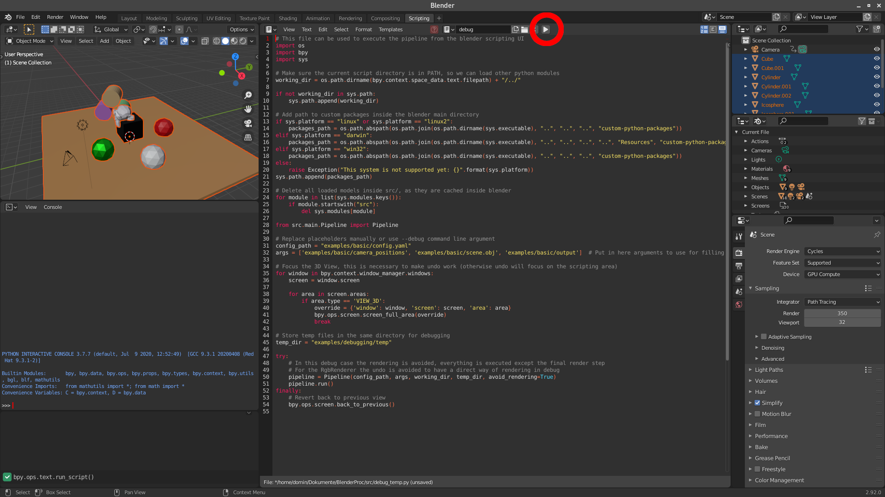

# BlenderProc

[](https://dlr-rm.github.io/BlenderProc/)
[](https://colab.research.google.com/github/DLR-RM/BlenderProc/blob/main/examples/basics/basic/basic_example.ipynb)
[](https://www.gnu.org/licenses/gpl-3.0)

<p align="center">

</p>

A procedural Blender pipeline for photorealistic training image generation.

Check out our [arXiv paper](https://arxiv.org/abs/1911.01911) (we are updating it from time to time) and our [workshop paper](https://sim2real.github.io/assets/papers/2020/denninger.pdf) on sim2real transfer presented at RSS 2020.

## Overview Video

<div align="center">
<a href="http://www.youtube.com/watch?v=tQ59iGVnJWM">
 </a>
</div>

BlenderProc also has a complete [documentation site](https://dlr-rm.github.io/BlenderProc).

There is also an extended introduction video to BlenderProc, it covers the basics and a bit of the background story and how it all started. It can be found [here](https://www.youtube.com/watch?v=1AvY_iS6xQA).

## Contents

* [General](#general)
* [Functionality](#functionality)
* [Examples](#examples)
* [Debugging](#debugging)
* [Source code](#source-code)
* [Contributions](#contributions)
* [Change log](#change-log)

## General

In general, one run of the pipeline first loads or constructs a 3D scene, then sets some camera positions inside this scene and renders different types of images (rgb, distance, normals etc.) for each of them.
The blender pipeline consists of different modules, where each of them performs one step in the described process.
The modules are selected, ordered and configured via a .yaml file.
 
To run the blender pipeline one just has to call the `run.py` script in the main directory together with the desired config file and any additional arguments.
An exemplary `config.yaml` can be found in the respective example folder.
```shell
python run.py config.yaml <additional arguments>
```

This runs all modules specified in the config file in a step-by-step fashion in the configured order.

BlenderProc here generates a scene, places cameras in it and renders the content. This process has to be repeated multiple times to generate a diverse dataset.
Each run should construct a random scene to create a vast variety of different scenarios, to make the generalization to the real world easier.

<p align="center">

</p>

For that reason we offer a `rerun.py` script, which does exactly this:
```shell
python rerun.py config.yaml <additional arguments>
```
Make sure that the last additional argument is the output folder, in which it will create sub folders for each run.

Currently, BlenderProc officialy supports Linux and MacOS. There is also a community driven support for Windows.

## Functionality

The following modules are already implemented and ready to use:

* Loading: `*.obj`, `*.ply`, SunCG, Replica scenes, BOP datasets, etc.
* Objects: Sample object poses, apply physics and collision checking.
* Materials: Set or sample physically-based materials and textures
* Lighting: Set or sample lights, automatic lighting of SunCG scenes.
* Cameras: set, sample or load camera poses from file.
* Rendering: RGB, stereo, depth, normal and segmentation images/sequences.
* Writing: .hdf5 containers, COCO & BOP annotations.

..and many more ([docu](https://dlr-rm.github.io/BlenderProc)). For advanced/custom functionalities, you can easily write and integrate your [own modules](src/README.md#writing-your-own-modules).

## Examples

We provide a lot of [examples](examples/README.md) which explain all features in detail and should help you understand how the config files work. Exploring our examples is the best way to learn about what you can do with BlenderProc. We also provide limited support for some datasets.

* [Basic scene](examples/basics/basic/README.md): Basic example, this is the ideal place to start for beginners
* [Camera sampling](examples/basics/camera_sampling/README.md): Sampling of different camera positions inside of a shape with constraints for the rotation.
* [Object manipluation](examples/basics/entity_manipulation/README.md): Changing various parameters of objects via selecting them in the config file.
* [Material manipulation](examples/basics/material_manipulation/README.md): Material selecting and manipulation.
* [Physics positioning](examples/basics/physics_positioning/README.md): Enabling simple simulated physical interactions between objects in the scene.
* [Semantic segmentation](examples/basics/semantic_segmentation/README.md): Generating semantic segmentation labels for a given scene.
* [BOP Challenge](README_BlenderProc4BOP.md): Generate the pose-annotated data used at the BOP Challenge 2020
* [COCO annotations](examples/advanced/coco_annotations/README.md): Write COCO annotations to a .json file for selected objects in the scene.

... And much more, see our [examples](examples/README.md) for more details.

## Debugging

To find a bug or to understand what the pipeline is doing, it is possible to run BlenderProc from inside the Blender UI.
To do so, just add the `--debug` flag to your blender proc command.
For example, to start the basic example in debug mode, run:
```
python run.py examples/basics/basic/config.yaml examples/resources/camera_positions examples/resources/scene.obj examples/basics/basic/output --debug
```

Now the Blender UI opens up, the scripting tab is selected, the correct script is loaded and your config path and arguments are placed.
To start the BlenderProc pipeline, one now just has to press play (see red circle in image).
 
<p align="center">

</p>

The pipeline can be run multiple times, as in the beginning of each run the scene is cleared.
To adjust the config arguments without restarting blender, just change line 32 in the scripting tab.

## Source Code

Now it's a good time to take a look at the [source code](src): All modules are there. Explore and look at the short guide about writing your own modules.

## Contributions

Found a bug? help us by reporting it. Want a new feature in the next BlenderProc release? Create an issue. Made something useful or fixed a bug? Start a PR. Check the [contributions guidelines](CONTRIBUTING.md).

## Change log

See our [change log](change_log.md). 

## Citation 

If you use BlenderProc in a research project, please cite as follows:

```
@article{denninger2019blenderproc,
  title={BlenderProc},
  author={Denninger, Maximilian and Sundermeyer, Martin and Winkelbauer, Dominik and Zidan, Youssef and Olefir, Dmitry and Elbadrawy, Mohamad and Lodhi, Ahsan and Katam, Harinandan},
  journal={arXiv preprint arXiv:1911.01911},
  year={2019}
}
```

---

<div align="center">
  <a href="https://www.dlr.de/EN/Home/home_node.html"></a>
</div>
