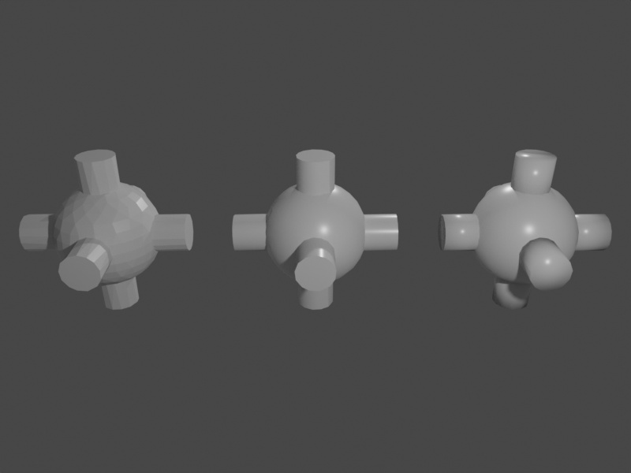

# Auto shading



This example demonstrates the different shading modes of Blender and how to apply them to objects. Available options are,
from left to right, FLAT, AUTO and SMOOTH shading.

## Usage

Execute in the Blender-Pipeline main directory:

```
blenderproc run examples/advanced/auto_shading/main.py examples/advanced/auto_shading/camera_position examples/advanced/auto_shading/scene.blend examples/advanced/auto_shading/output
``` 

* `examples/advanced/auto_shading/main.py`: path to the main python file to run.
* `examples/advanced/auto_shading/camera_position`: text file with parameters of camera positions.
* `examples/advanced/auto_shading/scene.blend`: path to the blend file with the basic scene.
* `examples/advanced/auto_shading/output`: path to the output directory.

## Visualization

The rendered image as shown above can be found in the output directory.

## Implementation

```python
sphere.set_shading_mode("auto", 45)
```

Each MeshObject has a shading mode ('flat', 'smooth', 'auto'). For 'auto' you specify the angle (in degrees) up to which shading is smooth.
All angles greater 45 degrees will be shaded flat, here.
