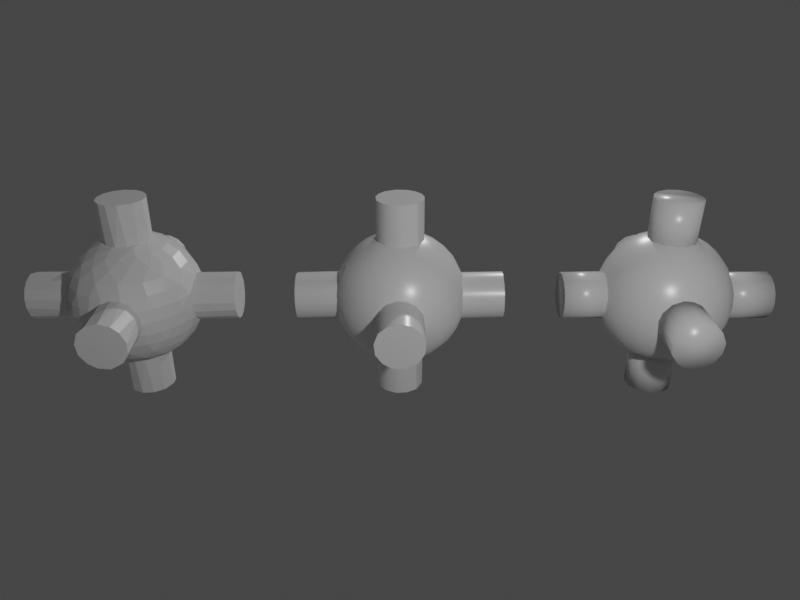

# Auto shading



This example demonstrates the different shading modes of Blender and how to apply them to objects. Available options are,
from left to right, FLAT, AUTO and SMOOTH shading.

## Usage

Execute in the Blender-Pipeline main directory:

```
python run.py examples/auto_shading/config.yaml examples/auto_shading/camera_position examples/auto_shading/scene.blend examples/auto_shading/output
``` 

* `examples/auto_shading/config.yaml`: path to the configuration file with pipeline configuration.
* `examples/auto_shading/camera_positions`: text file with parameters of camera positions.
* `examples/auto_shading/scene.blend`: path to the blend file with the basic scene.
* `examples/auto_shading/output`: path to the output directory.

## Visualization

The rendered image as shown above can be found in the output directory.

## Steps

* Loads `scene.blend`: `loader.BlendLoader` module.
* Selects materials based on the condition and changes some parameters of the selected materials: `material.MaterialManipulator` module.
* Selects objects based on the condition: `manipulators.EntityManipulator` module. Used here to set the different shading modes for each object.
* Creates a point light : `lighting.LightLoader` module.
* Loads camera positions from `camera_positions`: `camera.CameraLoader` module.
* Renders rgb: `renderer.RgbRenderer` module.

## Config file

### EntityManipulator

```yaml
    {
        "module": "manipulators.EntityManipulator",
        "config": {
          "selector": {
            "provider": "getter.Entity",
            "conditions": {
              "name": "Sphere"
            }
          },
          "cf_set_shading": "AUTO",
          "cf_shading_auto_smooth_angle_in_deg": 45
        }
    }
```

Using the `manipulators.EntityManipulator` we can manipulate properties of the entity selected by `name` using the `getter.Entity` provider.
Here, we assign `AUTO` to the shading function `cf_set_shading` and also specify the angle (in degrees) up to which we want to apply smoothing.
All angles greater 45 degrees will be shaded flat.
