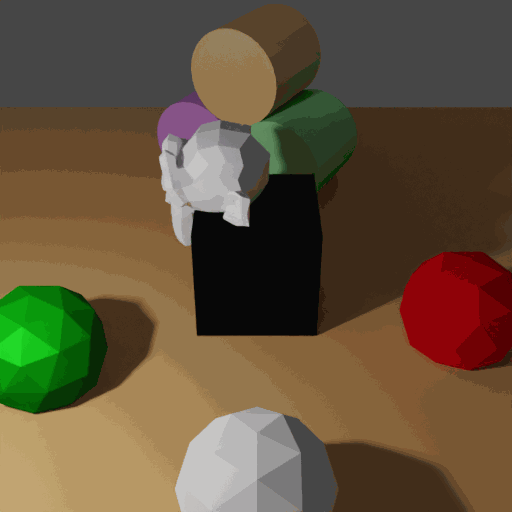

# Camera Random Trajectories

<p align="center">

</p>

In this example we are demonstrating the generation of camera trajectories with a random walk sampler.

## Usage

Execute in the BlenderProc main directory:

```
blenderproc run examples/advanced/camera_random_trajectories/main.py examples/resources/scene.obj examples/advanced/camera_random_trajectories/output
```

* `examples/advanced/camera_random_trajectories/main.py`: path to the python file.
* `examples/resources/scene.obj`: path to the object file with the basic scene.
* `examples/advanced/camera_random_trajectories/output`: path to the output directory.

## Visualization

Open the .gif animation files with your favorite image viewer. If you are using Linux try

```
eog examples/advanced/camera_random_trajectories/output/gif_animations/0_colors_animation.gif
```

## Steps

### Sample random walk trajectories

```python
# Find point of interest, cam poses should look towards it
poi = bproc.object.compute_poi(objs)

# Create translational random walk that we will add to the POI
poi_drift = bproc.sampler.random_walk(total_length = 25, dims = 3, step_magnitude = 0.05, 
                                      window_size = 5, interval = [-0.3, 0.3], distribution = 'uniform')

# Create rotational random walk to imitate camera shaking: Sample an axis angle representation  
camera_shaking_rot_angle = bproc.sampler.random_walk(total_length = 25, dims = 1, step_magnitude = np.pi/32, window_size = 5,
                                                     interval = [-np.pi/6, np.pi/6], distribution = 'uniform', order = 2)
camera_shaking_rot_axis = bproc.sampler.random_walk(total_length = 25, dims = 3, window_size = 10, distribution = 'normal')
camera_shaking_rot_axis /= np.linalg.norm(camera_shaking_rot_axis, axis=1, keepdims=True)
```

In this example, all camera poses are constructed to "look at" a point of interest (POI). On top, we sample random walks for translation and camera rotation to create more realistic, noisy trajectories.  

* Sample translational POI drift uniformly with maximum `step_magnitude` in the predefined `interval`. Smoothen the resulting trajectory by convolving it with an average filter of `window_size`.
* Sample rotational camera shaking in axis-angle representation. To obtain a uniform axis distribution we sample from a normalized normal `distribution`. The angle is sampled from a squared uniform distribution (`order=2`).

### Add random walk noise to a clean camera trajectory

```python
for i in range(25):
    # Camera trajectory that defines a quater circle at constant height 
    location_cam = np.array([10*np.cos(i/25 * np.pi), 10*np.sin(i/25 * np.pi), 8])
    # Compute rotation based on vector going from location towards poi + drift
    rotation_matrix = bproc.camera.rotation_from_forward_vec(poi + poi_drift[i] - location_cam)
    # random walk axis-angle -> quaternion
    q_rand = transform.quaternion_about_axis(camera_shaking_rot_angle[i], camera_shaking_rot_axis[i])
    # quaternion -> rotation matrix
    R_rand = transform.quaternion_matrix(q_rand)[:3,:3]
    # Add the random walk to the camera rotation 
    rotation_matrix = R_rand @ rotation_matrix
    # Add homog cam pose based on location an rotation
    cam2world_matrix = bproc.math.build_transformation_mat(location_cam, rotation_matrix)
    bproc.camera.add_camera_pose(cam2world_matrix)
```

* We first define a camera location trajectory, i.e. a half circle at constant height.
* The camera looks at the POI plus some drift from the random walk
* Additionally, the camera rotation is perturbed by the axis-angle random walk. We first transform the perturbation to a rotation matrix before we apply it.
* Finally, we add the camera pose for the specified frame.
