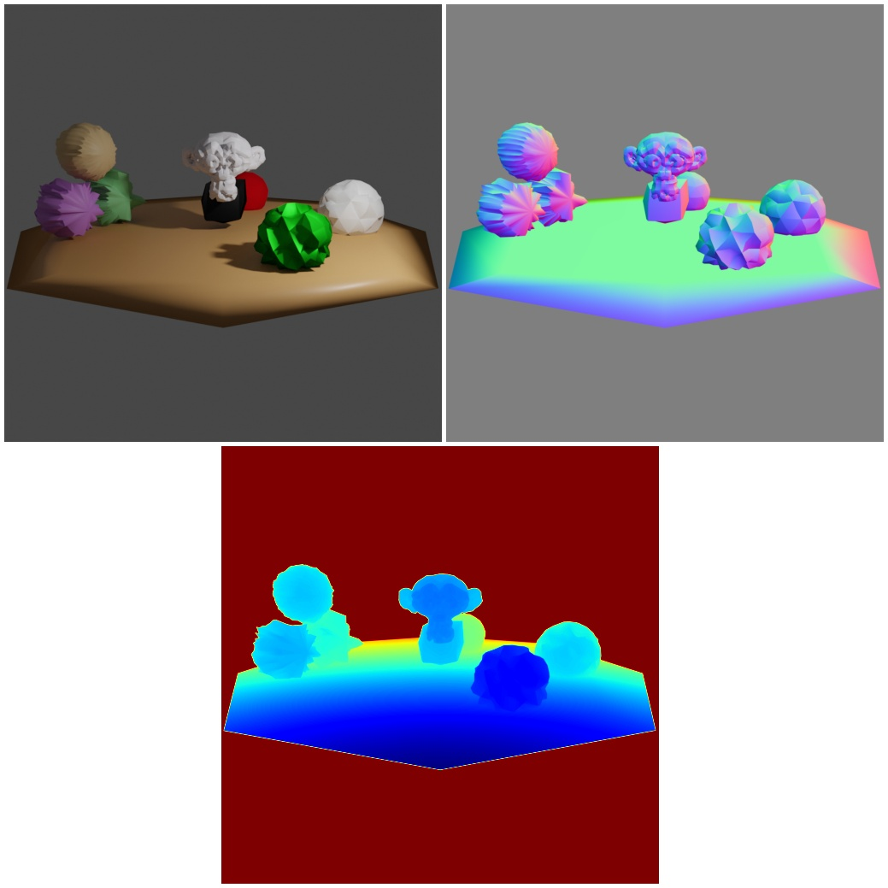

# Object selection and manipulation using displacement modifier



In this example we demonstrate how to manipulate a entity by adding different displacement modifiers with different textures as part of the `EntityManipulator` module.
This is an advanced example, please make sure that you have read:

* [entity_manipulator](../shapenet/README.md): Basics of `EntityManipulator` module to load entities and manipulate them. 
## Usage

Execute this in the BlenderProc main directory:

```
blenderproc run examples/advanced/entity_displacement_modifier/main.py examples/resources/scene.obj examples/advanced/entity_displacement_modifier/output
```

* `examples/advanced/entity_displacement_modifier/main.py`: path to the main python file to run.
* `examples/resources/scene.obj`: path to the object file with the basic scene.
* `examples/advanced/entity_displacement_modifier/output`: path to the output directory.

## Visualization

Visualize the generated data:

```
blenderproc vis hdf5 examples/advanced/entity_displacement_modifier/output/0.hdf5
```

## Implementation

```python
# Add displacement to all objects
for obj in objs:
    # Create a uv mapping based on a cylinder projection
    obj.add_uv_mapping("cylinder")

    # Create a random procedural texture
    texture = bproc.material.create_procedural_texture('CLOUDS')
    # Displace the vertices of the object based on that random texture
    obj.add_displace_modifier(
        texture=texture,
        strength=random.gauss(0, 0.5),
        subdiv_level=random.randint(1, 3),
    )
```
If an object doesn't already have an uv map, we add one, since it's necessary for mapping a displacement texture to the object. 
For the UV mapping we chose a `projection`. Possible projection types given by blender are: "cube", "cylinder", "smart" and "sphere".

Then we add a displacement modifier with a random texture to each entity. 

* `strength` is the amount to displace geometry. We are here sampling the `strength` over a gaussian distribution with mean `0.0` and standard deviation of `0.5`.
* If a subdivision is being applied the `subdiv_level` defines the numbers of subdivisions to perform on the entity. We are using one or two in this example.
* `mid_level` is the texture value which will be treated as no displacement by the modifier. Texture values below this threshold will result in negative displacement along the selected direction, while texture values above it will result in positive displacement. `displacement = texture_value - mid_level`. Recall that color/luminosity values are typically between (0.0 to 1.0) in Blender, and not between (0 to 255).
* By adding a value to `min_vertices_for_subdiv` we can check if a subdivision modifier is necessary for the entity. If the vertices of a entity are less than `min_vertices_for_subdiv` a Subdivision modifier will be added to increase the number of vertices. The number of vertices of a entity has a big effect on the displacement modifier. If there are not enough vertices, the displacement modifier will not work well.                                                                         