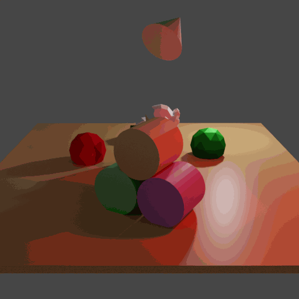
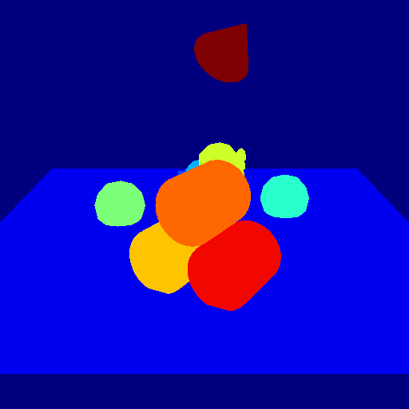

# Gif animation

<p align="center">


</p>

In this example it will be explored how to get a .gif animation out of the rendered frames similarly to the advertising demonstration known from the main page. Here are also used a camera trajectory and physic simulation. 
For more information about the physics, see `examples/basics/physics_positioning`. Since syncing effects are an important part of animation, we will sync a falling object, a camera movement and a blinking "LED". 
For background information about syncing, there is the tutorial "How key frames work".

## Usage

Execute in the BlenderProc main directory:

```
blenderproc run examples/advanced/gif_animation/main.py examples/resources/scene.obj examples/advanced/gif_animation/output
```
It will produce several animations, where only two of them are shown above.

## Visualization

Open the .gif animation files with your favorite image viewer. If you are using Linux try

```
eog examples/advanced/gif_animation/output/gif_animations/0_colors_animation.gif
```
and switch between the different animation types with the arrow keys.

## Implementation

If you want to use different effects during the animation, make sure that you sync the attached frames. For just one changing object or parameter over "time", you don't need to care about frames.
In this example the total number of frames, the later .gif animation will consist of, is set as a global parameter to 99.

```python
frame_end = 99
```
### Physics simulation
To visualize physics, it is one object created that has an active interaction with it's enviroment. 
```python
# create an additional item in the scene that is moveable
item = bproc.object.create_primitive("CONE")
item.set_location([0,-1,7])
item.set_rotation_euler([1,0,1])
item.enable_rigidbody(active=True)
```

The other objects are all set to be passive.

```python
# Set all entities from the scene as solid, passive objects
for obj in objs:
    obj.enable_rigidbody(active=False)
```

### Camera trajectory
A continuous movement of the camera is reached through the usage of a path in 3D space. The time parametrisation is done via 'frame_end' steps from 0 to 1. Since the time is a discrete list, you have also a list of locations you apply to the camera settings. It is important to attach each camera sample to the according frame, such that the effects of physics and the camera movement happen at once.

```python
# Set time interval from 0 ... 1
time = [t/frame_end for t in range(frame_end)]
# The trajectory for the camera positions in [x(t), y(t), z(t)] coordinates
locations = [[(20-10*t)*np.cos(np.pi*(1+0.5*t)),(20-10*t)*np.sin(np.pi*(1+0.5*t)),8] for t in time]
for frame, location in enumerate(locations):
    # Camera rotation/orientation is chosen such, that it points towards the scene
    rotation_matrix = bproc.camera.rotation_from_forward_vec(poi - location, inplane_rot=0)
    cam2world_matrix = bproc.math.build_transformation_mat(location, rotation_matrix)
    # You have to attach the camera pose to the already given frames from the physics simulation
    bproc.camera.add_camera_pose(cam2world_matrix, frame=frame)
```

### Save to .gif animation
If all effects are enabled which should be applied and the data are generated through a render process, the gif animations will be activated similarly to the `write_hdf5()` method. To generate just .gif animations, of course it is also possible to simply leave out the `write_hdf5()` call.

```python
# write the animations into .gif files
bproc.writer.write_gif_animation(args.output_dir, data)
```
This method will also produce a simple .gif picture, if `frame_end = 1`.

For adjustments, the `write_gif_animation` method comes with the following parameters:
* `output_dir_path`: The directory path in which the gif animation folder will be saved
* `output_data_dict`: The data dictionary which was produced through the render method
* `append_to_existing_output`: Leaves given `#_animation.gif` files in the output folder unaffected and stores the new ones named with higher numbers. This should e.g. be set True for loops over several animations with different settings.
* `frame_duration_in_ms`: The duration time in milliseconds of each frame in the animation, which affects the speed of effects seen in the animation
* `reverse_animation`: If set to True, the effects will happen backwards

## Further notes

Since the generation of the animations happens within the usual pipeline, it is also possible to loop this process with different samples, like different starting positions of the falling object, such that there is a comparison of the different animations afterwards. In general a lot of settings can be looped over frames, such that the animations providing a nearly continuous visualisation of the individual parameter impacts.

* The quality of the resulting .gif animation is only defined by the camera resolution setting
```python
# define the camera resolution
bproc.camera.set_resolution(512,512)
```
* The duration of the .gif animation is determined by the quotient of the number of frames and the `time_constant` for each frame.

*  It is also possible to apply stereographic view, like discriped in the `examples/advanced/stereo_matching`

