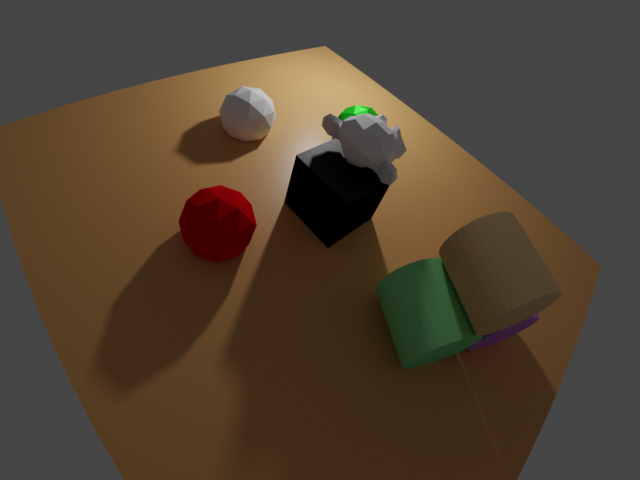
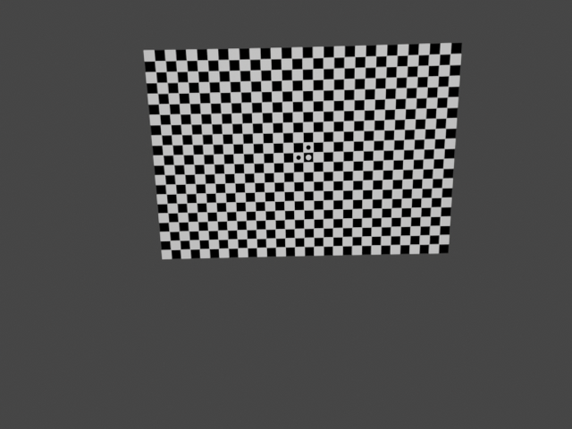
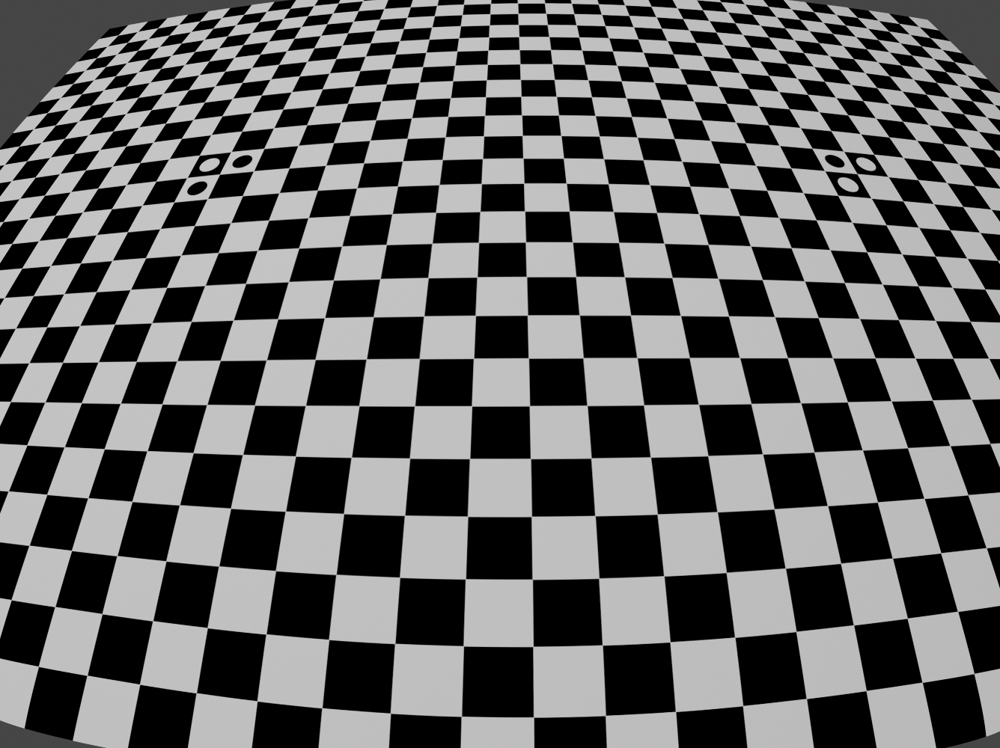
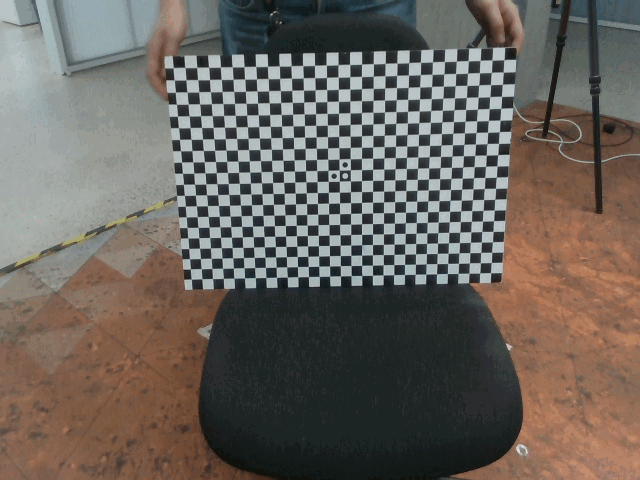
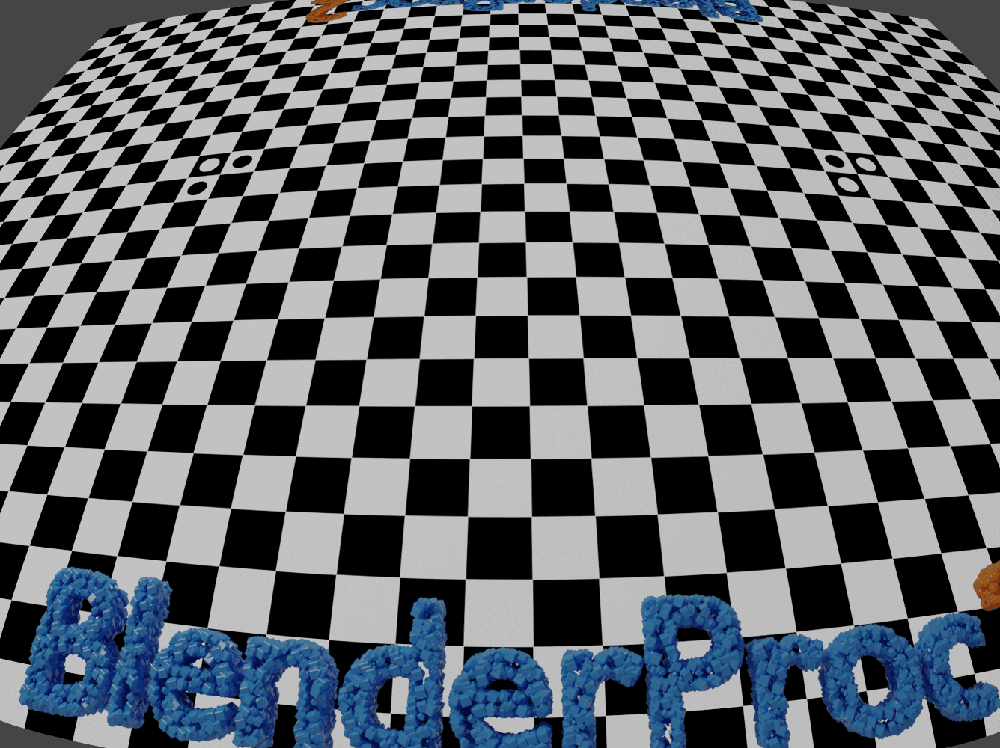

# Camera lens distortion generation and validation

Generates distorted images (RGB, depth, and normals) of a typical BlenderProc virtual scene and of a precisely measured camera calibration plate at known poses and intrinsics. The latter will be used for validation of our geometric camera model by comparing the generated images to real images.

## Usage

Execute in the BlenderProc main directory:
```
blenderproc run examples/advanced/lens_distortion/main.py examples/resources/scene.obj examples/advanced/lens_distortion/output
``` 
for the standard scene:



or
```
blenderproc run examples/advanced/lens_distortion/main_callab.py examples/advanced/lens_distortion/callab_platte.obj examples/advanced/lens_distortion/camera_calibration_callab_img1.cal examples/advanced/lens_distortion/output
``` 

for a simple calibration image by loading intrinsics and extrinsics from a file:



or
```
blenderproc run examples/advanced/lens_distortion/main_callab.py examples/advanced/lens_distortion/callab_platte_justin.obj examples/advanced/lens_distortion/camera_calibration_callab_img2.cal examples/advanced/lens_distortion/output
``` 

for a fairly distorted image:



## Visualization

The `output` folder will contain hdf5 files including distorted color, depth, and normal images. Use `./blenderproc/scripts/saveAsImg.py` or `blenderproc extract hdf5` to unpack.

## Validation

Compare the above images with the real images in `./images/lens*real*` for geometric validation:





## Steps

* Loads objects; locates them at the origin of the world ref. frame
* Creates a point light
* Sets the camera intrinsics including the lens distortion parameters
* Intializes the undistorted-to-distorted coordinates mapping for all generated undistorted images (typically in a higher resolution than desired) to be eventually distorted
* Either samples camera-to-object poses (first example) or loads the camera poses measured with a camera calibration software (e.g., [DLR CalLab v1](https://www.robotic.de/callab))
* Renders RGB, depth and, normals
* Applies lens distortion (to the temporal, higher-resoluted, intermediate Blender images, and then cropes them down to the desired resolution)
* Writes the distorted data to a .hdf5 container
* Test by comparing the generated images with the reference real images `./images/lens_img1_real.jpg` and `./images/lens_img2_real.png`

## Implementation

### Object loader

This comes by argument and accepts both `.obj` (+`.mtl`) and `.blend` files. The `.blend` files included in the directory show the BlenderProc2 logo as in the GIF images above. The object models are expected in metric scale.

### Set camera intrinsics manually and setup lens distortion

You can specify the camera intrinsics (following the pinhole camera model but with skew=0 always) including the undistorted-to-distorted Brown-Conrady lens distortion model in the `.py` config file. We discourage the use of the parameters `k3`,`p1`,`p2` since they are virtually never needed and they may compromise the distorted-to-undistorted mapping at the corner pixels of the image. This model is widespread in computer vision (e.g., OpenCV, DLR CalLab, Kalibr, Bouguet).
```python
resolution_x, resolution_y = 1336, 1000
cam_K = np.array([[774.189,   0., 665.865], [0., 774.189, 498.651], [0.0, 0.0, 1.0]])
k1, k2, k3 = -0.249855, 0.102193, -0.0210435
p1, p2 = 0., 0.
bproc.camera.set_intrinsics_from_K_matrix(cam_K, resolution_x, resolution_y,
bpy.context.scene.camera.data.clip_start, bpy.context.scene.camera.data.clip_end)
```

Subsequently, the lens distortion mapping is computed:
```python
mapping_coords, orig_img_res = bproc.camera.set_lens_distortion(k1, k2, k3, p1, p2)
```

Here we setup the lens distortion and adapt intrinsics so that it can be later applied in the PostProcessing. Mapping coordinates between the distorted and undistorted image as well as the original image resolution are saved and need to be applied in the actual lens distortion step done in postprocessing.

### Alternatively: Set camera intrinsics from file

You can instead locate all these data within a text file following the DLR-RMC camera calibration file format (e.g., `camera_calibration_callab_img1.cal` as an argument to the `.py` config file). Then you can read, set the parameters, setup the distortion mapping, and even setting a camera pose using this line of code:
```python
orig_res_x, orig_res_y, mapping_coords = bproc.camera.set_camera_parameters_from_config_file(args.config_file, read_the_extrinsics=False)
```

### Camera pose

You can either sample poses for the configured scene to be in camera view (first example):
```python
# Find point of interest, all cam poses should look towards it
poi = bproc.object.compute_poi(objs)
# Sample random camera location above objects
location = np.random.uniform([-10, -10, 12], [10, 10, 8])
# Compute rotation based on vector going from location towards poi
rotation_matrix = bproc.camera.rotation_from_forward_vec(poi - location, inplane_rot=np.random.uniform(-0.7854, 0.7854))
# Add homog cam pose based on location an rotation
cam2world_matrix = bproc.math.build_transformation_mat(location, rotation_matrix)
bproc.camera.add_camera_pose(cam2world_matrix)
```

Or input a known pose as an homog. transformation matrix from the world ref. frame to the camera ref. frame:
```python
cam2world = Matrix(([0.999671270370088, -0.00416970801689331, -0.0252831090758257, 0.18543145448762],
    [-0.0102301044453415, 0.839689004789377, -0.542971400435615, 0.287115596159953],
    [0.0234939480338283, 0.543051112648318, 0.839370243145164, -0.209347565773035],
    [0, 0, 0, 1.]))
cam2world = bproc.math.change_source_coordinate_frame_of_transformation_matrix(cam2world, ["X", "-Y", "-Z"])
bproc.camera.add_camera_pose(cam2world)
```

Note here the required change in the definition of the camera ref. frame from the OpenGL definition to the standard computer vision (OpenCV) definition featuring the Z axis to the front, the Y to the bottom, and the X to the right.

Alternatively, you can skip this step by setting `read_the_extrinsics=True` when reading data from a DLR-RMC camera calibration file.

### Apply lens distortion
```python
# post process the data and apply the lens distortion
for key in ['colors', 'distance', 'normals']:
    # use_interpolation should be false, for everything except colors 
    use_interpolation = key == "colors"
    data[key] = bproc.postprocessing.apply_lens_distortion(data[key], mapping_coords, orig_res_x, orig_res_y,
                                                           use_interpolation=use_interpolation)
```
For all generated image outputs (this would also include segmentation if generated) we now apply the mapping coordinates to distort the rendered image and crop it back to the original resolution.

### Test w.r.t. real images
```python
# test: compare generated image with real image
if "img1" in os.path.basename(args.config_file):
    real_path = "./images/lens_img1_real.jpg"
    norm_corr_limit = 0.660 # low since the real background is large and different
elif "img2" in os.path.basename(args.config_file):
    real_path = "./images/lens_img2_real.png"
    norm_corr_limit = 0.890 # less background
else:
    raise Exception("Reference real image not found.")
img_gene = np.asarray(Image.fromarray(data['colors'][0]).convert('L'))
img_real = np.asarray(Image.open(real_path).convert('RGB').convert('L'))
assert img_gene.shape == img_real.shape
result = match_template(img_gene, img_real[3:-3,3:-3], pad_input=False)
if result.argmax()==24: # center of the (7,7) correlation window
    print(f"The generated image is not biased w.r.t. the reference real image.")
    if result.max()>norm_corr_limit:
        print(f"The norm. correlation index between generated and real images is {np.round(result.max(),3)}, which is fine.")
    else:
        raise Exception("The norm. correlation index between generated and real image is too low. The images do not match. Choose other object or config file.")
else:
    raise Exception("The generated calibration pattern image and the reference real image do not match. Choose other object or config file.")
```
We apply normalized 2-D cross-correlation between the generated image and a reference real image (either `./images/lens_img1_real.jpg` or `./images/lens_img2_real.png`). Of course, the image background beyond the calibration plate is not modeled and differs, yet the strong pattern of the calibration plate dominates such that:
1. any pixel shift must worsen the cross-correlation result (i.e., its maximum must lie at the kernel center)
1. their norm. cross-correlation value must reach at least the empiric value `0.660` or `0.890` for img1 or img2, resp. (they are weakened by the unmodeled background, hence <1)

If the test fails, either the wrong object model or calibration file has been used, or a bug appeared in the used BlenderProc version.
