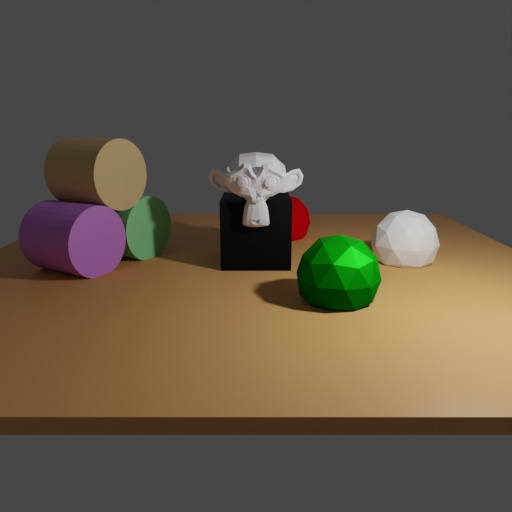
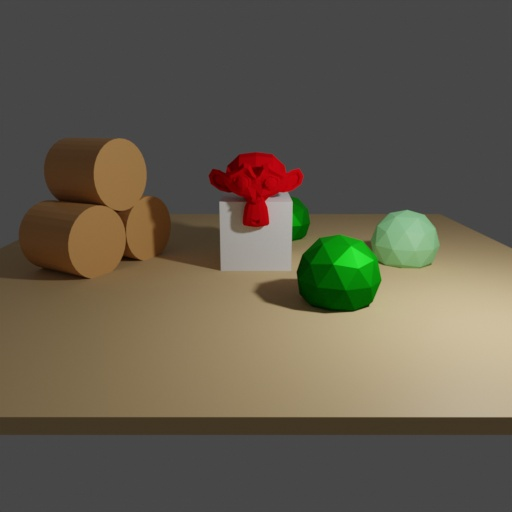

# Material Randomization

<div style="text-align:center">


</div>

In this example we demonstrate how to switch materials.

## Usage

Execute in the BlenderProc main directory:

```
blenderproc run examples/advanced/material_randomizer/main.py examples/resources/scene.obj examples/advanced/material_randomizer/output
```

* `examples/advanced/material_randomizer/main.py`: path to the main python file to run.
* `examples/resources/scene.obj`: path to the object file with the basic scene.
* `examples/advanced/material_randomizer/output`: path to the output directory.

## Visualization

Visualize the generated data:

```
blenderproc vis hdf5 examples/advanced/material_randomizer/output/*.hdf5
```

## Implementation

```python
# Collect all materials
materials = bproc.material.collect_all()

# Go through all objects
for obj in objs:
    # For each material of the object
    for i in range(len(obj.get_materials())):
        # In 50% of all cases
        if np.random.uniform(0, 1) <= 0.5:
            # Replace the material with a random one
            obj.set_material(i, random.choice(materials))
```

Collect all materials that were previously loaded. For each object replace their materials with a chance of 50% with one of the collected materials.
