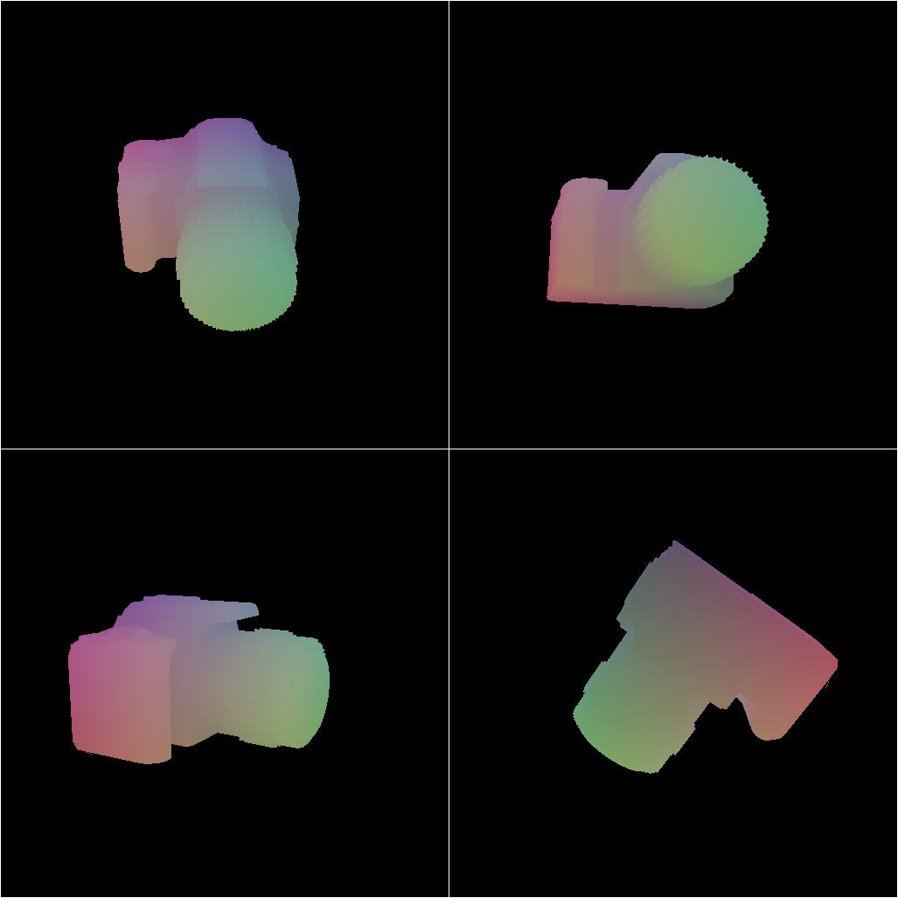

# NOCS
<p align="center">

</p>

The focus of this example is to show how to render the Normalized Object Coordinate Space (NOCS).

See the paper [Normalized Object Coordinate Space for Category-Level6D Object Pose and Size Estimation](https://arxiv.org/pdf/1901.02970.pdf) for more details.

## Usage

Execute in the BlenderProc main directory:

```
blenderproc run examples/datasets/nocs/main.py <PATH_TO_ShapeNetCore.v2> examples/datasets/nocs/output
``` 

* `examples/datasets/nocs/main.py`: path to the python file with pipeline configuration.
* `<PATH_TO_ShapeNetCore.v2>`: path to the downloaded shape net core v2 dataset, get it [here](http://www.shapenet.org/) 
* `examples/advanced/nocs/output`: path to the output directory.

## Visualization

In the output folder you will find a series of `.hdf5` containers. These can be visualized with the script:

```
blenderproc vis hdf5 examples/datasets/nocs/output/*.hdf5
``` 

## Steps

* Set the ShapeNet category as specified with `bproc.loader.load_shapenet()`.
* Sample camera poses `bproc.camera`.
* Render RGB with `bproc.renderer.render()`.
* Render NOCS with `bproc.renderer.render_nocs()`.
* Write HDF5 file: `bproc.writer.write_hdf5()`.

 
## Python file (main.py)


### ShapeNetLoader 

```python
shapenet_obj = bproc.loader.load_shapenet(args.shapenet_path, used_synset_id="02942699", used_source_id="97690c4db20227d248e23e2c398d8046", move_object_origin=False)
```

* This loads a camera object from the ShapeNet dataset
* Make sure to disable `move_object_origin`, as otherwise the local coordinates of the object are changed. 
* ShapeNet objects are already normalized, so all local coordinates should be in `[-1, 1]`

## NOCS Renderer

```python
data.update(bproc.renderer.render_nocs())
```

* `bproc.renderer.render_nocs()` renders NOCS of all frames
* Thereby, the local coordinates `[-1, 1]` are mapped into the `[0, 1]` colorspace
* The rendering function returns a dict, containing one entry `nocs` which points to the list of rendered NOCS frames.
