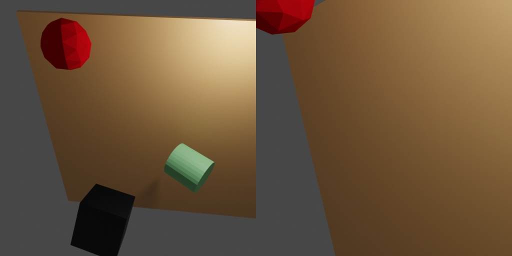

# Object pose sampling



The focus of this example is introducing the `object.ObjectPoseSampler` which allows one to sample object poses inside a sampling volume with collision checks.

## Usage

Execute in the BlenderProc main directory:

```
blenderproc run examples/advanced/object_pose_sampling/main.py examples/resources/camera_positions examples/resources/scene.obj examples/advanced/object_pose_sampling/output
``` 

* `examples/advanced/object_pose_sampling/main.py`: path to the main python file to run.
* `examples/resources/camera_positions`: text file with parameters of camera positions.
* `examples/resources/scene.obj`: path to the object file with the basic scene.
* `examples/advanced/object_pose_sampling/output`: path to the output directory.

## Visualization

Visualize the generated data:

```
blenderproc vis hdf5 examples/advanced/object_pose_sampling/output/0.hdf5
```

## Implementation

```python
# Define a function that samples the pose of a given object
def sample_pose(obj: bproc.types.MeshObject):
    obj.set_location(np.random.uniform([-5, -5, -5], [5, 5, 5]))
    obj.set_rotation_euler(np.random.uniform([0, 0, 0], [np.pi * 2, np.pi * 2, np.pi * 2]))

# Sample the poses of all objects, while making sure that no objects collide with each other.
bproc.object.sample_poses(
    objs,
    sample_pose_func=sample_pose,
    objects_to_check_collisions=objs
)
```
Define a function that samples ands sets an object location and rotation. The object is placed at the sampled pose with collision checks against all objects specified by `objects_to_check_collisions` (default=all objects). If there is a collision - the position is reset and module tries to sample a new one. Maximum number of trials can be defined by `max_tries`.
