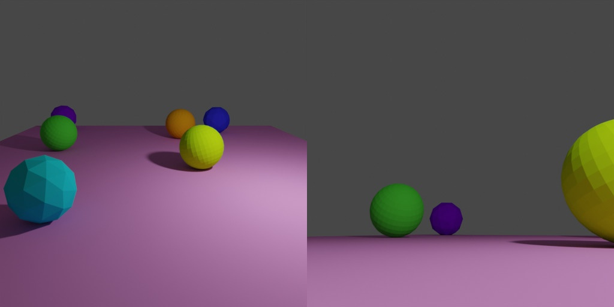

# On surface object pose Sampling



The focus of this example is the `OnSurfaceSampler` which allows pose sampling for some selected objects on top of a selected surface.

## Usage

Execute this in the BlenderProc main directory:

```
blenderproc run examples/advanced/on_surface_object_sampling/main.py examples/resources/camera_positions examples/advanced/on_surface_object_sampling/scene.blend examples/advanced/on_surface_object_sampling/output
```

* `examples/advanced/on_surface_object_sampling/main.py`: path to the main python file to run.
* `examples/resources/camera_positions`: text file with parameters of camera positions.
* `examples/advanced/on_surface_object_sampling/scene.blend`: path to the object file with the basic scene.
* `examples/advanced/on_surface_object_sampling/output`: path to the output directory.

## Visualization

Visualize the generated data:

```
blenderproc vis hdf5 examples/advanced/on_surface_object_sampling/output/0.hdf5
```

## Implementation

We first define a function that samples poses above a list of `objects_to_sample_on` between `min_height` and `max_height`. 
```python
# Define a function that samples the pose of a given object
def sample_pose(obj: bproc.types.MeshObject):
    # Sample the spheres location above the surface
    obj.set_location(bproc.sampler.upper_region(
        objects_to_sample_on=[surface],
        min_height=1,
        max_height=4,
        use_ray_trace_check=False
    ))
    obj.set_rotation_euler(np.random.uniform([0, 0, 0], [np.pi * 2, np.pi * 2, np.pi * 2]))


```

In `sample_poses_on_surface` takes the function handle and samples poses and projects them down on to a given surface. Objects not within `min_distance` and `max_distance` are resampled. 

```python
# Sample the spheres on the surface
spheres = bproc.object.sample_poses_on_surface(spheres, surface, sample_pose, min_distance=0.1, max_distance=10)
```

Then we enable active rigidbody attributes for the spheres and a passive one for the surface in order to run a physics simulation. This optinal step makes sure that the resulting object poses are physically stable. 

```python
# Enable physics for spheres (active) and the surface (passive)
for sphere in spheres:
    sphere.enable_rigidbody(True)
surface.enable_rigidbody(False)

# Run the physics simulation
bproc.object.simulate_physics_and_fix_final_poses(min_simulation_time=2, max_simulation_time=4, check_object_interval=1)
```
