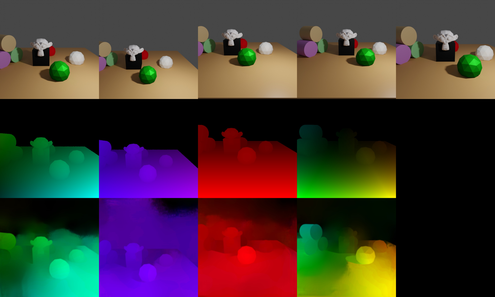

# Optical Flow


_First row: RGB images, second row: forward optical flow generated by Blender, third row: forward optical flow from a pretrained [LiteFlowNet](http://mmlab.ie.cuhk.edu.hk/projects/LiteFlowNet/) as comparison_


In this example we demonstrate how to obtain forward / backward flow values between consecutive key frames. 

Flow is visible if either the camera or objects move between frames. Here, the camera undergoes the following motion:
```python
0 -10 4 1.3 0 0  # initial position
0 -12 4 1.3 0 0  # moving away from object
2 -12 4 1.3 0 0  # moving to the right
2 -12 6 1.3 0 0  # moving upwards
1 -11 5 1.3 0 0  # combined motion (to the left, towards object and downwards)
```

## Usage

Execute in the BlenderProc main directory:

```
blenderproc run examples/advanced/optical_flow/main.py examples/advanced/optical_flow/camera_positions examples/resources/scene.obj examples/advanced/optical_flow/output
```

* `examples/advanced/optical_flow/main.py`: path to the main python file to run.
* `examples/advanced/optical_flow/camera_positions`: text file with parameters of camera positions.
* `examples/resources/scene.obj`: path to the object file with the basic scene.
* `examples/advanced/optical_flow/output`: path to the output directory.

## Visualization

Visualize the generated data:

```
blenderproc vis hdf5 examples/advanced/optical_flow/output/1.hdf5
```

## Implementation

```python
# Render the optical flow (forward and backward) for all frames
bproc.renderer.render_optical_flow(get_backward_flow=True, 
                                   get_forward_flow=True, 
                                   blender_image_coordinate_style=False)
```

* Go through all cam poses and renders forward and / or backward flow
* The images are rendered using the `.exr` format which allows linear colorspace and higher precision, and then converted to numpy.float32 arrays
* Per default, Blender uses the bottom left corner as coordinate system origin. OpenCV and popular Flow datasets use the upper left corner instead - change the flag `"blender_image_coordinate_style": True` if you want the default Blender behaviour. Note that the colors in the visualization will be different!