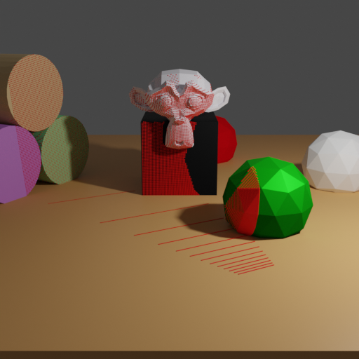
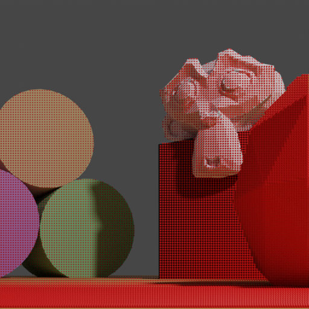

# Point clouds

<p align="center">


</p>

In this example we demonstrate how to compute a depth map with raytracing and how to unproject it into a point cloud.
The point cloud is computed from the view of the second camera pose (right image) and is visualized using red dots.

## Usage

Execute in the Blender-Pipeline main directory:

```
blenderproc run examples/advanced/point_clouds/main.py examples/resources/camera_positions examples/resources/scene.obj examples/basics/basic/output
```

* `examples/resources/camera_positions`: text file with parameters of camera positions.
* `examples/resources/scene.obj`: path to the object file with the basic scene.
* `examples/basics/basic/output`: path to the output directory.

## Visualization

Visualize the generated data:

```
blenderproc vis hdf5 examples/advanced/point_clouds/output/0.hdf5
```

## Implementation

First we are computing a depth image via raytracing using the camera pose set to keyframe #1.

```
depth = bproc.camera.depth_via_raytracing(bvh_tree, 1)
```

Alternatively, one could also use the renderer to render a depth image:

```
data = bproc.renderer.render()
depth = data["depth"][1]
```

We now unproject the depth image again, resulting in a point cloud.
The point cloud contains one point per pixel.

```
points = bproc.camera.pointcloud_from_depth(depth, 1)
points = points.reshape(-1, 3)
```

To visualize the point cloud, we create a mesh with vertices set from the point cloud.
To be able to see the points in the final rendering, we add geometry nodes which add a sphere mesh to each point.

```
point_cloud = bproc.object.create_from_point_cloud(points, "point_cloud", add_geometry_nodes_visualization=True)
```