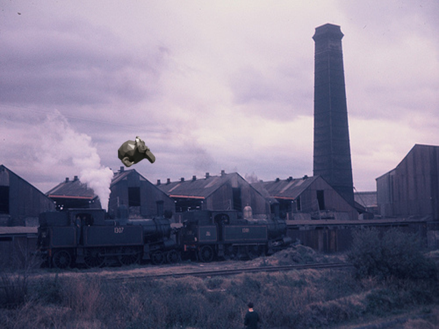

# Random Backgrounds



In this example we generate renderings of an object (Suzanne) and then paste them onto random background images,
randomizing position, orientation, material properties and lighting of the object. This is a naive way to generate data
for training classification, object detection and segmentation tasks. It is easy to implement and use but usually
leads to inferior results compared to renderings of objects in actual 3D scenes.

## Usage

Execute in the Blender-Pipeline main directory:

```
python run.py examples/advanced/random_backgrounds/config.yaml examples/advanced/random_backgrounds/object.ply examples/advanced/random_backgrounds/output
``` 

* `examples/advanced/random_backgrounds/config.yaml`: path to the configuration file with pipeline configuration.
* `examples/advanced/random_backgrounds/object.ply`: path to the object file.
* `examples/advanced/random_backgrounds/output`: path to the output directory.

## Visualization

The rendered data can be found in the output directory.

## Steps

* Loads `object.ply`: `loader.ObjectLoader` module.
* Selects materials based on the condition and changes some parameters of the selected materials: `material.MaterialManipulator` module.
* Samples a point light at a random position with random intensity and light color: `lighting.LightLoader` module.
* Samples a camera at a random position looking at the object: `camera.CameraSampler` module.
* Renders rgb: `renderer.RgbRenderer` module.
* Renders instance segmentation: `renderer.SegMapRenderer` module.
* Writes coco annotations: `writer.CocoAnnotationsWriter` module.

## Config file

### ObjectLoader

```yaml
  {
    "module": "loader.ObjectLoader",
    "config": {
      "path": "<args:0>",
      "add_properties": {
        "cp_category_id": 1,
        "cp_is_object": True
      }
    }
  }
```

The `loader.ObjectLoader` loads the object and sets its category ID to 1, which is used by the `renderer.SegMapRenderer`
to differentiate the object from the background when creating bounding box and segmentation mask.

### MaterialManipulator

```yaml
  {
    "module": "manipulators.MaterialManipulator",
    "config": {
      "selector": {
        "provider": "getter.Material",
        "conditions": {
          "name": "ply_material"
        }
      },
      "cf_set_specular": {
        "provider": "sampler.Value",
        "type": "float",
        "min": 0.0,
        "max": 1.0
      },
      "cf_set_roughness": {
        "provider": "sampler.Value",
        "type": "float",
        "min": 0.0,
        "max": 1.0
      },
      "cf_set_base_color": {
        "provider": "sampler.Color",
        "min": [0.0, 0, 0.0, 1.0],
        "max": [1.0, 1.0, 1.0, 1.0]
      },
      "cf_set_metallic": {
        "provider": "sampler.Value",
        "type": "float",
        "min": 0.0,
        "max": 1.0
      }
    }
  }
```

The `manipulators.MaterialManipulator` selects the generic `ply_material` of the object in `PLY` format and randomizes
specular, roughness, metallic and color values.

### LightSampler

```yaml
  {
    "module": "lighting.LightSampler",
    "config": {
      "lights": [
      {
        "location": {
          "provider": "sampler.Shell",
          "center": {
            "provider": "getter.POI",
            "selector": {
              "provider": "getter.Entity",
              "conditions": {
                "cp_is_object": True,
                "type": "MESH"
              }
            }
          },
          "radius_min": 1,
          "radius_max": 5,
          "elevation_min": 1,
          "elevation_max": 89,
          "uniform_elevation": True
        },
        "color": {
          "provider": "sampler.Color",
          "min": [0.5, 0.5, 0.5, 1],
          "max": [1, 1, 1, 1]
        },
        "type": "POINT",
        "energy": {
          "provider": "sampler.Value",
          "type": "int",
          "min": 100,
          "max": 1000
        }
      }
      ]
    }
  }
```

The `lighting.LightSampler` samples a point light with random intensity at a random position centered on the object
using the `cp_is_object` custom property added when loading the object as selector.

### CameraSampler

```yaml
  {
    "module": "camera.CameraSampler",
    "config": {
      "cam_poses": [
      {
        "number_of_samples": 5,
        "check_if_objects_visible": {
          "provider": "getter.Entity",
          "conditions": {
            "cp_is_object": True,
            "type": "MESH"
          }
        },
        "location": {
          "provider": "sampler.Shell",
          "center": {
            "provider": "getter.POI",
            "selector": {
              "provider": "getter.Entity",
              "conditions": {
                "cp_is_object": True,
                "type": "MESH"
              }
            }
          },
          "radius_min": 1,
          "radius_max": 4,
          "elevation_min": 1,
          "elevation_max": 89,
          "uniform_elevation": True
        },
        "rotation": {
          "format": "look_at",
          "value": {
            "provider": "getter.AttributeMerger",
            "elements": [
            {
              "provider": "getter.POI",
              "selector": {
                "provider": "getter.Entity",
                "conditions": {
                  "cp_is_object": True,
                  "type": "MESH"
                }
              }
            },
            {
              "provider": "sampler.Uniform3d",
              "min": [-0.5, -0.5, -0.5],
              "max": [0.5, 0.5, 0.5],
            },
            ],
            "transform_by": "sum"
          },
          "inplane_rot": {
            "provider": "sampler.Value",
            "type": "float",
            "min": -0.7854,
            "max": 0.7854
          }
        }
      }
      ],
      "intrinsics": {
        "fov": 1,
        "resolution_x": 640,
        "resolution_y": 480
      }
    }
  }
```

The `camera.CameraSampler` samples a camera at a random position centered on the object and looking at it but adds a
random offset vector such that the object is not always centered in the rendered image. This is crucial if the rendered
data is used for object detection.

### RgbRenderer

```yaml
  {
    "module": "renderer.RgbRenderer",
    "config": {
      "transparent_background": True
    }
  }
```

The `renderer.RgbRenderer` renders the object on a transparent background. This is necessary as we want to overlay the
rendering on a random background image in the next step.

## Paste rendered images on random backgrounds

To paste the rendered images onto random backgrounds, we make use of the `paste_images_on_backgrounds.py` script found
in the `scripts` directory. To do so, execute:

```
python scripts/paste_images_on_backgrounds.py --images examples/advanced/random_backgrounds/output/coco_data --backgrounds path/to/background/images --overwrite
```

You need to provide a directory with random background images. A common choice are images from the VOC challenge or
ImageNet. We use the `--overwrite` flag to replace the rendered images with their version pasted on random backgrounds.
