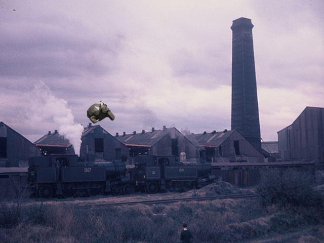

# Random Backgrounds



In this example we generate renderings of an object (Suzanne) and then paste them onto random background images,
randomizing position, orientation, material properties and lighting of the object. This is a naive way to generate data
for training classification, object detection and segmentation tasks. It is easy to implement and use but usually
leads to inferior results compared to renderings of objects in actual 3D scenes.

## Usage

Execute in the Blender-Pipeline main directory:

```
blenderproc run examples/advanced/random_backgrounds/main.py examples/advanced/random_backgrounds/object.ply examples/advanced/random_backgrounds/output
``` 

* `examples/advanced/random_backgrounds/main.py`: path to the main python file to run.
* `examples/advanced/random_backgrounds/object.ply`: path to the object file.
* `examples/advanced/random_backgrounds/output`: path to the output directory.

## Visualization

The rendered data can be found in the output directory.

## Implementation
Render transparent background to overlay the rendering on a random background image in the next step.
```python
# Enable transparency so the background becomes transparent
bproc.renderer.set_output_format(enable_transparency=True)
```

## Paste rendered images on random backgrounds

To paste the rendered images onto random backgrounds, we make use of the `paste_images_on_backgrounds.py` script. To do so, execute:

```
python examples/advanced/random_backgrounds/paste_images_on_backgrounds.py --images examples/advanced/random_backgrounds/output/coco_data/images --backgrounds path/to/background/images --overwrite
```

You need to provide a directory with random background images. A common choice are images from the VOC challenge or
ImageNet. We use the `--overwrite` flag to replace the rendered images with their version pasted on random backgrounds.
