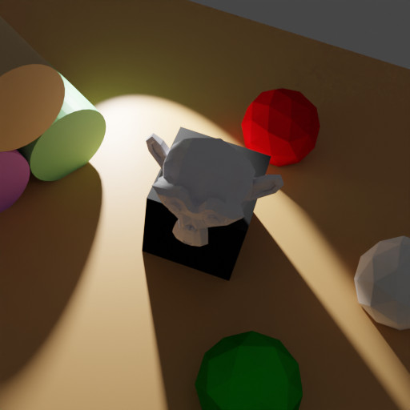

# Intersecting Spotlight Sampling


<p align="center">

</p>

In this example, a new spotlight is sampled in relationship to the sampled camera poses. This spotlight is outside 
the camera frustum but has to intersect with it, to ensure that the objects inside the camera frustum are illuminated. 

## Usage

Execute in the BlenderProc main directory:

```
blenderproc run examples/advanced/spotlight/main.py examples/resources/scene.obj examples/advanced/spotlight/output
```

* `examples/advanced/spotlight/main.py`: path to the python file.
* `examples/resources/scene.obj`: path to the object file with the basic scene.
* `examples/advanced/spotlight/output`: path to the output directory.

## Visualization

Visualize the generated data:

```
blenderproc vis hdf5 examples/advanced/spotlight/output/0.hdf5
```

## Steps

### Spotlight sampling

```python
# add a spotlight which intersect with the sampled camera poses
spot_light = bproc.lighting.add_intersecting_spot_lights_to_camera_poses(clip_start=7, clip_end=15)
```

A new spotlight will be sampled, which will have keyframe poses for each camera pose. The `clip_start` and `clip_end` 
value define the near and far clipping plane of the camera frustum, the interesting objects should lie inside this 
range.
