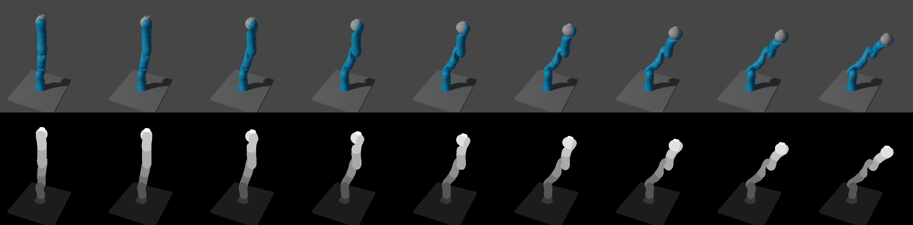

# URDF Robot Loading and Manipulation

---

<p align="center">

</p>

This example explains loading a robot from a urdf file and manipulating it.

## Usage

---

Execute in the BlenderProc main directory:

```
blenderproc run examples/advanced/urdf_loading_and_manipulation/main.py examples/resources/medical_robot/miro.urdf examples/advanced/urdf_loading_and_manipulation/output
```

* `examples/advanced/urdf_loading_and_manipulation/main.py`: path to the python file with pipeline configuration.
* `examples/resources/medical_robot/miro.urdf`: path to the URDF robot definition file.
* `examples/advanced/urdf_loading_and_manipulation/output`: path to the output directory.

Please note that the provided robot model in `examples/resources/medical_robot` is a reduced model in order to keep its size at minimum.

## Visualization

---

In the output folder you will find a series of `.hdf5` containers. These can be visualized with the script:

```
blenderproc vis hdf5 examples/advanced/urdf_loading_and_manipulation/output/*.hdf5
```

## Implementation

### Loading from an urdf file

```python
robot = bproc.loader.load_urdf(urdf_file=args.urdf_file)
```

This will return a bproc.types.URDFObject instance.

### Basic functions of the URDFObject class

```python
robot.remove_link_by_index(index=0)
robot.set_ascending_category_ids()
```

The URDFObject class provides some basic functions which might come in handy.
Here, we first hide all link, collision and inertial objects from rendering.
Then, we remove the first link as this often represents a basic plate where the robot stands on.
This automatically handles all respective parenting and transforms the child link to the current position (though without changing the rotation!).
Note that this would also allow us to shrink the robot by calling e.g. `robot.remove_link_by_index(5)` twice.
Depending on the relative transformations between the links this might not automatically produce a realistic representation.
Last but not least, we set ascending category ids to all links and their respective link objects.

### Rotation of links in forward kinematic mode

```python
robot.set_rotation_euler_fk(link=None, rotation_euler=0.2, mode='relative', frame=0)
robot.set_rotation_euler_fk(link=None, rotation_euler=0.2, mode='relative', frame=1)
robot.set_rotation_euler_fk(link=None, rotation_euler=0.2, mode='relative', frame=2)

robot.set_rotation_euler_fk(link=robot.links[4], rotation_euler=0., mode='absolute', frame=3)
```

Here we relatively permute all revolute links of the robot by 0.2 radians for three frames.
Depending on the constraints from the urdf file the rotation is only applied on one axis.
Then, the fourth joint is rotated to its original position again.

Note that since the robot class inherits from bpy.types.Entity, you can directly call `robot.set_location()` or
`robot.set_rotation_euler()` - this would manipulate the whole robot at once. Note that when manipulating links,
use the appropriate suffix to declare the mode in which you want to manipulate - here `_fk` for forwards kinematic mode.

### Moving in inverse kinematic mode

```python
robot.create_ik_bone_controller(link=robot.links[-1], relative_location=[0., 0., 0.2])
robot.set_location_ik(location=[0., 0., 0.8], frame=4)
robot.set_rotation_euler_ik(rotation_euler=[-1.57, 1.57, 0.], mode='absolute', frame=4)

if robot.has_reached_ik_pose(location_error=0.01, rotation_error=0.01):
    print("Robot has reached pose!")

for i in range(5, 10):
    robot.set_rotation_euler_ik(rotation_euler=[0., 0., 0.4], mode='relative', frame=i)
```

First, we need to set up a control bone that controls the motion in inverse kinematics mode. Here, the bone is set to
control the end effector of the robot, but you could set it to any other joint as well.
We further set location and rotation in inverse kinematics mode (note the suffix `_ik`).

Then, we check if the robot was able to reach the desired pose.

Last but not least, we perform a relative rotation around the current point of interest.

### Accessing joint poses and other poses

```python
print("Current joint poses:", robot.get_all_local2world_mats())
print("Current visual poses:", robot.get_all_visual_local2world_mats())
```

The URDFObject interface allows easy access on the poses of the joints themselves, but also on e.g. the poses of the
meshes. Here we simply print them after the last motion.

### Write link poses in BOP format

```python
bproc.writer.write_bop(os.path.join(args.output_dir, 'bop_data'),
                       target_objects = robot.links,
                       depths = data["depth"],
                       colors = data["colors"], 
                       m2mm = False,
                       calc_mask_info_coco=True)
```

The poses of the visual meshes of every robot link can be written using the BOPWriter.
We disable writing object masks, as this would require setting for each object a `model_path` custom property, which is not yet supported by the URDF loader.

## Preparing URDF files

This example relies on [urdfpy](https://github.com/wboerdijk/urdfpy).
Currently (v0.0.22) you might need to format your `model.urdf` file:
- Mesh file paths can be saved with a prefix `mesh://` before the relative file name. Please replace this with the absolute (or relative) file name to the mesh.
- Instead of
```xml
<transmission name="..." type="...">
```
please write
```xml
<transmission name="...">
  <type>...</type>
```

Also note that blenderproc does not support all types of object loading (see [bpy.loader.load_obj()](blenderproc/python/loader/ObjectLoader.py)).
