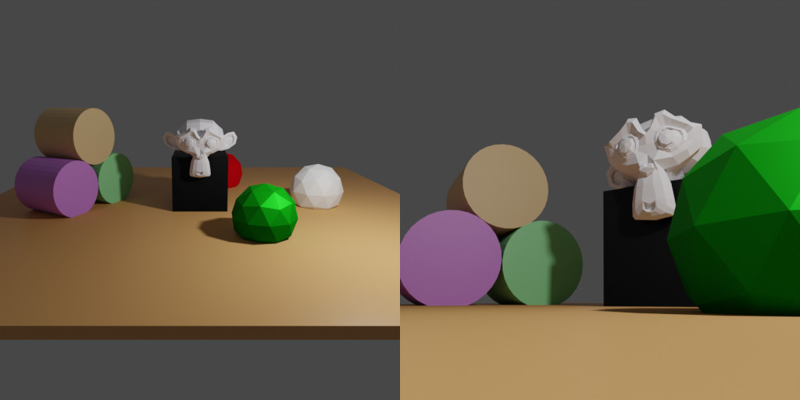

# Basic scene



In this example we demonstrate the basic functionality of BlenderProc.

## Usage

Execute in the BlenderProc main directory:

```
python run.py examples/basic/config.yaml examples/basic/camera_positions examples/basic/scene.obj examples/basic/output
```

* `examples/basic/config.yaml`: path to the configuration file with pipeline configuration.

The three arguments afterwards are used to fill placeholders like `<args:0>` inside this config file.
* `examples/basic/camera_positions`: text file with parameters of camera positions.
* `examples/basic/scene.obj`: path to the object file with the basic scene.
* `examples/basic/output`: path to the output directory.

## Visualization

Visualize the generated data:

```
python scripts/visHdf5Files.py examples/basic/output/0.hdf5
```

## Steps

* Loads `scene.obj`: `loader.ObjectLoader` module.
* Creates a point light : `lighting.LightLoader` module.
* Loads camera positions from `camera_positions`: `camera.CameraLoader` module.
* Renders normals: `renderer.NormalRenderer` module.
* Renders rgb: `renderer.RgbRenderer` module.
* Writes the output to .hdf5 containers: `writer.Hdf5Writer` module.

## Config file

### Setup

```yaml
  "setup": {
    "blender_install_path": "/home_local/<env:USER>/blender/",
    "pip": [
      "h5py"
    ]
  }
```

* blender is installed into `/home_local/<env:USER>/blender/` where `<env:USER>` is automatically replaced by the username.
* we want to use blender 2.8 (installation is done automatically on the first run).
* inside the blender python environment the python package `h5py` should be automatically installed. These are not provided per default, but are required in order to make the `writer.Hdf5Writer` module work.

### Global

```yaml
  "global": {
    "all": {
      "output_dir": "<args:2>"
    }
  }
```

* In the `global` section, we just specify the `output_dir` which defines where the final files should be stored.
* As this configuration is defined in `global/all`, it is inherited by all modules. This is equivalent to just putting the `output_dir` configuration into the `config` block of each single module.
* As we don't want to hardcode this path here, the `output_dir` is automatically replaced by the third argument given when running the pipeline. In the upper command the output path is set to `examples/basic/output`.

### Modules

Under `modules` we list all modules we want the pipeline to execute. The order also defines the order in which they are executed.
Every module has a name which specifies the python path to the corresponding class starting from the `src` directory and a `config` dict where we can configure the module to our needs.

#### Initializer

```yaml
 {
  "module": "main.Initializer",
  "config": {}
}
```

* This module does some basic initialization of the blender project (e.q. sets background color, configures computing device, creates camera).
* We are using the default parameters here, so `config` is empty.

#### ObjectLoader

```yaml
{
  "module": "loader.ObjectLoader",
  "config": {
    "path": "<args:1>"
  }
}
```

* This module imports an .obj file into the scene.
* The path of the .obj file should be configured via the parameter `path`.
* Here we are using the second argument given, in the upper command the output path is set to `examples/basic/scene.obj`.

#### LightLoader

```yaml
{
  "module": "lighting.LightLoader",
  "config": {
    "lights": [
      {
        "type": "POINT",
        "location": [5, -5, 5],
        "energy": 1000
      }
    ]
  }
}
```

* This module creates a point light.
* The properties of this light are configured via the parameter `lights`.

#### CameraLoader

```yaml
{
  "module": "camera.CameraLoader",
  "config": {
    "path": "<args:0>",
    "file_format": "location rotation/value",
    "default_cam_param": {
      "fov": 1
    }
  }
}
```

* This module imports the camera poses which defines from where the renderings should be taken.
* The camera positions are defined in a file whose path is again given via the command line (`examples/basic/camera_positions` - contains 2 cam poses).
* The file uses the following format which is defined at `file_format`.

```
location_x location_y location_z  rotation_euler_x rotation_euler_y rotation_euler_z
```

* The FOV is the same for all cameras and is therefore set inside `default_cam_param`.
* This module also writes the cam poses into extra `.npy` files located inside the `temp_dir` (default: /dev/shm/blender_proc_$pid). This is just some meta information, so we can later clearly say which image had been taken using which cam pose.

=> Creates the files `campose_0000.npy` and `campose_0001.npy` 

#### NormalRenderer

```yaml
{
  "module": "renderer.NormalRenderer",
  "config": {
      "output_key": "normals"
  }
}
```

* This module just goes through all cam poses which were defined in the previous model and renders a normal image for each of them
* The images are rendered using the `.exr` format which allows linear colorspace and higher precision
* The output files are stored in the defined output directory (see [Global](#Global)) and are named like `i.exr` where `i` is the cam pose index
* The `output_key` config is relevant for the last module, as it defines the key at which the normal rendering should be stored inside the `.hdf5` files.

=> Creates the files `normal_0000.exr` and `normal_0001.exr`.

#### RgbRenderer

```yaml
{
  "module": "renderer.RgbRenderer",
  "config": {
     "output_key": "colors",
     "samples": 350
  }
}
```

* This module just goes through all cam poses and renders a rgb image for each of them.
* In this case we increase the number of samples used for raytracing which increases the rendering quality.
* We again set the `output_key`, here to `colors`.

=> Creates the files `rgb_0001.png` and `rgb_0002.png`.

#### Hdf5Writer

```yaml
{
  "module": "writer.Hdf5Writer",
  "config": {
    "postprocessing_modules": {
      "depth": [
        {
          "module": "postprocessing.TrimRedundantChannels",
          "config": {}
        }
      ]
    }
  }
}
```

* The last module now merges all the single temporary files created by the two rendering modules into one `.hdf5` file per cam pose.
* A `.hdf5` file can be seen as a dict of numpy arrays, where the keys correspond to the `output_key` defined before.
* The module can also apply some post-processing routines based on two parameters, the `output_key` (in this case `depth`) and the post-processor module, which is in this case `postprocessing.TrimRedundantChannels.py`. This reduces the depth map from 3 channels to a single channel (the other channels exist for internal reasons). 


The file `0.h5py` would therefore look like the following:

```yaml
{
  "normals": #<numpy array with pixel values read in from normal_0000.exr>,
  "colors": #<numpy array with pixel values read in from rgb_0000.png>,
  "campose": #<numpy array with cam pose read in from campose_0000.npy>
}
``` 

* At the end of the hdf5 writer all temporary files are deleted.
* If you want to keep them, put `"output_is_temp": False` into the config of the corresponding module or in the `Global` section.

=> Creates the files `0.h5py` and `1.h5py`

## More examples

* [camera_sampling](../camera_sampling): Introduction to sampling for cameras.
* [light_sampling](../light_sampling): Introduction to sampling for lights.
