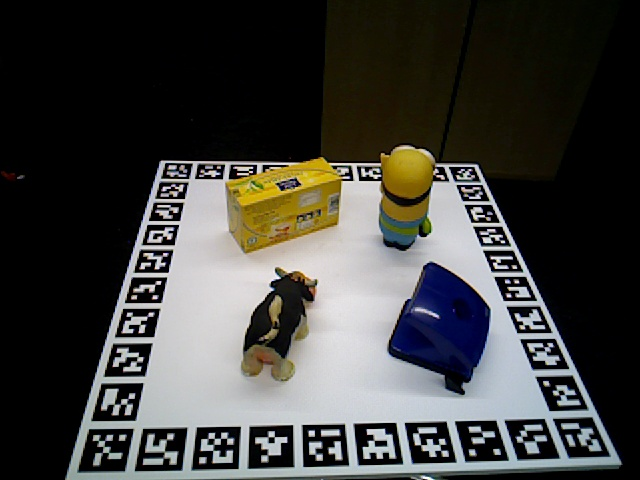

# Camera Object Pose Setting

<p align="center">


</p>

In this example we show how to load and render a 3D model in specified extrinsics and intrinsics with BlenderProc.

## Usage

Execute in the BlenderProc main directory:

```
blenderproc run examples/basics/camera_object_pose/main.py examples/basics/camera_object_pose/obj_000004.ply examples/basics/camera_object_pose/output
```

* `examples/basics/camera_object_pose/main.py`: path to the python file.

The arguments afterwards are used to fill placeholders like `<args:0>` inside this config file.
* `examples/basics/camera_object_pose/obj_000004.ply`: path to the model file, here a basic object from the `hb` dataset.
* `examples/basics/camera_object_pose/output`: path to the output directory.

## Steps

### Entity manipulation

```python
# Use vertex color for texturing
for mat in obj.get_materials():
    mat.map_vertex_color()
# Set pose of object via local-to-world transformation matrix
obj.set_local2world_mat(
    [[0.331458, -0.9415833, 0.05963787, -0.04474526765165741],
    [-0.6064861, -0.2610635, -0.7510136, 0.08970402424862098],
    [0.7227108, 0.2127592, -0.6575879, 0.6823395750305427],
    [0, 0, 0, 1.0]]
)
# Scale 3D model from mm to m
obj.set_scale([0.001, 0.001, 0.001])
# Set category id which will be used in the BopWriter
obj.set_cp("category_id", 1)
```

* Converts all materials to vertex color materials, where the vertex color of each loaded .ply object is directly used.
* Set the object pose `matrix_world` in meter
* `scale` the original model from mm to meter in every dimension. Note: Remove when object is already in meter! 
* Set a new custom property `"category_id"` to `1`, this one is later used by the `segmentation renderer`.

#### Camera setting

```python
# Set intrinsics via K matrix
bproc.camera.set_intrinsics_from_K_matrix(
    [[537.4799, 0.0, 318.8965],
     [0.0, 536.1447, 238.3781],
     [0.0, 0.0, 1.0]], 640, 480
)
# Set camera pose via cam-to-world transformation matrix
cam2world = np.array([
    [1, 0, 0, 0],
    [0, 1, 0, 0],
    [0, 0, 1, 0],
    [0, 0, 0, 1]
])
# Change coordinate frame of transformation matrix from OpenCV to Blender coordinates
cam2world = bproc.math.change_source_coordinate_frame_of_transformation_matrix(cam2world, ["X", "-Y", "-Z"])
bproc.camera.add_camera_pose(cam2world)
```

* The camera K matrix is set by calling `set_intriniscs_from_K_matrix`.
* The camera pose is defined by its world matrix, in this case it is just the identity.
* Change the camera source frame to match blender frame (this changes from OpenCV coordinate frame to blender's).
* Finally, add this new camera matrix to the pose, which should be rendered

#### Bop writer

```python
# render the whole pipeline
data = bproc.renderer.render()

# Write object poses, color and depth in bop format
bproc.writer.write_bop(args.output_dir, [obj], data["depth"], data["colors"], m2mm=True, append_to_existing_output=True)
```

* Saves all pose and camera information that is provided in BOP datasets.
* `"m2mm"` converts the pose to mm as in the original bop annotations. Set to False if you want it in meters.
* `"append_to_existing_output"` means that if the same output folder is chosen, data will be accumulated and not overwritten
