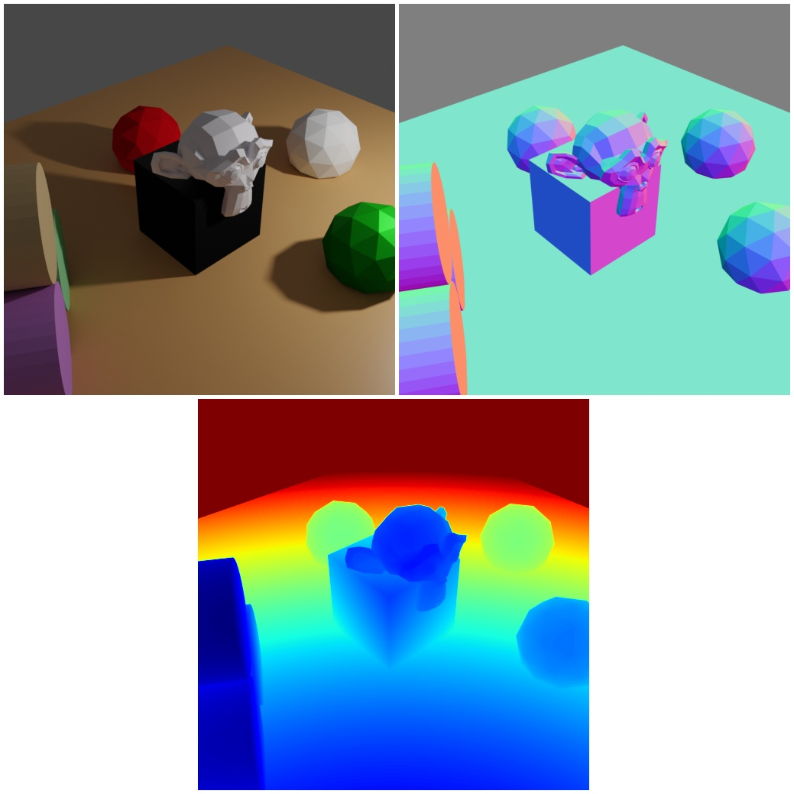

# Camera sampling


<p align="center">



</p>

In this example we are demonstrating the sampling features in relation to camera objects.

## Usage

Execute in the BlenderProc main directory:

```
blenderproc run examples/basics/camera_sampling/main.py examples/resources/scene.obj examples/basics/camera_sampling/output
```

* `examples/basics/camera_sampling/main.py`: path to the python file.
* `examples/resources/scene.obj`: path to the object file with the basic scene.
* `examples/basics/camera_sampling/output`: path to the output directory.

## Visualization

Visualize the generated data:

```
blenderproc vis hdf5 examples/basics/camera_sampling/output/0.hdf5
```

## Steps

### Camera sampling

```python
# Find point of interest, all cam poses should look towards it
poi = bproc.object.compute_poi(objs)
# Sample five camera poses
for i in range(5):
    # Sample random camera location above objects
    location = np.random.uniform([-10, -10, 8], [10, 10, 12])
    # Compute rotation based on vector going from location towards poi
    rotation_matrix = bproc.camera.rotation_from_forward_vec(poi - location, inplane_rot=np.random.uniform(-0.7854, 0.7854))
    # Add homog cam pose based on location an rotation
    cam2world_matrix = bproc.math.build_transformation_mat(location, rotation_matrix)
    bproc.camera.add_camera_pose(cam2world_matrix)
```

In this example, all camera poses are constrained to "look at" a point of interest (POI).

* Sample location uniformly in a bounding box above the plane.
* Set orientation of the camera such that it will always look at the POI at any given location. By using the `bproc.camera.rotation_from_forward_vec` fct.
* Optionally, add an `"inplane_rot"` value to rotate the camera around the optical axis. All values are in radians not in degree.
