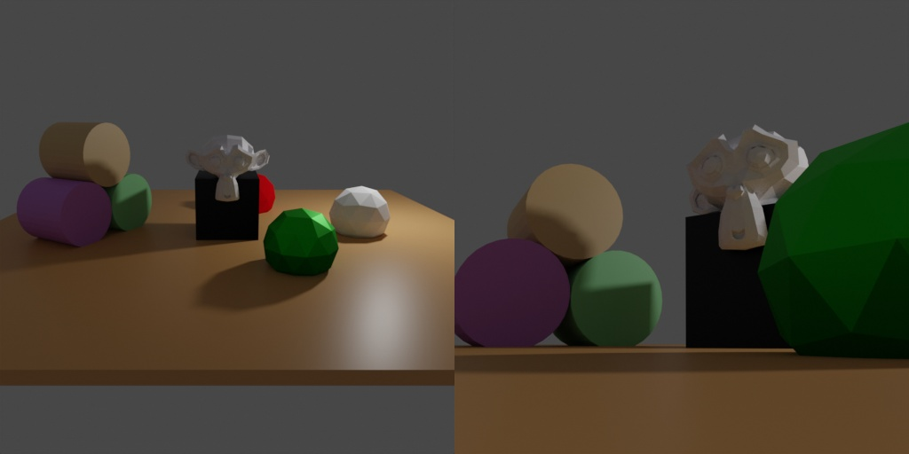

# Light sampling



In this example we are demonstrating the sampling features in relation to light objects.

## Usage

Execute in the BlenderProc main directory:

```
blenderproc run examples/basics/light_sampling/main.py examples/resources/camera_positions examples/resources/scene.obj examples/basics/light_sampling/output
```

* `examples/basics/light_sampling/main.py`: path to the python file.
* `examples/resources/camera_positions`: text file with parameters of camera positions.
* `examples/resources/scene.obj`: path to the object file with the basic scene.
* `examples/basics/light_sampling/output`: path to the output directory.

## Visualization

Visualize the generated data:

```
blenderproc vis hdf5 examples/basics/light_sampling/output/0.hdf5
```

## Steps

### Light sampling

```python
# Define a light
light = bproc.types.Light()
light.set_type("POINT")
# Sample its location in a shell around the point [1, 2, 3]
light.set_location(bproc.sampler.shell(
    center=[1, 2, 3],
    radius_min=4,
    radius_max=7,
    elevation_min=15,
    elevation_max=70
))
light.set_energy(500)
```

The focus of this example is the sampling of a location via the `sampler.shell` module which allows one to sample locations on a shell.

* Sample location in a spherical shell, by setting the center, the minimum and maximum radius and the minimum and maximum angle of elevation in degree.
* Set the light energy to 500
