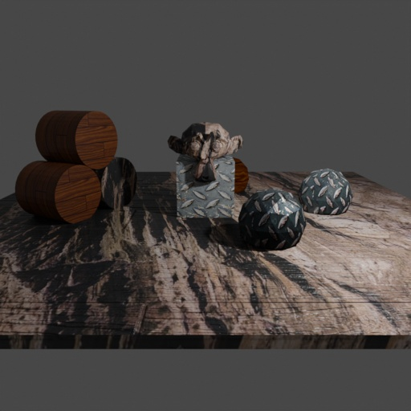

# Material selection and manipulation


<p align="center">

</p>


In this example we demonstrate how to select materials in the scene using `getter.Material` and then manipulate them using the `MaterialManipulator` module.

## Usage

Execute this in the BlenderProc main directory:

```
blenderproc run examples/basics/material_manipulation/main.py examples/basics/material_manipulation/scene.obj images examples/basics/material_manipulation/output
```

* `examples/basics/material_manipulation/main.py`: path to the python file.
* `examples/basics/material_manipulation/scene.obj`: path to the object file with the basic scene.
* `images`: path to a folder with .jpg textures to be used in the sampling process.
* `examples/basics/material_manipulation/output`: path to the output directory.

## Visualization

Visualize the generated data:

```
blenderproc vis hdf5 examples/basics/material_manipulation/output/0.hdf5
```

## Steps

### Material manipulation

```python
# Find all materials
materials = bproc.material.collect_all()

# Find the material of the ground object
ground_material = bproc.filter.one_by_attr(materials, "name", "Material.001")
# Set its displacement based on its base color texture
ground_material.set_displacement_from_principled_shader_value("Base Color", multiply_factor=1.5)
```

The focus of this example is the selection and adaption of a material.
* With the `filter.one_by_attr` we filter again for a certain material, for that we use all materials currently available.

All available material `attribute name`'s can be seen here: https://docs.blender.org/api/current/bpy.types.Material.html

We then link the input to the `Base Color` of the principled shader to the displacement output of the material and multiply with a given factor before that.
This value is used to scale the color input the texture up or down to increase or decrease the effect of the displacement.

<p align="center">

</p>

```python
# Collect all jpg images in the specified directory
images = list(Path(args.image_dir).rglob("material_manipulation_sample_texture*.jpg"))
for mat in materials:
    # Load one random image
    image = bpy.data.images.load(filepath=str(random.choice(images)))
    # Set it as base color of the current material
    mat.set_principled_shader_value("Base Color", image)
```

Finally, for all materials including the ground material a new image is loaded and selected as the `Base Color` input.
This means that the image which has been used for the displacement is now only used for the displacement and a new image is used for the color information.
This is the visible in the preview image at the top, that the displacement does not align with the texture of the object.

