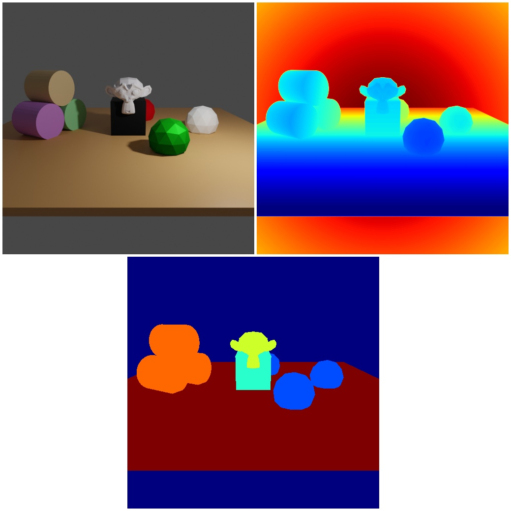
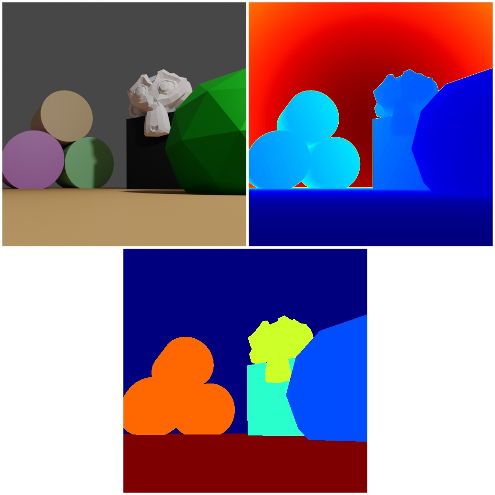

# Semantic Segmentation 

<p align="center">


</p>

The focus of this example is to introduce user to `renderer.SegMapRenderer` module, which generates semantic segmentations of scenes.

## Usage

Execute in the BlenderProc main directory:

```
blenderproc run examples/basics/semantic_segmentation/main.py examples/resources/camera_positions examples/basics/semantic_segmentation/scene.blend examples/basics/semantic_segmentation/output
```

* `examples/basics/semantic_segmentation/main.py`: path to the python file.
* `examples/resources/camera_positions`: text file with parameters of camera positions.
* `examples/basics/semantic_segmentation/scene.blend`: path to the blend file with the basic scene.
* `examples/basics/semantic_segmentation/output`: path to the output directory.

## Steps

### Blend loading

```python
# load the objects into the scene
objs = bproc.loader.load_blend(args.scene)
```

This loads the `.blend` file, it extracts hereby only the mesh objects from the file, not all information stored in this `.blend` file.

Be aware that in the loaded `.blend` file all objects already have set custom properties for the attribute name `"category_id"`.
This can be done manually by:

```python
obj.set_cp("category_id", 0)
```
### SegMapRenderer

```python
# enable segmentation masks (per class and per instance)
bproc.renderer.enable_segmentation_output(map_by=["category_id", "instance", "name"])
```

This module can map any kind of object related information to an image or to a list of indices of the objects in the scene.
So, if you want to map the custom property `category_id` to an image, you write `map_by=["category_id"]`.
Then each pixel gets assigned the custom property `category_id` of the object present in that pixel.
If it is set to `instance` each pixel gets an id for the obj number in the scene, these are consistent for several frames, which also means that not all ids must appear in each image.
It can also be set to different custom properties or attributes of the object class like: `"name"`, which returns the name of each object. 
This can not be saved in an image, so an extra dict is generated, which is attached to the `.hdf5` container in the end.
Where it maps each instance number to a name. 
If there are keys, which can not be stored in an image, it is necessary to also generate an instance image, else an error message will be thrown.

For example, it would also be possible to use the attribute: `"location"`. This would access the location of each object and add it to the dictionary.
Be aware that if the background is visible this will raise an error, as the background has no `location` attribute.
This can be avoided by providing a default value like: `default_values={"location: [0,0,0]}`.
