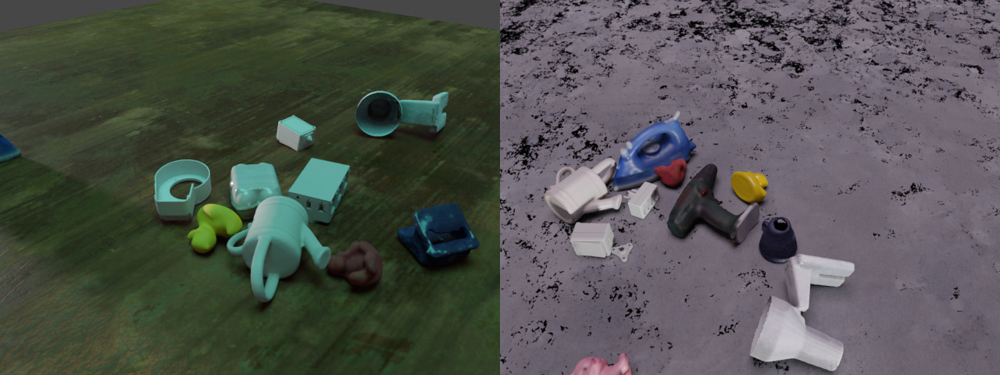

# BOP with object pose sampling and physics positioning



This example serves as the basis for generating the synthetic data provided at the BOP Challenge 2020. BOP objects from specified datasets are randomly chosen and dropped into an open cube with randomized PBR textures. Object material properties and light sources are also randomized. Samples cameras looking at objects. Outputs RGB, depth, segmentation masks, Coco annotations and object poses in BOP format.

## Usage

Execute in the BlenderProc main directory:

```
python scripts/download_cc_textures.py 
```


```
python run.py examples/bop_object_physics_positioning/config.yaml <path_to_bop_data> <bop_dataset_name> <path_to_bop_toolkit> resources/cctextures examples/bop_object_physics_positioning/output
``` 

* `examples/bop_object_physics_positioning/config.yaml`: path to the pipeline configuration file.
* `<path_to_bop_data>`: path to a folder containing BOP datasets.
* `<bop_dataset_name>`: name of BOP dataset.
* `<path_to_bop_toolkit>`: path to a bop_toolkit folder.
* `resources/cctextures`: path to CCTextures folder
* `examples/bop_object_physics_positioning/output`: path to an output folder.

## Visualization

Visualize the generated data if it is stored in a container.

```
python scripts/visHdf5Files.py examples/bop_object_physics_positioning/output/coco_data/0.hdf5
```

## Generate a dataset
To aggregate data and labels over multiple scenes, add the following 

```
"config": {
  "append_to_existing_output": True
}
```
to the configs of  
`writer.CocoAnnotationsWriter`   
`writer.Hdf5Writer`  
`writer.BopWriter`  
Then simply run the script multiple times.

## Steps

* Load T-LESS BOP models: `loader.BopLoader` module.
* Load ITODD BOP models: `loader.BopLoader` module.
* Load LM BOP models: `loader.BopLoader` module.
* Sample color for T-LESS and ITODD models: `materials.MaterialManipulator` module.
* Sample roughness and specular values for LM models: `materials.MaterialManipulator` module.
* Initialize two mesh planes: `constructor.BasicMeshInitializer` module.
* Set custom properties for those planes: `manipulators.EntityManipulator` module.
* Switch to an emission shader for one of those plane: `materials.MaterialManipulator` module.
* Load CCTexture materials: `loader.CCMaterialLoader` module.
* Sample a material for a second plane: `materials.MaterialRandomizer` module.
* Sample objects poses: `object.ObjectPoseSampler` module.
* Perform physics animation: `object.PhysicsPositioning` module.
* Sample light source pose: `lighting.LightSampler` module.
* Sample camera poses: `camera.CameraSampler` module.
* Render RGB: `renderer.RgbRenderer` module.
* Render segmentation: `renderer.SegMapRenderer` module.
* Write COCO annotations: `writer.CocoAnnotationsWriter` module.
* Write output to .hdf5 container: `writer.Hdf5Writer` module.
* Write BOP data: `writer.BopWriter` module.

## Config file

### BOP Loader

```yaml
    {
      "module": "loader.BopLoader",
      "config": {
        "bop_dataset_path": "<args:0>/tless",
        "model_type": "cad",
        "mm2m": True,
        "sample_objects": True,
        "amount_to_sample": 2,
        "add_properties": {
          "cp_physics": True
        }
      }
    },
    {
      "module": "loader.BopLoader",
      "config": {
        "bop_dataset_path": "<args:0>/itodd",
        "model_type": "",
        "mm2m": True,
        "sample_objects": True,
        "amount_to_sample": 2,
        "add_properties": {
          "cp_physics": True
        }
      }
    },
    {
      "module": "loader.BopLoader",
      "config": {
        "bop_dataset_path": "<args:0>/lm",
        "split": "val",
        "mm2m": True,
        "model_type": "",
        "sample_objects": True,
        "amount_to_sample": 8,
        "obj_instances_limit": 1,
        "add_properties": {
          "cp_physics": True
        }
      }
    },
```

* Here we are sampling BOP objects from 3 different datasets.
* We load 2 random objects from T-LESS and ITODD datasets, and 8 objects from LM dataset.
* Note `"obj_instances_limit": 1` parameter for LM data which dictates that each sampled object from this dataset must be unique in this scene, while this parameter is omitted for T-LESS and ITODD, which means that potentially those objects may have duplicates due to the process of sampling.
* Note that each loader loads the camera intrinsics and resolutions of each dataset, thus each subsequent `BopLoader` module overwrites these intrinsics. In this example, LM-dataset intrinsics are used when rendering. If required, they can be overwritten by setting `resolution_x / resolution_y / cam_K` in the camera or global config.

### Material Manipulator

```yaml
    {
      "module": "materials.MaterialManipulator",
      "config": {
        "selector": {
          "provider": "getter.Material",
          "conditions": [
          {
            "name": "bop_itodd_vertex_col_material.*"
          },
          {
            "name": "bop_tless_vertex_col_material.*"
          }
          ]
        },
        "cf_set_base_color": {
          "provider": "sampler.Color",
          "grey": True,
          "min": [0.25, 0.25, 0.25, 1],
          "max": [1, 1, 1, 1]
        }
      }
    },
    {
      "module": "materials.MaterialManipulator",
      "config": {
        "selector": {
          "provider": "getter.Material",
          "conditions": [
          {
            "name": "bop_itodd_vertex_col_material.*"
          },
          {
            "name": "bop_tless_vertex_col_material.*"
          },
          {
            "name": "bop_lm_vertex_col_material.*"
          }
          ]
        },
        "cf_set_specular": {
          "provider": "sampler.Value",
          "type": "float",
          "min": 0.1,
          "max": 1
        },
        "cf_set_roughness": {
          "provider": "sampler.Value",
          "type": "float",
          "min": 0.1,
          "max": 1
        }
      }
    },
```

* Sample RGBA color for T-LESS and ITODD object's materials using `sampler.Color` Provider.
* Sample `specular` and `roughness` values for object's materials from all datasets using `sampler.Value` Provider.

```yaml
    {
      "module": "materials.MaterialManipulator",
      "config": {
        "selector": {
          "provider": "getter.Material",
          "conditions": {
            "name": "light_plane_material"
          }
        },
        "cf_switch_to_emission_shader": {
          "color": {
            "provider": "sampler.Color",
            "min": [0, 0, 0, 1],
            "max": [1, 1, 1, 1]
          },
          "strength": {
            "provider": "sampler.Value",
            "type": "float",
            "min": 3,
            "max": 6
          }
        }
      }
    },
```

* For a default material of a light plane which was created during object's initialization, switch to a Emission shader and sample `color` and `strength` values of the emitted light.

### CC Material Loader

```yaml
    {
      "module": "loader.CCMaterialLoader",
      "config": {
        "folder_path": "<args:2>"
      }
    }
```

* Load CCMaterials.

### Material Randomizer

```yaml
    {
      "module": "materials.MaterialRandomizer",
      "config": {
        "randomization_level": 1,
        "mode": "once_for_all",
        "manipulated_objects": {
          "provider": "getter.Entity",
          "conditions": {
            "name": "ground_plane.*"
          }
        },
        "materials_to_replace_with": {
          "provider": "getter.Material",
          "conditions": {
            "cp_is_cc_texture": True
          }
        }
      }
    },
```

* Sample a CCTextures material once for all loaded ground_planes.

### Camera Sampler

```yaml
    {
      "module": "camera.CameraSampler",
      "config": {
        "cam_poses": [
        {          
          "proximity_checks": {
            "min": 0.3
          },
          "excluded_objs_in_proximity_check":  {
            "provider": "getter.Entity",
            "conditions": {
              "name": "ground_plane.*"
            }
          },
          "number_of_samples": 5,
          "location": {
            "provider": "sampler.Shell",
            "center": [0, 0, 0],
            "radius_min": 0.7,
            "radius_max": 1.3,
            "elevation_min": 10,
            "elevation_max": 89.9
          },
          "rotation": {
            "format": "look_at",
            "value": {
              "provider": "getter.Attribute",
              "entities": {
                "provider": "getter.Entity",
                "conditions": {
                  "cp_bop_dataset_name": "lm",
                }
              },
              "random_index": True,
              "get": "location"
            }
          }
        }
        ]
      }
    },
```

* Sample 5 camera poses, where camera's location is sampled using `sampler.Shell` Provider, and camera's rotation is based on the output of the `getter.Attribute` Provider.
* `getter.Attribute` Provider returns a `location` (`"get": "location"`) of a random object (`"random_index": True`) from the LM dataset (`"cp_bop_dataset_name": "lm"`).
* Camera poses undergo proximity checks (`"proximity_checks"`) with respect to all objects besides ground_plane (`"excluded_objs_in_proximity_check"`).

## More examples

* [bop_object_pose_sampling](../bop_object_pose_sampling): Sample BOP object and camera poses.
* [bop_scene_replication](../bop_scene_replication): Replicate the scenes and cameras from BOP datasets in simulation.
