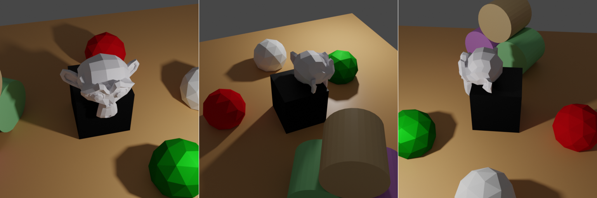

# Camera sampling



In this example we are demonstrating the sampling features in relation to camera objects.

## Usage

Execute in the BlenderProc main directory:

```
python run.py examples/camera_sampling/config.yaml examples/camera_sampling/scene.obj examples/camera_sampling/output
```

* `examples/camera_sampling/config.yaml`: path to the configuration file with pipeline configuration.
* `examples/camera_sampling/scene.obj`: path to the object file with the basic scene.
* `examples/camera_sampling/output`: path to the output directory.

## Visualization

Visualize the generated data:

```
python scripts/visHdf5Files.py examples/camera_sampling/output/0.hdf5
```

## Steps

* Loads `scene.obj`: `loader.ObjectLoader` module.
* Creates a point light: `lighting.LightLoader` module.
* Samples camera positions randomly above the plane looking to the point of interest: `camera.CameraSampler` module.
* Renders normals: `renderer.NormalRenderer` module.
* Renders rgb: `renderer.RgbRenderer` module.
* Writes the output to .hdf5 containers: `writer.Hdf5Writer` module.

## Config file

### Camera sampling

```yaml
{
  "module": "camera.CameraSampler",
  "config": {
    "cam_poses": [
      {
        "number_of_samples": 5,
        "location": {
          "provider":"sampler.Uniform3d",
          "max":[10, 10, 8],
          "min":[-10, -10, 12]
        },
        "rotation": {
          "format": "look_at",
          "value": {
            "provider": "getter.POI"
          }
        }
      }
    ]
  }
},
```

The focus of this example is `camera.CameraSampler` module which allows one to sample random camera positions. 
In this example we are doing it in such a way that all camera positions always "look" towards the point of interest (POI).

* Sample location uniformly in a bounding box above the plane.

Note that for this we are using [sampler.Uniform3d](../../src/provider/sampler) Provider which is not a part of a module, but a useful tool for introducing some "controlled randomness" into the process.
To call a sampler for some attribute of a camera, specify a name (`provider`) of a desired sampler and define some input arguments for it, e.g. `min` and `max`.
Sampler returns a value based on these input parameters specified in the config file, check the documentation for the samplers for more information on the input arguments, output formats, etc.

* Set orientation of the camera such that it will always look at the POI in any pose.

Note that here we are using a [getter.POI](../../src/provider/getter) Provider which is just as like a `sampler.Uniform3d`, but without any "randomness" inside.
They also have a well-defined config structure, but `getter.POI`, for example, has no input arguments since it's output is fully dependent on the current state of the objects in the scene.
The POI is calculated from the position of all objects.
 
## More examples

* [light_sampling](../light_sampling): More on sampling for lights.
* [entity_manipulation](../entity_manipulation): More on the true power of Providers.
