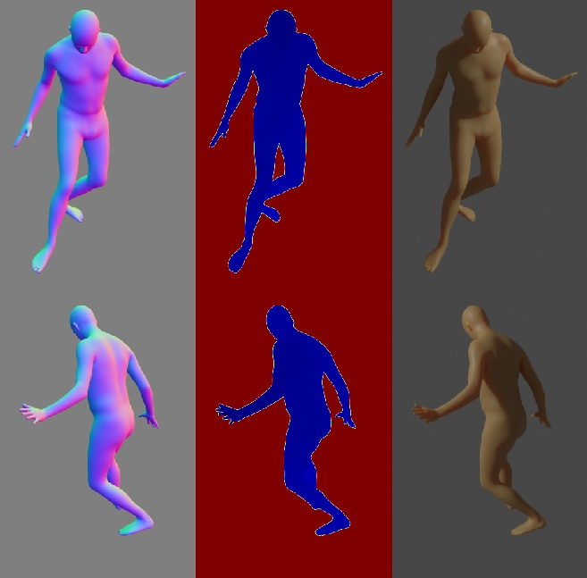
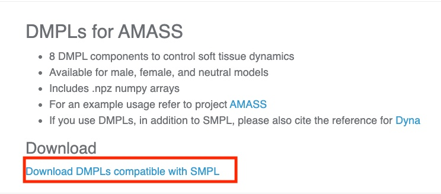
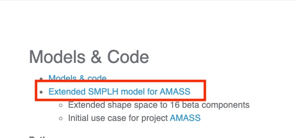
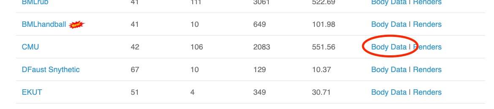

# AMASS Dataset
<p align="center">

</p>

AMASS (Archive of Motion Capture as Surface Shapes) is a large database of human motion unifying different optical marker-based motion capture datasets by representing them within a common framework and parameterization. AMASS is readily useful for generating training data for deep learning.

## Get The Dataset
As you are required to agree to the Use Of Terms for this dataset, we can not provide a download script.

However, we will give you a step by step explanation on how to get access.

1. Visit the following websites and sign up as user after you agree to the terms of use on all of them separately. The first corresponds to the dataset and the other two to the parametric model to generate the mesh.
	1. `https://amass.is.tue.mpg.de/`
	2. `https://mano.is.tue.mpg.de/`
	3. `https://smpl.is.tue.mpg.de/`
2. Wait till you receive the confirmation vie e-mail, once you confirm your account you can access the download sections.
3. download the following files which represent the body models and extract them inside folder `resources/AMASS/body_models`
	1. from `https://smpl.is.tue.mpg.de/downloads` download the following file 
	2. from `https://mano.is.tue.mpg.de/downloads` download the following file  
4. Explore the collection of motion capture dataset that are supported by AMASS and choose the motion capture dataset and motion sequence that you want to generate a pose from. For now, we only provide support for CMU motion capture dataset *(we're planning to support the rest of the datasets in the near future)*, so you have to choose a pose from the variety of poses that could be extracted from this dataset.
	1. For example, after exploring different motion sequences in CMU mocap dataset, we are now interested in generating a body pose, where a person kicks a ball. (You can explore all motion sequences categories for CMU dataset through the dataset website `http://mocap.cs.cmu.edu/search.php?subjectnumber=%&motion=%`. Go to the website and select all motion tab to see different motions)
	2. From the different motion categories available there, we are interested in the "kick soccer ball" category (note it is listed as subject # 10, we need this number among other identifiers to identify the pose.)
5. On the AMASS download page `https://amass.is.tue.mpg.de/dataset` many different motion capture dataset are listed, choose the one you are interested in to generate a pose from and download the body data. For example, we choose here the CMU motion capture dataset to download.
	 
	Download the dataset and extract it under the `resources/AMASS` folder.
6. In the end the structure of the `resource/AMASS` folder should be as following. This might mean you need to create some folders or move some data: 

```shell
- resources
    - AMASS
        - body_models
            - dmpls  
                - female  
                - LICENSE.txt  
                - male  
                - neutral
            - smplh
                - female  
                - LICENSE.txt  
                - info.txt
                - male  
                - neutral
        - CMU
            - CMU 
                - 01
                  ...
                - 144
        - taxonomy.json
```

## Usage
Execute in the BlenderProc main directory:

```shell
blenderproc run examples/datasets/amass_human_poses/main.py resources/AMASS examples/datasets/amass_human_poses/output
```

* `examples/datasets/amass_human_poses/main.py`: path to the python file with pipeline configuration.
* `resources/AMASS`: path to the AMASS Dataset folder in resources folder.
* `examples/datasets/amass_human_poses/output`: path to the output directory.

## Visualization

In the output folder you will find multiple `.hdf5` files. These can be visualized with the script:

```shell
blenderproc vis hdf5 examples/datasets/amass_human_poses/output/*.hdf5
```

## Steps

* AMASSLoader first checks the taxonomy.json file for the currently supported datasets.
* Loads the body parameters for the selected pose from the dataset.
* Loads the parametric body model from the downloaded body models.
* Feed the pose parameters inside the parametric model and generate a mesh equivalent to the selected pose.
* Define a light and set its location and energy level.
* Find point of interest, all cam poses should look towards it: `bproc.object.compute_poi()`.
* Sample random camera location around the objects: `bproc.sampler.sphere()`.
* Adds camera pose to the scene: `bproc.camera.add_camera_pose()`.
* Enables normals and depth (rgb is enabled by default): `bproc.renderer.enable_normals_output()` `bproc.renderer.enable_depth_output()`.
* Renders all set camera poses: `bproc.renderer.render()`.
* Writes the output to .hdf5 containers: `bproc.writer.write_hdf5()`.

## Python file (main.py)

### AMASSLoader

```python
objs = bproc.loader.load_AMASS(
    args.amass_dir,
    sub_dataset_id="CMU",
    body_model_gender="male",
    subject_id="10",
    sequence_id=1,
    frame_id=600
)
```

* `sub_dataset_id` : one of the motion capture datasets included inside the AMASS dataset, the name is exactly equivalent to the names mentioned in the download page of the AMASS dataset https://amass.is.tue.mpg.de/dataset **Note: only the CMU motion capture dataset is currently supported by the AMASSLoader**
* `body_model_gender` : select gender of the model that will represent the selected pose. Available options are: `[male, female, neutral]`
* `subject_id` : represents the category of the motion, which type of motion the pose will be extracted from. This refers to every motion capture dataset included in AMASS dataset to see the set of supported motion categories. For the CMU dataset, you can have a look on the different supported motion categories on their website [http://mocap.cs.cmu.edu/search.php?subjectnumber=%&motion=%](http://mocap.cs.cmu.edu/search.php?subjectnumber=%&motion=%) and configure the number equivalent to the category id. *For this example, we are interested in the "kick soccer ball" category, so we chose the subject_id to be `10`.*
* `sequence_id` : every category has more than one sequence of people performing the same motion using different scenarios. Hint: You can watch the videos on the original dataset website to select a a specific sequence or you can just leave the default value which is `1`.
* `frame_id` : which frame in the sequence contains the represented pose. This parameter id dependents on the length of the sequence and the fps in which the motion is recorded. Usually you can obtain the length of the sequence and fps values from the dataset website or leave it blank and the loader will choose a random pose.

### CameraSampler

```python
# Find point of interest, all cam poses should look towards it
poi = bproc.object.compute_poi(objs
for i in range(5):
    # Sample random camera location around the objects
    location = bproc.sampler.sphere([0, 0, 0], radius=3, mode="SURFACE")
    # Compute rotation based on vector going from location towards poi
    rotation_matrix = bproc.camera.rotation_from_forward_vec(poi - location)
    # Add homog cam pose based on location an rotation
    cam2world_matrix = bproc.math.build_transformation_mat(location, rotation_matrix)
    bproc.camera.add_camera_pose(cam2world_matrix
```

We sample here five random camera poses, where the location is on a sphere with a radius of 3 around the object. 
Each cameras rotation is such that it looks directly at the object and the camera faces upwards in Z direction.
