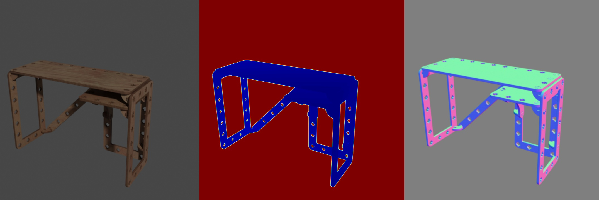

# BlenderKit 
<p align="center">

</p>

The example demonstrates using `loader.BlendLoader` to load the .blend files downloaded from [BlenderKit](https://www.blenderkit.com/).

A script to download the .blend files is provided in the [scripts folder](../../scripts).

## Usage

Execute in the BlenderProc main directory:

```shell
blenderproc run examples/datasets/blenderkit/main.py <PATH_TO_.BLEND_FILE> examples/datasets/blenderkit/output
``` 

* `examples/datasets/blenderkit/main.py`: path to the python file with pipeline configuration.
* `<PATH_TO_.BLEND_FILE>`: path to the downloaded .blend file, see the [scripts folder](../../scripts) for the download script. 
* `examples/datasets/blenderkit/output`: path to the output directory.

## Visualization

In the output folder you will find a series of `.hdf5` containers. These can be visualized with the script:

```shell
blenderproc vis hdf5 examples/datasets/blenderkit/output/*.hdf5
``` 

## Steps

* The BlendLoader loads assets from blend file specified in the main.py file.
* Define a light and set its location and energy level.
* Find point of interest, all cam poses should look towards it: `bproc.object.compute_poi()`.
* Sample random camera location around the objects: `bproc.sampler.sphere()`.
* Adds camera pose to the scene: `bproc.camera.add_camera_pose()`.
* Enables normals and depth (rgb is enabled by default): `bproc.renderer.enable_normals_output()` `bproc.renderer.enable_depth_output()`.
* Renders all set camera poses: `bproc.renderer.render()`.
* Writes the output to .hdf5 containers: `bproc.writer.write_hdf5()`

## Python file (main.py)

### BlendLoader 

```python
objs = bproc.loader.load_blend(path)
```
This loads a BLEND file resource and needs the relative path of the .blend file model you want to load, which should be specified under `path` attribute in the loader section above. <br>
Per default this will load all mesh objects from the given .blend file. By using the parameters `obj_types` and `datablocks`, also other data and object types can be loaded.

### CameraSampler

```python
# Find point of interest, all cam poses should look towards it
poi = bproc.object.compute_poi(bproc.filter.all_with_type(objs, bproc.types.MeshObject))

# Sample five camera poses
for i in range(5):
    # Sample random camera location around the objects
    location = bproc.sampler.part_sphere([0, 0, 0], radius=2.5, part_sphere_dir_vector=[1, 0, 0], mode="SURFACE")
    # Compute rotation based on vector going from location towards poi
    rotation_matrix = bproc.camera.rotation_from_forward_vec(poi - location)
    # Add homog cam pose based on location an rotation
    cam2world_matrix = bproc.math.build_transformation_mat(location, rotation_matrix)
    bproc.camera.add_camera_pose(cam2world_matrix
```

For sampling camera poses we used the ``bproc.sampler.part_sphere`` which uses only the upper half of the sphere cut along the x-axis (defined by `part_sphere_vector`). 
The center of the sphere is moved in z-direction and camera positions are sampled from the upper hemisphere to ensure that their view is not "below" the object, which is specifically important for tables.   
Each camera rotation is computed to look directly at a sampled point of interest ``POI`` of the object, and the camera faces upwards in Z direction.
