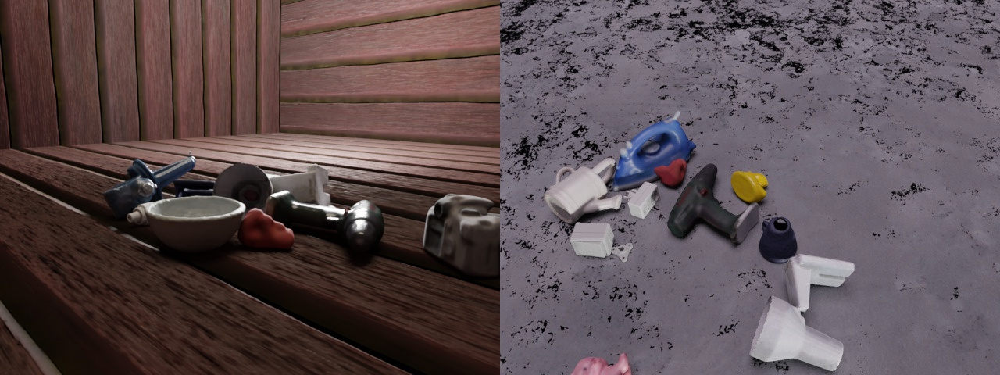

# BOP with object pose sampling and physics positioning



This example serves as the basis for generating the synthetic data provided at the BOP Challenge 2020. BOP objects from specified datasets are randomly chosen and dropped into an open cube with randomized PBR textures. Object material properties and light sources are also randomized. Samples cameras looking at objects. Outputs RGB, depth, segmentation masks, Coco annotations and object poses in BOP format.

## Usage

Make sure that you downloaded the [BOP datasets](https://bop.felk.cvut.cz/datasets/).

Execute in the BlenderProc main directory:

```
blenderproc download cc_textures 
```

```
blenderproc run examples/datasets/bop_object_physics_positioning/main.py
              <path_to_bop_data>
              <bop_dataset_name>
              resources/cctextures 
              examples/datasets/bop_object_physics_positioning/output
``` 

* `examples/datasets/bop_object_physics_positioning/main.py`: path to the python file with pipeline configuration.
* `<path_to_bop_data>`: path to a folder containing BOP datasets
* `<bop_dataset_name>`: name of BOP dataset for which ground truth should be saved, e.g. ycbv
* `resources/cctextures`: path to CCTextures folder
* `examples/datasets/bop_object_physics_positioning/output`: path to an output folder

## Generate a dataset
To aggregate data and labels over multiple scenes, simply run the script multiple times using the same command. As data is saved in chunks of 1000 images, you can easily distribute the data generation by running the scripts on different machines/servers and then collecting all chunks.

## Steps

* Load T-LESS BOP models: `bproc.loader.load_bop_objs()`.
* Load LM BOP models: `bproc.loader.load_bop_objs`.
* Load `<args:1>` (YCB-V) BOP models: `bproc.loader.load_bop_objs`.
* Sample colors for T-LESS models: `mat.set_principled_shader_value()`.
* Sample roughness and specular values for all objects: `mat.set_principled_shader_value()`.
* Construct planes: `bproc.object.create_primiative()`.
* Switch to a light emission shader for the top plane.
* Load CCTexture materials: `bproc.loader.load_ccmaterials()`.
* Sample a material for the other planes: `plane.replace_materials()`.
* Sample objects poses: `bproc.object.sample_poses()`.
* Perform physics simulation: `bproc.object.simulate_physics_and_fix_final_poses()`.
* Sample upright objects poses on surface.
* Sample point light source.
* Sample camera poses `bproc.add_camera_pose()`.
* Render RGB and depth: `bproc.renderer`.
* Write BOP data: `bproc.writer.write_bop`.


## Python file (main.py)

### BOP Loader

```python
# load distractor bop objects
distractor_bop_objs = bproc.loader.load_bop(bop_dataset_path = os.path.join(args.bop_parent_path, 'tless'),
                                     model_type = 'cad',
                                     mm2m = True,
                                     sample_objects = True,
                                     num_of_objs_to_sample = 3)
```
```python
distractor_bop_objs += bproc.loader.load_bop(bop_dataset_path = os.path.join(args.bop_parent_path, 'lm'),
                                      mm2m = True,
                                      sample_objects = True,
                                      num_of_objs_to_sample = 3)
```
```python
# load a random sample of bop objects into the scene
sampled_bop_objs = bproc.loader.load_bop(bop_dataset_path = os.path.join(args.bop_parent_path, args.bop_dataset_name),
                                         mm2m = True,
                                         sample_objects = True,
                                         num_of_objs_to_sample = 10)
                                         
bproc.loader.load_bop_intrinsics(bop_dataset_path = os.path.join(args.bop_parent_path, args.bop_dataset_name))                                     
```

* Here we are sampling BOP objects from 3 different datasets.
* We load 3 random objects from LM and T-LESS datasets, and 10 objects from the dataset given by `"<args:1>"` (e.g. ycbv in this case).
* `"obj.set_shading_mode('auto')"` sets the shading for these corresponding objects to auto smoothing. This looks more realistic for meshes that have both sharp edges and curved surfaces like in YCB-V.
* In this example, `args.bop_dataset_name`(ycbv) dataset intrinsics are used when rendering by `bproc.loader.load_bop_intrinsics()`


### Material Manipulator

```python
# set shading and physics properties and randomize PBR materials
for j, obj in enumerate(sampled_bop_objs + distractor_bop_objs):
    obj.set_shading_mode('auto')
        
    mat = obj.get_materials()[0]
    if obj.get_cp("bop_dataset_name") in ['itodd', 'tless']:
        grey_col = np.random.uniform(0.3, 0.9)   
        mat.set_principled_shader_value("Base Color", [grey_col, grey_col, grey_col, 1])        
    mat.set_principled_shader_value("Roughness", np.random.uniform(0, 1.0))
    mat.set_principled_shader_value("Specular", np.random.uniform(0, 1.0))
```

* Sample grey colors for T-LESS object's materials using `mat.set_principled_shader_value()` function.
* Sample `specular` and `roughness` values for object's materials from all datasets using `mat.set_principled_shader_value()` function.


### Basic Mesh Initializer

```python
room_planes = [bproc.object.create_primitive('PLANE', scale=[2, 2, 1]),
               bproc.object.create_primitive('PLANE', scale=[2, 2, 1], location=[0, -2, 2], rotation=[-1.570796, 0, 0]),
               bproc.object.create_primitive('PLANE', scale=[2, 2, 1], location=[0, 2, 2], rotation=[1.570796, 0, 0]),
               bproc.object.create_primitive('PLANE', scale=[2, 2, 1], location=[2, 0, 2], rotation=[0, -1.570796, 0]),
               bproc.object.create_primitive('PLANE', scale=[2, 2, 1], location=[-2, 0, 2], rotation=[0, 1.570796, 0])]
for plane in room_planes:
    plane.enable_rigidbody(False, collision_shape='BOX', friction = 100.0, linear_damping = 0.99, angular_damping = 0.99)
```

* Construct minimal 4m x 4m x 4m room from 6 planes
* Set `"cp_physics": False` to fix the planes during any simulations
* Give ground planes a BOX collision shape since they behave better.

### Material Manipulator

```python
light_plane = bproc.object.create_primitive('PLANE', scale=[3, 3, 1], location=[0, 0, 10])
light_plane.set_name('light_plane')
light_plane_material = bproc.material.create('light_material')
light_plane_material.make_emissive(emission_strength=np.random.uniform(3,6), 
                                   emission_color=np.random.uniform([0.5, 0.5, 0.5, 1.0], [1.0, 1.0, 1.0, 1.0]))    
light_plane.replace_materials(light_plane_material)
```

* For the top light plane, switch to an Emission shader and sample `emision_color` and `emission_strength` values of the emitted light.

### CCMaterial Loader 

```python
cc_textures = bproc.loader.load_ccmaterials(args.cc_textures_path)
random_cc_texture = np.random.choice(cc_textures)
```

* Load a random CC0Texture that was downloaded from https://cc0textures.com/

### Entity Manipulator
```python
for plane in room_planes:
    plane.replace_materials(random_cc_texture)
```

* Sample a CCTextures material once for all loaded ground_planes.

### Object Pose Sampler

```python
# Define a function that samples 6-DoF poses
def sample_pose_func(obj: bproc.types.MeshObject):
    min = np.random.uniform([-0.3, -0.3, 0.0], [-0.2, -0.2, 0.0])
    max = np.random.uniform([0.2, 0.2, 0.4], [0.3, 0.3, 0.6])
    obj.set_location(np.random.uniform(min, max))
    obj.set_rotation_euler(bproc.sampler.uniformSO3())

bproc.object.sample_poses(objects_to_sample = sampled_bop_objs + distractor_bop_objs,
                        sample_pose_func = sample_pose_func, 
                        max_tries = 1000)
```

* Samples initial object poses before applying physics
* For all `"objects_to_sample"`, i.e. with `"cp_physics": True`, uniformly sample a position in the specified range and a uniform SO3 rotation. Resamples if collisions occur.

### Physics Positioning

```python
bproc.object.simulate_physics_and_fix_final_poses(min_simulation_time=3,
                                                max_simulation_time=10,
                                                check_object_interval=1,
                                                substeps_per_frame = 20,
                                                solver_iters=25)
```

* Performs physics simuluation, i.e. dropping objects on the floor.
* `"min_simulation_time", "max_simulation_time"` in seconds
* `"check_object_interval"` after which objects are checked to stand still  
* `"solver_iters": 25` increase if physics glitches occur.
* `"substeps_per_frame": 20` increase if physics glitches occur.

### Light Sampler

```python
light_point = bproc.types.Light()
light_point.set_energy(200)
light_point.set_color(np.random.uniform([0.5,0.5,0.5],[1,1,1]))
location = bproc.sampler.shell(center = [0, 0, 0], radius_min = 1, radius_max = 1.5,
                        elevation_min = 5, elevation_max = 89, uniform_volume = False)
light_point.set_location(location)
```

* Samples an additional point light source (next to ceiling) in a `"bproc.sampler.shell"` around the origin. 

### Camera Sampler

```python
poses = 0
while poses < 10:
    # Sample location
    location = bproc.sampler.shell(center = [0, 0, 0],
                            radius_min = 0.61,
                            radius_max = 1.24,
                            elevation_min = 5,
                            elevation_max = 89,
                            uniform_volume = False)
    # Determine point of interest in scene as the object closest to the mean of a subset of objects
    poi = bproc.object.compute_poi(np.random.choice(sampled_bop_objs, size=10))
    # Compute rotation based on vector going from location towards poi
    rotation_matrix = bproc.camera.rotation_from_forward_vec(poi - location, inplane_rot=np.random.uniform(-0.7854, 0.7854))
    # Add homog cam pose based on location an rotation
    cam2world_matrix = bproc.math.build_transformation_mat(location, rotation_matrix)
    
    # Check that obstacles are at least 0.3 meter away from the camera and make sure the view interesting enough
    if bproc.camera.perform_obstacle_in_view_check(cam2world_matrix, {"min": 0.3}, bop_bvh_tree):
        # Persist camera pose
        bproc.camera.add_camera_pose(cam2world_matrix)
        poses += 1
```

* Samples `"poses": 10` camera poses, where the camera location is sampled using a `bproc.sampler.shell` Provider with `"uniform_elevation"` sampling. 
* The camera rotation is defined by a point of interest (`"poi"`) plus a sampled `"inplane_rot"` in the specified range.
* The `"poi"` is defined by the object closest to the mean position of all objects that are returned by the `"brpoc.object.compute_poi"` function, i.e. `"size": 10` objects from the target BOP dataset.
* Camera poses undergo `"obstacle_in_view_checks"` with respect to all objects besides ground_plane (`"excluded_objs_in_proximity_check"`) to ensure that no objects are closer than `"min": 0.3` meters.

### Rgb Renderer

```python
bproc.renderer.enable_depth_output(activate_antialiasing=False)
```
* Renders an RGB image and also outputs a depth images. 

### Bop Writer

```python
bproc.writer.write_bop(os.path.join(args.output_dir, 'bop_data'),
                       dataset = args.bop_dataset_name,
                       depths = data["depth"], 
                       colors = data["colors"], 
                       color_file_format = "JPEG",
                       ignore_dist_thres = 10)
```

* Saves all pose and camera information that is provided in BOP datasets.
* Only considers objects from the given `"dataset": "<args:1>"`
* Saves the images as jpg

## More examples

* [bop_object_pose_sampling](../bop_object_pose_sampling/README.md): Sample BOP object and camera poses.
* [bop_scene_replication](../bop_scene_replication/README.md): Replicate the scenes and cameras from BOP datasets in simulation.
* [bop_object_on_surface_sampling](../bop_object_on_surface_sampling/README.md): Sample upright poses on plane and randomize materials
