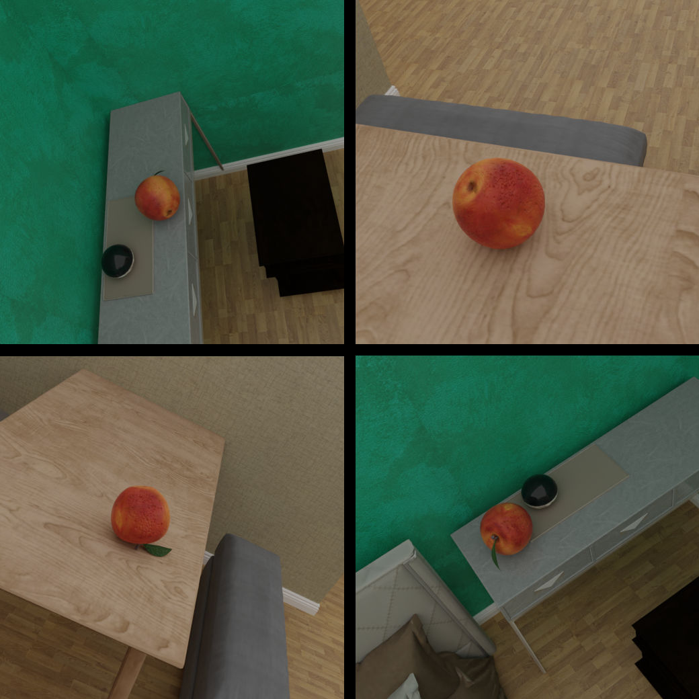

# Sampling objects in the 3D Front Dataset

<p align="center">

</p>

In this example, we explain to you how to sample specific objects in the 3D-Front Dataset with the BlenderProc pipeline.
What's special is, that we select the surface object beforehand and that the sampled object is placed directly on the surface of a table for example. 
This is an advanced example, make sure that you have executed the basic examples before proceeding to this one.

## Get the 3D-Front dataset

Please have a look at our description [here](https://github.com/DLR-RM/BlenderProc/tree/main/examples/datasets/front_3d).

## Get the sampling object

We used an apple, downloaded from [here](https://www.cgtrader.com/free-3d-models/food/fruit/apple-1).

## Usage

Execute in the BlenderProc main directory:

```
blenderproc run examples/datasets/front_3d_object_sampling/main.py {PATH_TO_3D-Front-Json-File} {PATH_TO_3D-Future} {PATH_TO_3D-Front-texture} {PATH_TO_3d_object} examples/datasets/front_3d/output 
```

* `examples/datasets/front_3d/main.py`: path to the python file with pipeline configuration.

* `PATH_TO_3D-Front-Json-File`: path to the 3D-Front json file. For the example pictures we used: "036bc96c-419d-4a43-812e-1e533d95dfd3.json" 
* `PATH_TO_3D-Future`: path to the folder where all 3D-Future objects are stored 
* `PATH_TO_3D-Front-texture`: path to the folder where all 3D-Front textures are stored 
* `PATH_TO_3D-Object`: path to the downloaded 3D object, get it [here](https://www.cgtrader.com/free-3d-models/food/fruit/apple-1) 
* `examples/datasets/front_3d_object_sampling/output`: path to the output directory

## Visualization

Visualize the generated data:

```
blenderproc vis hdf5 examples/datasets/front_3d_object_sampling/output/0.hdf5
```

## Steps

* Loads the `.json` file: `bproc.loader.load_front3d`. It creates the rooms and also adds emission shaders to the ceiling and lamps.
* Select the surfaces, where the objects should be sampled on: `bproc.object.slice_faces_with_normals()`.
* Load the object, which should be sampled on the surface: `bproc.loader.load_blend()`.
* Sample the object on the surface: `bproc.object.sample_poses_on_surface()`.
* Run the physics simulation: `bproc.object.simulate_physics_and_fix_final_poses`.
* Check if the objects are still on the surface.
* Adds camera pose to the scene: `bproc.camera.add_camera_pose()`. 
* Renders all set camera poses: `bproc.renderer.render()`.
* Writes the output to .hdf5 containers: `bproc.writer.write_hdf5()`.


## Python file (main.py)

#### Front3DObjectSelection 

```python
# Select the objects, where other objects should be sampled on
for obj in room_objs:
    if "table" in obj.get_name().lower() or "desk" in obj.get_name().lower():
        left_objects.append(obj)
for obj in left_objects:
    # The loop starts with and UndoAfterExecution in order to restore the camera positions for each object
    with bproc.utility.UndoAfterExecution():
        # Select the surfaces, where the object should be sampled on
        droppable_surface = bproc.object.slice_faces_with_normals(obj)
```

* Specify with objects to use to sample on. In this case, it's "table" and "desk".
* Then for each of those objects, the biggest surface is selected (e. g. top of the table) for sampling.


#### Front3DObjectSampling 

```python
surface_height_z = np.mean(surface_obj.get_bound_box(), axis=0)[2]
        def sample_pose(obj: bproc.types.MeshObject):
            # Sample the spheres location above the surface
            obj.set_location(bproc.sampler.upper_region(
                objects_to_sample_on=[surface_obj],
                min_height=1,
                max_height=4,
                use_ray_trace_check=False
            ))
            #Randomized rotation of the sampled object
            obj.set_rotation_euler(np.random.uniform([0, 0, 0], [np.pi * 2, np.pi * 2, np.pi * 2]))

dropped_object_list = bproc.object.sample_poses_on_surface(sampling_obj, surface_obj, sample_pose,
                                                                   min_distance=0.1, max_distance=10,
                                                                   check_all_bb_corners_over_surface=False)
```

* Get the height of the sampling surface
* For every surface, the object is placed by `bproc.object.sample_poses_on_surface`.
* This also needs a pre-defined `sample_pose()` function, where the sampling surface, as well as the minimum and maximum sampling height, are given.
* It also sets the rotation of the sampled object.

#### Front3DObjectSamplingChecks

```python
    # get the minimum value of all eight corners and from that the Z value
    min_coord_z = np.min(dropped_object.get_bound_box(local_coords=False), axis=0)[2]
    # Check if object is on surface, otherwise delete object
    remove_list = []
    for index, dropped_object in enumerate(dropped_object_list):
        # if distance is smaller than 5 cm
        print(f"Object: {dropped_object.get_name()} has a diff of: {abs(min_coord_z - surface_height_z)}m to the surface")
        if abs(min_coord_z - surface_height_z) > 0.05:
            print("Delete this object, distance is above 0.05m")
            dropped_object.delete()
            remove_list.append(index)
```

* After running the physics we have to check if the sampled object is still on the surface.