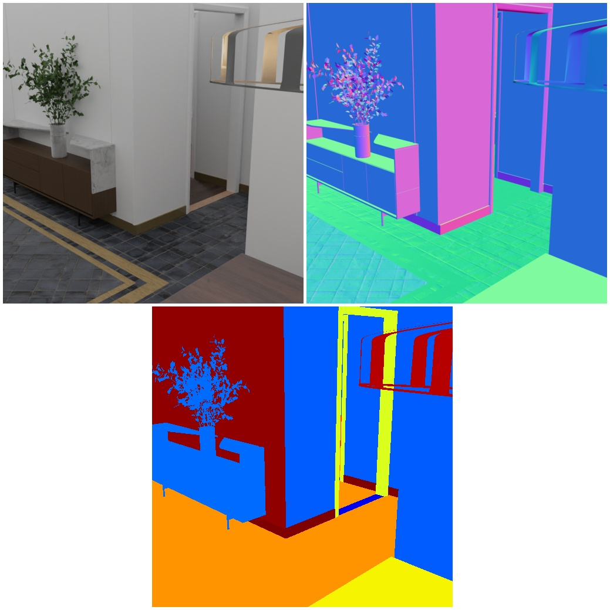
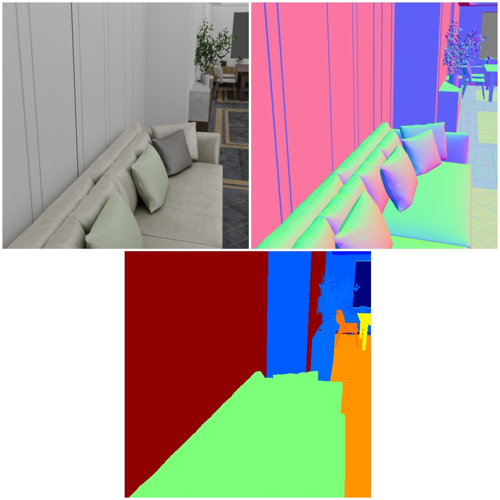

# 3D Front Dataset with improved mat 

<p align="center">


</p>

In this example we explain to you how to use the 3D-Front Dataset with the BlenderProc pipeline in combination with the CCMaterialLoader.
This is an advanced example, make sure that you have executed the basic examples before proceeding to this one, especially the `front_3d` example.
It is also necessary to download the textures from cc_textures, we provide a script [here](../../scripts/download_cc_textures.py).

## Usage

Execute in the BlenderProc main directory:

```
blenderproc run examples/datasets/front_3d_with_improved_mat/main.py {PATH_TO_3D-Front-Json-File} {PATH_TO_3D-Future} {PATH_TO_3D-Front-texture} resources/cctextures examples/datasets/front_3d_with_improved_mat/output  
```

* `examples/datasets/front_3d_with_improved_mat/main.py`: path to the python file with pipeline configuration.

The three arguments afterwards are used to fill placeholders like `<args:0>` inside this python file.
* `PATH_TO_3D-Front-Json-File`: path to the 3D-Front json file 
* `PATH_TO_3D-Future`: path to the folder where all 3D-Future objects are stored 
* `PATH_TO_3D-Front-texture`: path to the folder where all 3D-Front textures are stored 
* `resources/cctextures`: path to the cc texture folder
* `examples/datasets/front_3d_with_improved_mat/output`: path to the output directory

## Visualization

Visualize the generated data:

```
blenderproc vis hdf5 examples/datasets/front_3d_with_improved_mat/output/0.hdf5
```

## Steps

* Loads the `.json` file: `bproc.loader.load_front3d`. It creates the rooms and also adds emission shaders to the ceiling and lamps.
* Adds camera pose to the scene: `bproc.camera.add_camera_pose()`.
* Loading the cc material: `bproc.loader.load_ccmaterials()`.
* The material is filtered: `bproc.filter.by_attr()`.
* Several material Randomizers are used to replace the floor, baseboards and walls materials with cc materials.
* Enables normals and depth (rgb is enabled by default): `bproc.renderer.enable_normals_output()` `bproc.renderer.enable_depth_output()`.
* Renders all set camera poses: `bproc.renderer.render()`.
* Writes the output to .hdf5 containers: `bproc.writer.write_hdf5()`.


## Python file (main.py)

#### CCMaterialLoader

```python
cc_materials = bproc.loader.load_ccmaterials(args.cc_material_path, ["Bricks", "Wood", "Carpet", "Tile", "Marble"])
```

The `folder_path` if the script was used, should be `"resources/cctextures"`
This loads the assets which names contain a string listed in `"used_assets"`.
These will be later used to replace the materials in the 3D-Front scenes.

#### Entity Manipulator

```python
floors = bproc.filter.by_attr(loaded_objects, "name", "Floor.*", regex=True)
for floor in floors:
    # For each material of the object
    for i in range(len(floor.get_materials())):
        # In 95% of all cases
        if np.random.uniform(0, 1) <= 0.95:
            # Replace the material with a random one
            floor.set_material(i, random.choice(cc_materials))
```

This is one of the manipulators which swaps the materials of the selected objects, with the materials which are used to replace them.
It will replace 95% of all materials of object, which are selected via the `bproc.filter.by_attr()`. 

A further example is: 

```python
walls = bproc.filter.by_attr(loaded_objects, "name", "Wall.*", regex=True)
marble_materials = bproc.filter.by_cp(cc_materials, "asset_name", "Marble.*", regex=True)
for wall in walls:
    # For each material of the object
    for i in range(len(wall.get_materials())):
        # In 50% of all cases
        if np.random.uniform(0, 1) <= 0.1:
            # Replace the material with a random one
            wall.set_material(i, random.choice(marble_materials))
```

Here the materials of all walls are replaced, but instead of using all loaded materials only the cc materials, whose names start with `"Marble"`.
Also pay attention that only 10% of all materials are replaced, to not over load the rooms with marble.
