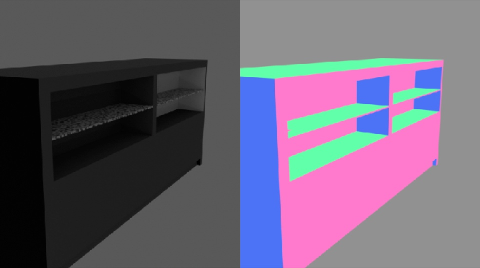

# IKEA 
<p align="center">

</p>

The focus of this example is the `bproc.loader.load_ikea()`, which can be used to load objects from the [IKEA dataset](http://ikea.csail.mit.edu/).
The IKEA dataset consists of 218 3D models of IKEA furniture collected from Google 3D Warehouse. <br>
If you use this dataset please cite

```
@article{lpt2013ikea,
   title={{Parsing IKEA Objects: Fine Pose Estimation}},
   author={Joseph J. Lim and Hamed Pirsiavash and Antonio Torralba},
   journal={ICCV},
   year={2013}
}
```

A script to download the .obj files is provided in the [scripts folder](../../scripts).

## Usage

Execute in the BlenderProc main directory:

```shell
blenderproc run examples/datasets/ikea/main.py <PATH_TO_IKEA> examples/datasets/ikea/output
``` 

* `examples/datasets/ikea/main.py`: path to the python file with pipeline configuration.
* `<PATH_TO_IKEA>`: path to the downloaded IKEA dataset, see the [scripts folder](../../scripts) for the download script. 
* `examples/datasets/ikea/output`: path to the output directory.

## Visualization

In the output folder you will find a series of `.hdf5` containers. These can be visualized with the script:

```shell
blenderproc vis hdf5 examples/datasets/ikea/output/*.hdf5
``` 

## Steps

* The IKEALoader loads all the object paths with the type and style specified in the python file.
* If there are multiple options it picks one randomly or if the style or the type is not specified it picks one randomly.
* The selected object is loaded.  
 

## Python file (main.py)

### IKEALoader 

```python
# Load IKEA objects from type table into the scene
objs = bproc.loader.load_ikea(args.ikea_path, obj_categories="table")
```
This loads an IKEA Object, it only needs the path to the directory of the dataset, which is saved in `data_dir`. <br>
The `obj_categories` = `table` means an object of type 'table' will be loaded. <br>
If `obj_style` is not set or = `null` means the object does not have to belong to a specific IKEA product series (e.g. HEMNES)

### CameraSampler

```python
# Find point of interest, all cam poses should look towards it
poi = bproc.object.compute_poi(objs)
# Sample five camera poses
for i in range(5):
    # Sample random camera location around the object
    location = bproc.sampler.part_sphere([0, 0, 0], radius=2.5, part_sphere_dir_vector=[1, 0, 0], mode="SURFACE")
    # Compute rotation based on vector going from location towards poi
    rotation_matrix = bproc.camera.rotation_from_forward_vec(poi - location)
    # Add homog cam pose based on location an rotation
    cam2world_matrix = bproc.math.build_transformation_mat(location, rotation_matrix)
    bproc.camera.add_camera_pose(cam2world_matrix)
```
For sampling camera poses we used the ``bproc.sampler.part_sphere()`` which uses only the upper half of the sphere cut along the x-axis (defined by `part_sphere_vector`). 
The center of the sphere is moved in z-direction and camera positions are sampled from the upper hemisphere to ensure that their view is not "below" the object, which is specifically important for tables.   
Each camera rotation is computed to look directly at a sampled point of interest ``POI`` of the object, and the camera faces upwards in Z direction.
