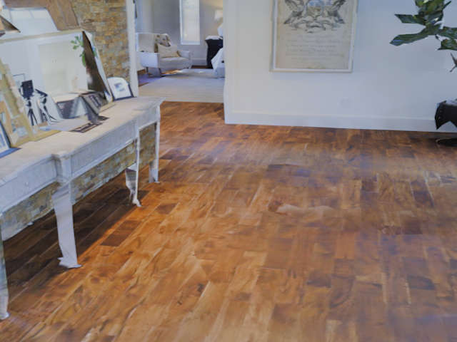

# Matterport3D 

<p align="center">

</p>
The focus of this example is the `loader.Matterport3D`, which can be used to load objects from the Matterport3D dataset.

We provide a general script to download the `.obj` files. However, before this can be used, one has to agree to the Terms of Use. See this page for the agreement: https://niessner.github.io/Matterport/.

After the people behind Matterport3D accept your form, they will send you an e-mail that contains two files. 

1.`download_mp.py` file
2. `scans.txt` file

Download both files and save them onto your disc. You will need both of them for the download. Then you can execute the download:

```shell
blenderproc download matterport3d <PATH_TO_DOWNLOAD_MP_FILE> <PATH_TO_SCANS_TXT_FILE> <MATTERPORT3D_FOLDER_PATH> 
```

## Usage

Execute in the BlenderProc main directory:

```
blenderproc run examples/datasets/matterport3d/main.py <MATTERPORT3D_FOLDER_PATH> examples/datasets/matterport3d/output
``` 

* `examples/datasets/matterport3d/main.py`: path to the python file with pipeline configuration.
* `<MATTERPORT3D_FOLDER_PATH>`: path to the downloaded Matterport3D dataset
* `examples/datasets/matterport3d/output`: path to the output directory.

## Visualization

In the output folder you will find a series of `.hdf5` containers. These can be visualized with the script:

```
blenderproc vis hdf5 examples/datasets/matterport3d/output/*.hdf5
``` 

## Steps

* The `Matterport3DLoader` loads the objects, which are stored in this one `.obj` file, the function automatically separates the floor from the object.
 
## Python file (main.py)

### Matterport3DLoader 

```python
# Load a random Matterport3D room
objects, floor = bproc.loader.load_matterport3d(args.matterport3d_data)
```

This loads the Matterport3D data object, specified via the `matterport3d_data`. 
There are no `category_id` set for the objects, as these are not contained in the `.obj` files.
The floor object returned by the function is used in the camera sampling portion to find good spots for camera poses.

### CameraSampler

```python
# Init bvh tree containing all mesh objects
bvh_tree = bproc.object.create_bvh_tree_multi_objects([objects, floor])

poses = 0
for try_counter in range(10000):
    location = bproc.sampler.upper_region([floor], min_height=1.5, max_height=1.8)
    # Check that there is no object between the sampled point and the floor
    _, _, _, _, hit_object, _ = bproc.object.scene_ray_cast(location, [0, 0, -1])
    if hit_object != floor:
        continue

    # Sample rotation (fix around X and Y axis)
    rotation = np.random.uniform([1.2217, 0, 0], [1.2217, 0, 2 * np.pi])
    cam2world_matrix = bproc.math.build_transformation_mat(location, rotation)

    # Check that there is no obstacle in front of the camera closer than 1m
    if not bproc.camera.perform_obstacle_in_view_check(cam2world_matrix, {"min": 1.0, "no_background": True},
                                                       bvh_tree, sqrt_number_of_rays=20):
        continue

    # If all checks were passed, add the camera pose
    bproc.camera.add_camera_pose(cam2world_matrix)
    poses += 1
    if poses == 5:
        break
```

We sample here five random camera poses, where the location is above the object floor.
So all cameras will be sampled above the floor, with a certain height.
In the end, we perform a check that the sampled pose is directly above a floor and not an object.

Be aware that it might be possible, if the values are too high, that the CameraSampler will try for a very long time new poses to fulfill the given conditions.
Best is always to check with low values and then increasing them until they don't work anymore.
