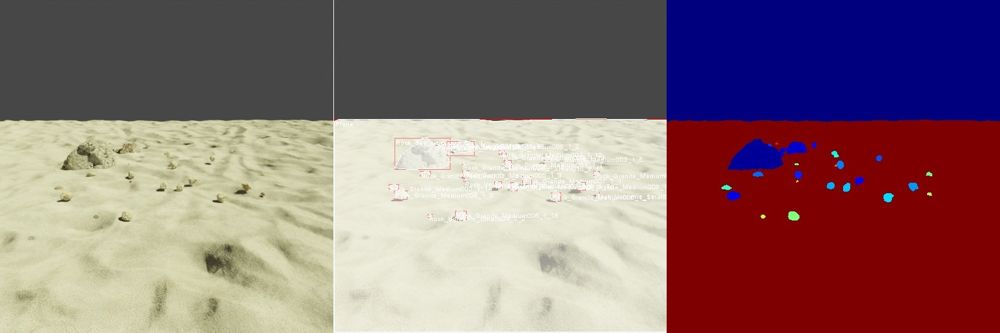

# Rock Essentials Dataset



The focus of this example is the `loader.RockEssentialsRockLoader`, `constructor.RockEssentialsGroundConstructor`, and `materials.RockEssentialsTextureSampler` modules that allow us to load models and textures from the [Rock Essentials](https://blendermarket.com/products/the-rock-essentials) (RE) dataset.

## Usage

Execute in the BlenderProc main directory:

```
blenderpoc run examples/datasets/rock_essentials/config.yaml <re_dataset> examples/datasets/rock_essentials/output
``` 

* `examples/datasets/rock_essentials/config.yaml`: path to the configuration file with pipeline configuration.
* `<re_dataset>`: path to the downloaded Rock Essentials dataset 
* `examples/datasets/rock_essentials/output`: path to the output directory.

## Visualization

In the output folder you will find a `coco_data/` folder with a `coco_annotations.json` file and a series of rgb images. Note, that due to the configuration of `global` section of the config, output of multiple consecutive BlenderProc runs will be appended.

## Steps

* Loads 4 batches of RE rocks: `loader.RockEssentialsRockLoader` module.
* Constructs a blank ground tile wirh RE material: `constructor.RockEssentialsGroundConstructor` module.
* Samples a texture for a ground's plane material: `materials.RockEssentialsTextureSampler` module.
* Samples positions on the ground plane for large rocks: `manipulators.EntityManipulator` module.
* Sample positions for rocks: `object.ObjectPoseSampler` module.
* Samples camera positions: `camera.CameraSampler` module.
* Creates a Sun light: `lighting.LightLoader` module.
* Runs the physics simulation: `object.PhysicsPositioning` module.
* Displaces a ground plane up: `manipulators.EntityManipulator` module.
* Renders rgb: `renderer.RgbRenderer` module.
* Renders instance segmentation: `renderer.SegMapRenderer` module.
* Writes coco annotations: `writer.CocoAnnotationsWriter` module.

## Config file

### Global

```yaml
{
    "module": "main.Initializer",
    "config": {
      "global": {
        "output_dir": "<args:1>",
        "append_to_existing_output": True
      }
    }
}
```

`"append_to_existing_output": True` conditions all the modules (e.g. `writer.CocoAnnotationsWriter`) to append it's output to the existing output of the pipeline. It is useful when generating a coco annotation data for training.

### Rock Essentials Rock Loader

```yaml
{
  "module": "loader.RockEssentialsRockLoader",
  "config": {
    "batches": [
    {
      "path": "<args:0>/Rock Essentials/Individual Rocks/Sea/Rocks_Sea_Large.blend",
      "objects": ['Rock_Sea_Large001','Rock_Sea_Large003'],
      "physics": False,
      "render_levels": 2,
      "high_detail_mode": True
    },
    {
      "path": "<args:0>/Rock Essentials/Individual Rocks/Granite/Rocks_Granite_Medium.blend",
      "amount": 10,
      "physics": True,
      "render_levels": 2,
      "high_detail_mode": False,
      "scale": [1.5, 1.5, 1.5]
    },
    {
      "path": "<args:0>/Rock Essentials/Individual Rocks/Desert/Rocks_Desert_Medium.blend",
      "amount": 15,
      "physics": True,
      "render_levels": 2,
      "high_detail_mode": False,
      "scale": [1.5, 1.5, 1.5]
    },
    {
      "path": "<args:0>/Rock Essentials/Individual Rocks/Forest/Rocks_Forest_Large.blend",
      "objects": ['Rock_Forest_Large002', 'Rock_Forest_Large012'],
      "physics": False,
      "render_levels": 2,
      "high_detail_mode": False
    }
    ]
  }
}
```

This module allows us to integrate the RE's models into our dataset.
In `batches` we are specifying batches of rocks to load by defining:
* `path` to the .blend file with the models,
* `amount` of rocks or the names (`objects`) to load, (or both to have multiple selected rocks loaded)
* the `physics` state of the rocks of this batch,
* number of subdivisions (`render_levels`) to perform while rendering,
* scaling factor for X,Y,Z dimensions of rocks, HSV values, toggle HDM when possible, etc.

### Rock Essentials Ground Constructor

```yaml
{
  "module": "constructor.RockEssentialsGroundConstructor",
  "config": {
    "add_properties":{
      "cp_category_id": 2
    },
    "tiles": [
    {
      "shader_path": "<args:0>/Rock Essentials/Individual Rocks/Volcanic/Rocks_Volcanic_Small.blend",
      "plane_scale": [50, 50, 1],
      "subdivision_cuts": 30,
      "subdivision_render_levels": 2,
      "tile_name": "Gr_Plane_1"
    }
    ]
  }
}
```

In `tiles` we are defining a settings of one or multiple ground tiles by specifying:
* `cp_category_id` set category for segmap and coco annotations, as a custom property
* `shader_path` for a ground plane,
* scale of the plane `plane_scale`,
* `subdivision_cuts` and `subdivision_render_levels` to perform on a ground plane,
* and  a tile name.

### Rock Essentials Texture Sampler

```yaml
{
  "module": "materials.RockEssentialsTextureSampler",
  "config": {
    "selector": {
      "provider": "getter.Entity",
      "conditions": {
        "name": "Gr_Plane.*",
        "type": "MESH"
      }
    },
    "textures": [
    {
      "path": "<args:0>/Rock Essentials/Ground Textures/Pebbles/RDTGravel001/",
      "uv_scaling": 9,
      "displacement_strength": 0.7,
      "ambient_occlusion": [0.5, 0.5, 0.5, 1],
      "images": {
        "color": "RDTGravel001_COL_VAR1_3K.jpg",
        "roughness": "RDTGravel001_GLOSS_3K.jpg",
        "reflection": "RDTGravel001_REFL_3K.jpg",
        "normal": "RDTGravel001_NRM_3K.jpg",
        "displacement": "RDTGravel001_DISP16_3K.tif"
      }
    },
    ]
  }
}
```

This module allows us to set a texture for selected ground planes which have a RE specific material which is set by `constructor.RockEssentialsGroundConstructor` (or sampled if more than one texture is defined) by specifying:
* `selector` for selecting the ground planes created by the ground constructor by specifying the name in the `conditions`,
* one or multiple `textures`,
* `path` to a texture maps folder, `uv_scaling` for the maps `displacements_strength` of the displacements modifier, ambient_occlusion parameter of the shader, and at least a `color` map file name.

### Physics Positioning

```yaml
{
  "module": "object.PhysicsPositioning",
  "config": {
    "min_simulation_time": 2,
    "max_simulation_time": 5,
    "check_object_interval": 1,
    "solver_iters": 25,
    "substeps_per_frame": 40
  }
}
```

Sometimes small objects that are `"physics": True` (just like rocks) can bug through the plane which is `"physics": True` (just like our ground plane) during the animation.
To counter this, we are setting two new parameters to `object.PhysicsPositioning` module:
* `"solver_iters"`: Number of constraint solver iterations made per simulation step.
* `"substeps_per_frame"`: Number of simulation steps taken per frame. 

Which usually helps.
