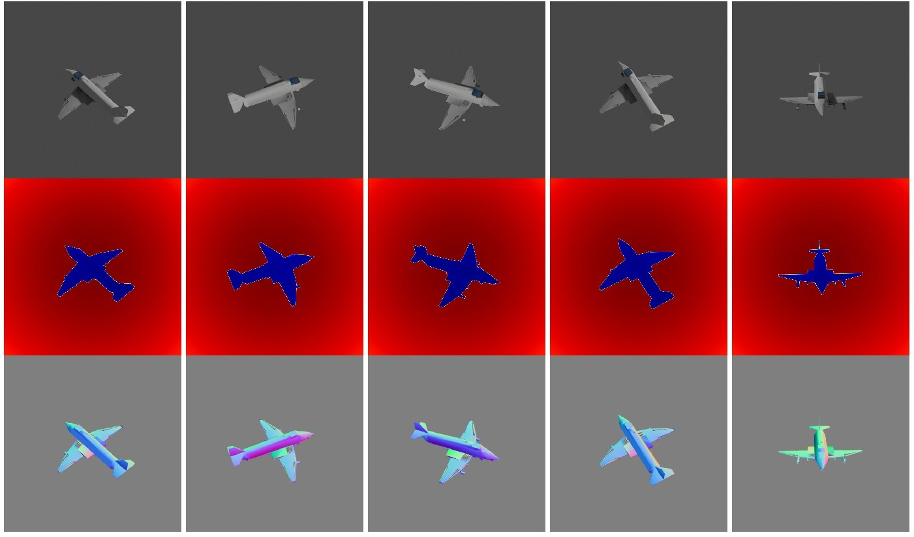

<p align="center">

</p>

The focus of this example is the `bproc.loader.load_shapenet()`, which can be used to load objects from the ShapeNet dataset.

See the [ShapeNet Webpage](http://www.shapenet.org/) for downloading the data. We cannot provide the script for downloading the ShapeNet dataset because a user account on the ShapeNet webpage is needed.

## Usage

Execute in the BlenderProc main directory:

```
blenderproc run examples/datasets/shapenet/main.py <PATH_TO_ShapeNetCore.v2> examples/datasets/shapenet/output
``` 

* `examples/datasets/shapenet/main.py`: path to the python file with pipeline configuration.
* `<PATH_TO_ShapeNetCore.v2>`: path to the downloaded shape net core v2 dataset, get it [here](http://www.shapenet.org/) 
* `examples/datasets/shapenet/output`: path to the output directory.

## Visualization

In the output folder you will find a series of `.hdf5` containers. These can be visualized with the script:

```
blenderproc vis hdf5 examples/datasets/shapenet/output/*.hdf5
``` 

## Steps

* Set the ShapeNet category as specified with `bproc.loader.load_shapenet()`.
* Sample camera poses `bproc.camera`.
* Render RGB, Depth and Normal images `bproc.renderer`.
* Collect the metadata of the ShapeNet object.
* Collect Camera Pose and Instrinsics data.
* Write HDF5 file: `bproc.writer.write_hdf5()`.

 
## Python file (main.py)

### Global

```python
bproc.init()
```

The same as in the basic example.

### ShapeNetLoader 

```python
shapenet_obj = bproc.loader.load_shapenet(args.shapenet_path, used_synset_id="02691156", used_source_id="10155655850468db78d106ce0a280f87")
```

* This loads a ShapeNet Object, it only needs the path to the `ShapeNetCore.v2` folder, which is saved in `args.shapenet_path`.
* The `used_synset_id` = `02691156` is set to the id of an airplane, and the `used_source_id` = `10155655850468db78d106ce0a280f87` selects one particular object of that category.
* The position will be in the center of the scene.
* By default, the object center will be moved to the bottom of the bounding box in Z direction and also in the middle of the X and Y plane which makes it easier to place them later on. This does not change the `.location` of the object. To disable this behaviour, set the `move_object_origin` flag to `False`.


### CameraSampler

```python
for i in range(5):
    # Sample random camera location around the object
    location = bproc.sampler.sphere([0, 0, 0], radius=2, mode="SURFACE")
    # Compute rotation based on vector going from location towards the location of the ShapeNet object
    rotation_matrix = bproc.camera.rotation_from_forward_vec(shapenet_obj.get_location() - location)
    # Add homog cam pose based on location an rotation
    cam2world_matrix = bproc.math.build_transformation_mat(location, rotation_matrix)
    bproc.camera.add_camera_pose(cam2world_matrix)
```

We sample here five random camera poses, where the location is on a sphere with a radius of 2 around the object. 
Each cameras rotation is such that it looks directly at the object and the camera faces upwards in Z direction.


## RGB Renderer

```python
# activate normal and depth rendering
bproc.renderer.enable_normals_output()
bproc.renderer.enable_depth_output(activate_antialiasing=False)

# render the whole pipeline
data = bproc.renderer.render()
```
To render with a transparent background, add `bproc.renderer.set_output_format(enable_transparency=True)`. Depth and Normal images will also be produced.
