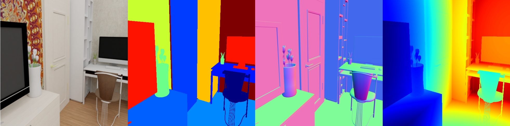

# Basic SUNCG scene



Renders a SUNCG scene using precomputed camera poses read from file.

## Usage

Execute in the BlenderProc main directory:

```
blenderpoc run examples/datasets/suncg_basic/main.py <path to cam_pose file> <path to house.json> examples/datasets/suncg_basic/output
```

* `examples/datasets/suncg_basic/main.py`: path to the python file with pipeline configuration.
* `<path to cam_pose file>`: Should point to a file which describes one camera pose per line (here the output of `scn2cam` from the `SUNCGToolbox` can be used).
* `<path to house.json>`: Path to the house.json file of the SUNCG scene you want to render.
* `examples/datasets/suncg_basic/output`: path to the output directory.

## Visualization

Visualize the generated data:

```
blenderproc vis hdf5 examples/datasets/suncg_basic/output/0.hdf5
```

## Steps

* Loads a SUNCG scene: `bproc.loader.load_suncg`.
* Loads camera positions from a given file.
* Automatically adds light sources inside each room.
* Renders semantic segmentation map.
* Renders rgb, depth and normals.
* Merges all into an `.hdf5` file.

## Python file (main.py)

### SuncgLoader

```python
label_mapping = bproc.utility.LabelIdMapping.from_csv(bproc.utility.resolve_resource(os.path.join('id_mappings', 'nyu_idset.csv')))
objs = bproc.loader.load_suncg(args.house, label_mapping=label_mapping)
```

This loader automatically loads a SUNCG scene/house given the corresponding `house.json` file. 
Therefore all objects specified in the given `house.json` file are imported and textured.
The `SuncgLoader` also sets the `category_id` of each object, such that semantic segmentation maps can be rendered in a following step.

### CameraLoader

```python
with open(args.camera, "r") as f:
    for line in f.readlines():
        line = [float(x) for x in line.split()]
        position = bproc.math.change_coordinate_frame_of_point(line[:3], ["X", "-Z", "Y"])
        rotation = bproc.math.change_coordinate_frame_of_point(line[3:6], ["X", "-Z", "Y"])
        matrix_world = bproc.math.build_transformation_mat(position, bproc.camera.rotation_from_forward_vec(rotation))
        bproc.camera.add_camera_pose(matrix_world)
```

Here the cam poses from the given file are loaded. 


### SuncgLighting

```python
bproc.lighting.light_suncg_scene()
```

This automatically sets light sources inside the loaded house.
Therefore each window, lamp or lampshade gets an emissive material and also the ceiling is made to slowly emit light to make sure even rooms without lights or windows are not completely dark.
