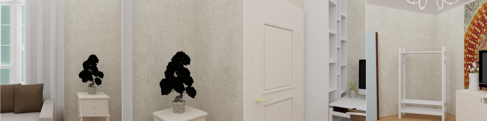

# SUNCG scene with custom camera sampling



In contrast to the SUNCG basic example, we do not load precomputed camera poses here, but sample them.

## Usage

Execute in the BlenderProc main directory:

```
blenderpoc run examples/datasets/suncg_with_cam_sampling/main.py <path to house.json> examples/datasets/suncg_with_cam_sampling/output
```

* `examples/datasets/suncg_with_cam_sampling/main.py`: path to the python file with pipeline configuration.
* `<path to house.json>`: Path to the house.json file of the SUNCG scene you want to render.
* `examples/datasets/suncg_with_cam_sampling/output`: path to the output directory.

## Visualization

Visualize the generated data:

```
blenderproc vis hdf5 examples/datasets/suncg_with_cam_sampling/output/0.hdf5
```

## Steps

* Loads a SUNCG scene.
* Sample camera positions inside every room.
* Automatically adds light sources inside each room.
* Writes sampled camera poses to file.
* Renders semantic segmentation map.
* Renders rgb, depth and normals.
* Merges all into an `.hdf5` file.

## Python file (main.py)

### SuncgCameraSampler

```python
# Init sampler for sampling locations inside the loaded suncg house
point_sampler = bproc.sampler.SuncgPointInRoomSampler(objs)
# Init bvh tree containing all mesh objects
bvh_tree = bproc.object.create_bvh_tree_multi_objects([o for o in objs if isinstance(o, bproc.types.MeshObject)])
poses = 0
tries = 0
while tries < 10000 and poses < 5:
    # Sample point inside house
    height = np.random.uniform(0.5, 2)
    location, _ = point_sampler.sample(height)
    # Sample rotation (fix around X and Y axis)
    euler_rotation = np.random.uniform([1.2217, 0, 0], [1.2217, 0, 6.283185307])
    cam2world_matrix = bproc.math.build_transformation_mat(location, euler_rotation)

    # Check that obstacles are at least 1 meter away from the camera and make sure the view interesting enough
    if bproc.camera.perform_obstacle_in_view_check(cam2world_matrix, {"min": 1.0}, bvh_tree) and bproc.camera.scene_coverage_score(cam2world_matrix) > 0.4:
        bproc.camera.add_camera_pose(cam2world_matrix)
        poses += 1
    tries += 
```

With this we want to sample `5` valid camera poses inside the loaded SUNCG rooms. 
The x and y coordinate are hereby automatically sampled uniformly across a random room, while we configure the z coordinate to lie between `0.5m` and `2m` above the ground.
Regarding the camera rotation we fix the pitch angle to `70°`, the roll angle to `0°` and sample the yaw angle uniformly between `0°` and `360°`. 

After sampling a pose the pose is only accepted if it is valid according to the properties we have specified:
  * Per default a camera pose is only accepted, if there is no object between it and the floor
  * As we enabled `proximity_checks` with a `min` value of `1.0`, we then only accept the pose if every object in front of it is at least 1 meter away
  * At the end we also check if the sampled view is interesting enough. Therefore a score is calculated based on the number of objects that are visible and how much space they occupy. Only if the score is above `0.4` the pose is accepted.
  
