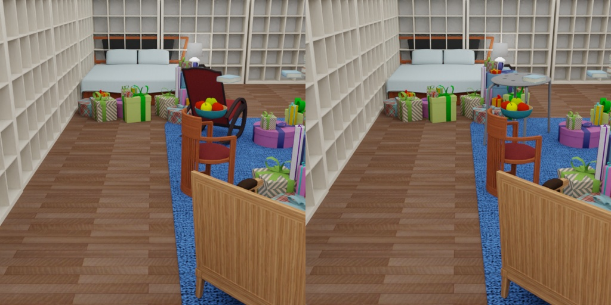

# SUNCG scene with object switching



The ObjectReplacer tries to replace objects with other objects.
First, you can specify the group of objects, which should be replaced: `objects_to_be_replaced` 
and second you can select the objects you want to them to replace them with: `objects_to_replace_with`.
Both groups of objects can be selected with the `getter.Entity`

## Usage

Execute in the Blender-Proc main directory:

```
blenderpoc run examples/datasets/suncg_with_object_replacer/main.py <path to house.json> <path to new object> examples/datasets/suncg_with_object_replacer/output
```

* `examples/datasets/suncg_with_object_replacer/main.py`: path to the python file with pipeline configuration.
* `<path to house.json>`: path to the house.json file of the SUNCG scene you want to render.
* `<path to new object>`: path to the `objects_to_replace_with`.
* `examples/datasets/suncg_with_object_replacer/output`: path to the output directory.


## Visualization

Visualize the generated data:

```
blenderproc vis hdf5 example/suncg_with_object_replacer/output/0.hdf5
```

## Steps

* Loads a SUNCG scene.
* Loads new object.
* Hides the new loaded objects from the renderer.
* Replacing objects.
* Sample camera positions inside every room.
* Automatically adds light sources inside each room.
* Writes sampled camera poses to file.
* Renders rgb, depth and normals.
* Merges all into an `.hdf5` file.

## Python file (main.py)

### ObjectReplacer

```python
chair_obj = bproc.loader.load_obj(args.object_path)
if len(chair_obj) != 1:
    raise Exception(f"There should only be one chair object not: {len(chair_obj)}")
chair_obj = chair_obj[0]


def relative_pose_sampler(obj):
    # Sample random rotation and apply it to the objects pose
    obj.blender_obj.rotation_euler.rotate(Euler((0, 0, np.random.uniform(0.0, 6.283185307))))


replace_ratio = 1.0
bproc.object.replace_objects(
    objects_to_be_replaced=bproc.filter.by_cp(objs, "coarse_grained_class", "chair"),
    objects_to_replace_with=[chair_obj],
    ignore_collision_with=bproc.filter.by_cp(objs, "type", "Floor"),
    replace_ratio=replace_ratio,
    copy_properties=True,
    relative_pose_sampler=relative_pose_sampler
)
```


* This replaces objects from `objects_to_be_replaced` with objects from `objects_to_replace_with`.
* When `copy_properties` is set to `True`, the `objects_to_replace_with` gets all the custom properties that the `objects_to_be_replaced` used to have.
* This doesn't do collision checking between `objects_to_replace_with` and object provided by `ignore_collision_with`.
