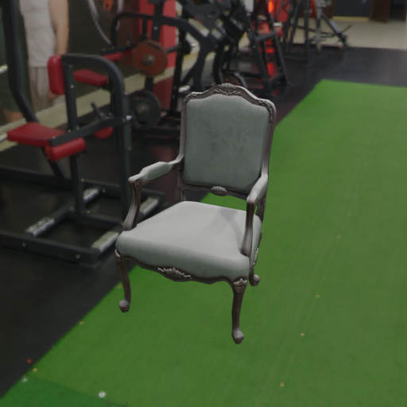

# Haven 
<p align="center">

</p>


The focus of this example is adding dust to a model with blender. For this example we are using the [haven dataset](../haven_dataset/README.md).

Make sure that you have downloaded the haven dataset first, see the [haven example](../haven_dataset/README.md)

## Usage

Execute in the BlenderProc main directory:

```
python run.py examples/haven_dataset/config.yaml resources/haven/models/ArmChair_01/ArmChair_01.blend resources/haven examples/haven_dataset/output
``` 

* `examples/haven_dataset/config.yaml`: path to the configuration file with pipeline configuration.
* `resources/haven/models/ArmChair_01/ArmChair_01.blend`:  Path to the blend file, from the haven dataset, browse the model folder, for all possible options
* `resources/haven`: The folder where the `hdri` folder can be found, to load an world environment
* `examples/haven_dataset/output`: path to the output directory.

## Visualization

In the output folder you will find a series of `.hdf5` containers. These can be visualized with the script:

```
python scripts/visHdf5Files.py examples/haven_dataset/output/*.hdf5
``` 

## Steps

* The BlendLoader loads the given blend file and extracts the object
* Then the `HavenEnvironmentLoader` loads a randomly selected HDR image as world environment
* After that the `MaterialManipulator` adds to all materials in the scene a layer of dust
* Then it is rendered and saved in a `hdf5` file.
 
## Config file

### MaterialManipulator 

```yaml
{
  "module": "manipulators.MaterialManipulator",
  "config":{
    "selector": {
      "provider": "getter.Material",
      "conditions": {
        "name": ".*",
        "use_nodes": True
      }
    },
    "cf_add_dust": {
      "strength": 0.8,
      "texture_scale": 0.05
    }
  }
},
```

The `MaterialManipulator` selects all materials in the scene and uses the `cf_add_dust` option to add dust to all of them.
Dust is always displayed on the top of a model, where the top is defined as facing upwards in Z direction. 
Here `"strength"` defines the amount of dust used on the model, the range is from zero to one. But, values above 1.0 might also work just do they add a lot of dust.
The `"texture_scale"` is used to reduce the size of the generated noise texture, be aware this only works if the object already has a UV mapping. 
Else you can generate one with the `EntityManipulator`.
