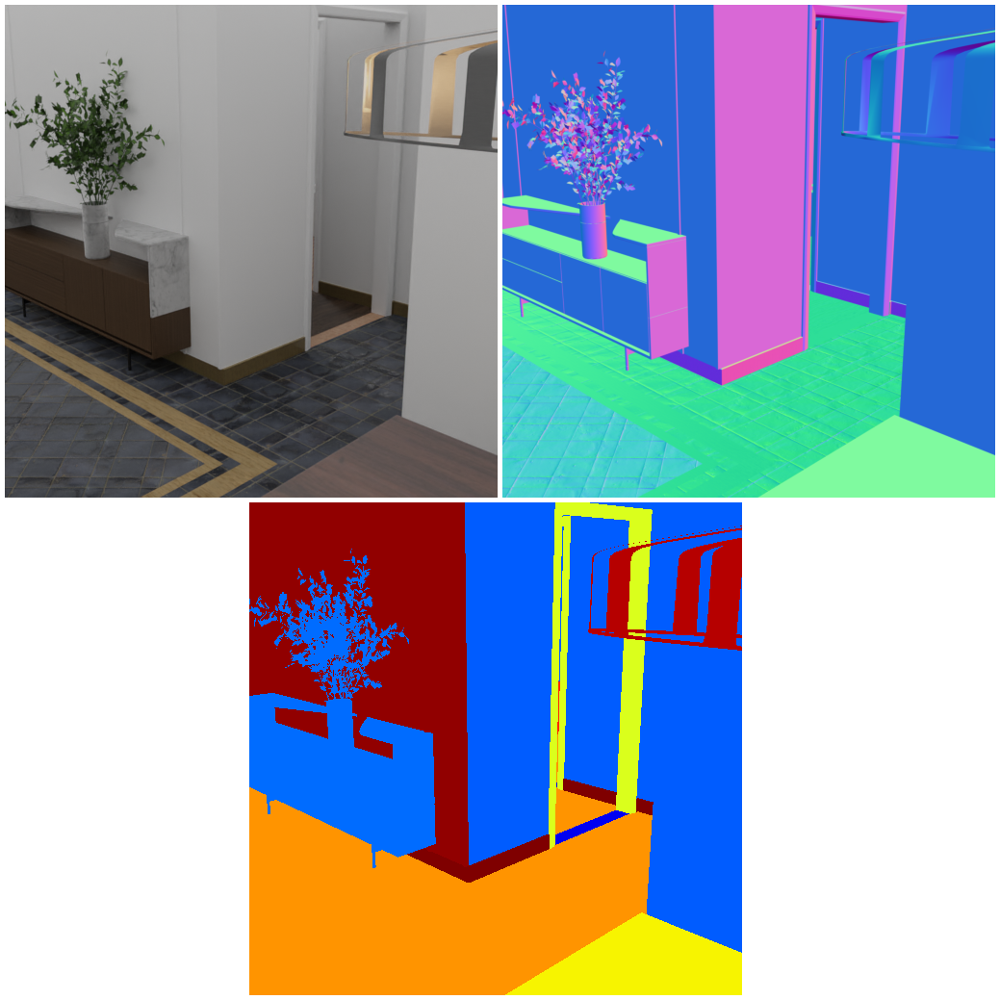
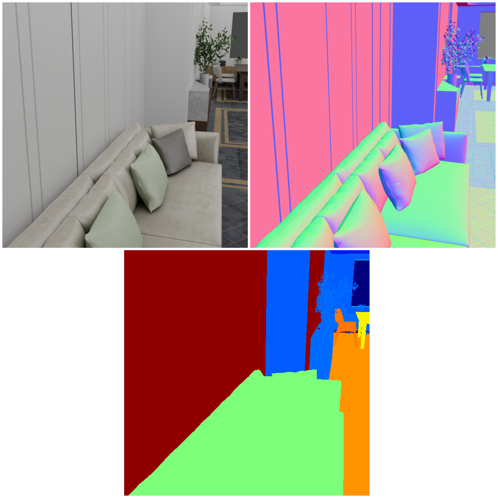

# 3D Front Dataset with improved mat 

<p align="center">


</p>

In this example we explain to you how to use the 3D-Front Dataset with the BlenderProc pipeline in combination with the CCMaterialLoader.
This is an advanced example, make sure that you have executed the basic examples before proceeding to this one, especially the `front_3d_with_improved_mat` example.
It is also necessary to download the textures from cc_textures we provide a script [here](../../scripts/download_cc_textures.py).

## Usage

Execute in the BlenderProc main directory, if this is the first time BlenderProc is executed. It will automatically downloaded blender 2.82, see the config-file if you want to change the installation path:

```
python run.py examples/front_3d_with_improved_mat/config.yaml {PATH_TO_3D-Front-Json-File} {PATH_TO_3D-Future} examples/front_3d_with_improved_mat/output 
```

* `examples/front_3d_with_improved_mat/config.yaml`: path to the configuration file with pipeline configuration.

The three arguments afterwards are used to fill placeholders like `<args:0>` inside this config file.
* `PATH_TO_3D-Front-Json-File`: path to the 3D-Front json file 
* `PATH_TO_3D-Future`: path to the folder where all 3D-Future objects are stored 
* `examples/front_3d_with_improved_mat/output`: path to the output directory

Be aware that the default path for the CCMaterialLoader is used, if you want to change this please refer to the documentation in the `CCMaterialLoader` class.

## Visualization

Visualize the generated data:

```
python scripts/visHdf5Files.py examples/front_3d_with_improved_mat/output/0.hdf5
```

## Steps

* Loads the `.json` file: `loader.Front3DLoader` module. It loads all modules and creates the rooms, it furthermore also adds emission shaders to the ceiling and lamps.
* Sets the category_id of the background to 0: `manipulators.WorldManipulator`
* Adds cameras to the scene: `camera.Front3DCameraSampler`
* Loads the cc Materials: `loader.CCMaterialLoader` (the default path is assumed)
* Several material Randomizers are used to replace the floor, baseboards and walls materials with cc materials: `materials.MaterialRandomizer`
* Renders rgb, normals and distance: `renderer.RgbRenderer` module.
* Renders semantic segmentation: `renderer.SegMapRenderer` module.
* Writes the output to .hdf5 containers: `writer.Hdf5Writer` module, removes unnecessary channels for the `"distance"`

## Config file

#### CCMaterialLoader

```yaml
{
  "module": "loader.CCMaterialLoader",
  "config": {
    "used_assets": ["Bricks", "Wood", "Carpet", "Tile", "Marble"]
  }
}
```

This module loads the assests which names contain a string listed in `"used_assets"`.
These will be later used to replace the materials in the 3D-Front scenes.

#### 

```yaml
{
  "module": "materials.MaterialRandomizer",
  "config": {
    "randomization_level": 0.95,
    "manipulated_objects": {
      "provider": "getter.Entity",
      "conditions": {
        "name": "Floor.*"
      }
    },
    "materials_to_replace_with": {
      "provider": "getter.Material",
      "conditions": {
        "cp_is_cc_texture": True  # this will return all loaded cc textures
      }
    }
  }
}
```

This is one of the `materials.MaterialRandomizer` it swaps the materials of the selected objects, with the materials which are used to replace them.
It will replace 95% of all materials, which are selected via the `getter.Entity`. 
The materials which are used to replace the existing ones all have to be from the CCMaterialLoader, which adds to each loaded material the custom property of `"cp_is_cc_texture"`.

A further example is: 

```yaml
{
  "module": "materials.MaterialRandomizer",
  "config": {
    "randomization_level": 0.1,
    "manipulated_objects": {
      "provider": "getter.Entity",
      "conditions": {
        "name": "Wall.*"
      }
    },
    "materials_to_replace_with": {
      "provider": "getter.Material",
      "conditions": {
        "cp_is_cc_texture": True,  # this will return all loaded cc textures
        "cp_asset_name": "Marble.*"
      }
    }
  }
}
```

Here the materials of all walls are replaced, but instead of using all loaded materials only the cc materials, which names start with `"Marble"`.
Also pay attention that only 10% of all materials are replaced, to not over load the rooms with marble.

## More examples

* [sung_basic](../suncg_basic): More on rendering SUNCG scenes with fixed camera poses.
* [suncg_with_cam_sampling](../suncg_with_cam_sampling): More on rendering SUNCG scenes with dynamically sampled camera poses.

