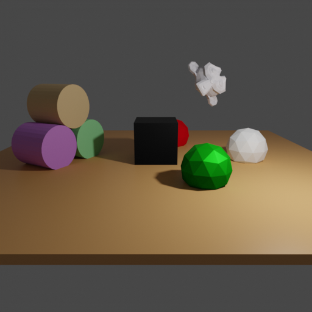
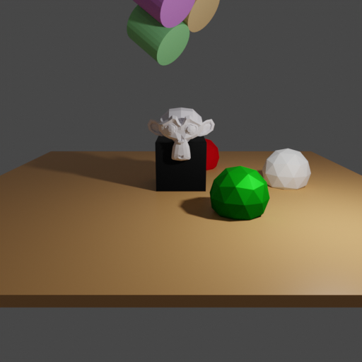

# Object selection and manipulation

 

## Usage

Execute in the Blender-Pipeline main directory:

```
python run.py examples/object_manipulation/config.yaml examples/object_manipulation/camera_positions examples/object_manipulation/scene.obj examples/object_manipulation/output
```
In this example we demonstrate how to select objects in the scene using `ObjectGetter` and then manipulate them using `ObjectManipulator` module.

## Steps

* Loads `scene.obj`
* Creates a point light
* Loads camera positions from `camera_positions`
* Selects objects inside the `selector` section of the `ObjectManipulator` module
* Change `physics`, `location` and `rotation_euler` parameters of the selected object

## ObjectManipulator

The focus of this example is the ObjectManipulator module and ObjectGetter which allow us to select multiple objects based on a user-defined condition and change the attribute and custom property values of the selected objects.

```yaml
    {
      "name": "object.ObjectManipulator",
      "config": {
        "instances": [
          {
            "selector": {
              "name": "ObjectGetter",
              "condition": {
                "name": 'Suzanne'
              }
            },
            "location": {
              "name":"Uniform3dSampler",
              "max":[1, 2, 3],
              "min":[0, 1, 2]
            },
            "rotation_euler": [1, 1, 0],
            "physics": 'active'
          }
        ]
      }
    },
```

`instances` - one "action" upon the selected objects inside an "instances" cell. We have only one here, yet one may define more.
`selector` - section of the `ObjectManipulator` for stating the `name` of the Getter and the `condition` to use for selecting.
Our condition is: `"name": 'Suzanne'`, which means that we want to select all the objects with `obj.name == 'Suzanne'`. In our case we have only one object which meets the requirement.
Yet one may define any condition where `key` is the valid name of any attribute of objects present in the scene or the name of an existing custom property.
This way it is possible to select multiple objects. One may try this condition to try multiple object selection: `"location": [0, 0, 0]`
NOTE: any given attribute_value of the type string will be treated as a *REGULAR EXPRESSION*, so `"name": 'Cylinder.*'` condition will select us all three cylinders in the scene.

Data types:
attribute_name - a valid name of any attribute, attribute_value types: string/int/bool/float/list.
attribute_name - a valid name of an existing custom property (or of a custom property to create), attribute_value types: string/int/float.
```
NOTE: any given attribute_value of the type string will be treated as a *REGULAR EXPRESSION*.
So try `"name": '^Cylinder'` condition and set all Cylinders in the scene flying.
```

After `selector` section we are defining attribute name and attribute value pairs in the familiar format of {attribute_name: attribute_value}.
If attribute_name is a valid name of any attribute of selected object(s), its value will be set to attribute_value.
If attribute_name is a name of an existing custom property, its value will be set to attribute_value.
If attribute_name is not a valid name of any attribute nor it is a name of an existing custom property, it will be treated as a name for a new custom property, and its value will be set to attribute_value.

In our case we sample the `location` attribute's value of the selected object using `Uniform3dSampler`, set the value of the `rotation_euler` attribute to `[1, 1, 0]`, and create new custom property `physics` and set it's value to `active`.