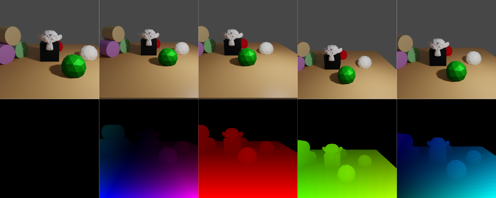

# Optical flow / scene flow



In this example we demonstrate how to obtain optical / scene flow values between consecutive key frames. 
Note that the flow is backward directed, i.e. from frame _i_ to frame _i - 1_.

Flow is visible if either the camera or objects move between frames. Here, the camera undergoes the following motion:
```yaml
0 -10 4 1.3 0 0  # initial position
0 -12 4 1.3 0 0  # moving away from object
2 -12 4 1.3 0 0  # moving to the right
2 -12 6 1.3 0 0  # moving upwards
1 -11 5 1.3 0 0  # combined motion (to the left, towards object and downwards)
```

## Usage

Execute in the BlenderProc main directory:

```
python run.py examples/optical_flow/config.yaml examples/optical_flow/camera_positions examples/optical_flow/scene.obj examples/optical_flow/output
```

* `examples/optical_flow/config.yaml`: path to the configuration file with pipeline configuration.

The three arguments afterwards are used to fill placeholders like `<args:0>` inside this config file.
* `examples/optical_flow/camera_positions`: text file with parameters of camera positions.
* `examples/optical_flow/scene.obj`: path to the object file with the basic scene.
* `examples/optical_flow/output`: path to the output directory.

## Steps

* Loads `scene.obj`: `loader.ObjectLoader` module.
* Creates a point light : `lighting.LightLoader` module.
* Loads camera positions from `camera_positions`: `camera.CameraLoader` module.
* Renders normals: `renderer.NormalRenderer` module.
* Renders rgb: `renderer.RgbRenderer` module.
* Renders scene / optical flow: `renderer.FlowRenderer` module.
* Writes the output to .hdf5 containers: `writer.Hdf5Writer` module.

## Config file

### FlowRenderer

```yaml
  "module": "renderer.FlowRenderer",
  "config": {
      "optical_flow": True,
      "scene_flow": False
}
```

* This module just goes through all cam poses which were defined in the previous model and renders optical and / or scene flow with respect to the previous image
* The images are rendered using the `.exr` format which allows linear colorspace and higher precision, and then converted to numpy.float32 arrays
* The output files are stored in the defined output directory (see [Global](#Global)) and are named like `{optical_flow, scene_flow}_i.npy` where `i` is the cam pose index
* The `output_key` config is relevant for the last module, as it defines the key at which the normal rendering should be stored inside the `.hdf5` files.

=> Creates the files `optical_flow_000{0, 1, 2, 3, 4}.npy` and / or `scene_flow_000{0, 1, 2, 3, 4}.npy`.

## Visualization

Visualize the generated data:

```
python scripts/visHdf5Files.py examples/optical_flow/output/0.hdf5
```

## More examples

* [camera_sampling](../camera_sampling): Introduction to sampling for cameras.
* [light_sampling](../light_sampling): Introduction to sampling for lights.
