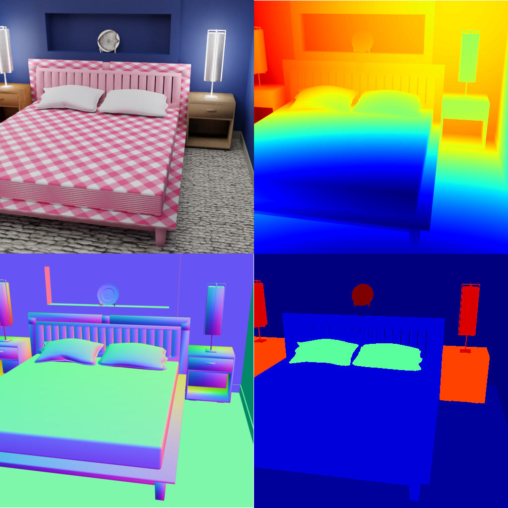

# SceneNet 

<p align="center">

</p>

The focus of this example is the `loader.SceneNetLoader`, which can be used to load objects from the SceneNet dataset.

We provide a script to download the `.obj` files, see the [scripts](../../scripts/) folder, the texture files can be downloaded [here](http://tinyurl.com/zpc9ppb).

Both are needed to use this dataset properly.

## Usage

Execute in the BlenderProc main directory:

```
python run.py examples/scenenet/config.yaml <PATH_TO_SCENE_NET_OBJ_FILE> <PATH_TO_TEXTURE_FOLDER> examples/scenenet/output
``` 

* `examples/scenenet/config.yaml`: path to the configuration file with pipeline configuration.
* `<PATH_TO_SCENE_NET_OBJ_FILE>`: path to the used scene net `.obj` file, download via this [script](../../scripts/download_scenenet.py)
* `<PATH_TO_TEXTURE_FOLDER>`: path to the downloaded texture files, you can find them [here](http://tinyurl.com/zpc9ppb)
* `examples/scenenet/output`: path to the output directory.

## Visualization

In the output folder you will find a series of `.hdf5` containers. These can be visualized with the script:

```
python scripts/visHdf5Files.py examples/scenenet/output/*.hdf5
``` 

## Steps

* The `SceneNetLoader` loads all the objects, which are stored in this one `.obj` file. 
* Each object gets randomly assigned textures based on its name. Therefore, in each run the objects, will have different textures.
 
## Config file

### Global

```yaml
"module": "main.Initializer",
"config": {
  "global": {
    "output_dir": "<args:2>",
  }
}
```

The same as in the basic example.

### SceneNetLoader 

```yaml
"module": "loader.SceneNetLoader",
"config": {
  "file_path": "<args:0>",
  "texture_folder": "<args:1>"
}
```

This module loads the SceneNet data object, specified via the `file_path`. 
All objects included in this `.obj` file get a randomly selected texture from the `texture_folder`.
The `category_id` of each object are set based on their name, check the [table](../../resources/scenenet/CategoryLabeling.csv) for more information on the labels.
Be aware if the `unknown_texture_folder` value is not set, that the unknown folder will be assumed to be inside of the `texture_folder` with the name `unknown`.
This folder does *not* exist after downloading the texture files, it has to be manually generated. 
By selecting random texture and putting them in this `unknown_texture_folder`, which can be used on unknown structures.

### SceneNetLighting

```yaml
"module": "lighting.SceneNetLighting"
```

We now have to light up the scene by making all lamps and the ceiling emit light.

### CameraSampler

```yaml
{
"module": "camera.CameraSampler",
"config": {
  "cam_poses": [{
    "number_of_samples": 5, # amount of camera samples
    "proximity_checks": {
      "min": 1.0
    },
    "location": {
      "provider": "sampler.UpperRegionSampler",
      "min_height": 1.5,
      "max_height": 1.8,
      "to_sample_on": {
        "provider": "getter.Entity",
        "index": 0,
        "conditions": {
          "cp_category_id": 2  # 2 stands for floor
        }
      }
    },
    "rotation": {
      "value": {
        "provider":"sampler.Uniform3d",
        "max":[1.2217, 0, 6.283185307],
        "min":[1.2217, 0, 0]
      }
    },
    "check_if_pose_above_object_list": {
      "provider": "getter.Entity",
      "conditions": {
        "cp_category_id": 2,
        "type": "MESH"
      }
    }
  }]
}
```

We sample here five random camera poses, where the location is above the object with the `category_id: 2`, which is the floor.
So all cameras will be sampled above the floor, with a certain height.
In the end, we perform a check with `check_if_pose_above_object_lis` that the sampled pose is directly above a floor and not an object.

## More examples

* [shapenet_with_scenenet](../shapenet_with_scenenet): Using shapenet combined with scenenet
* [scenenet_with_cctextures](../scenenet_with_cctextures): An example on how to use CCTextures with scenenet.
* [front_3d](../front_3d): More on rendering 3D Front scenes with sampled camera poses.
* [front_3d_with_improved_mat](../front_3d_with_improved_mat): More on rendering 3D Front scenes with sampled camera poses and randomized textures.
* [sung_basic](../suncg_basic): More on rendering SUNCG scenes with fixed camera poses.
* [suncg_with_cam_sampling](../suncg_with_cam_sampling): More on rendering SUNCG scenes with dynamically sampled camera poses.
