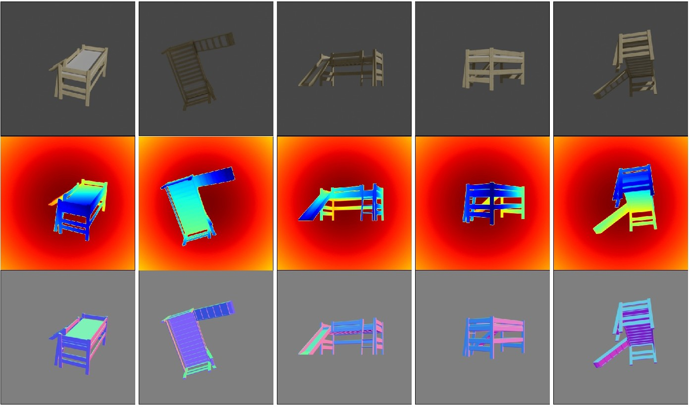

# ShapeNet Multiview

<p align="center">

</p>

The focus of this example is the `loader.ShapeNetLoader` in order to generate images from multiple views. This is an advanced example, please make sure that you have read:

* [shapenet](../shapenet): Rendering ShapeNet objects 


## Usage

Execute in the BlenderProc main directory:

```
python run.py examples/shapenet_multiview/config.yaml <PATH_TO_ShapeNetCore.v2> examples/shapenet_multiview/output
``` 

* `examples/shapenet_multiview/config.yaml`: path to the configuration file with pipeline configuration.
* `<PATH_TO_ShapeNetCore.v2>`: path to the downloaded shape net core v2 dataset, get it [here](http://www.shapenet.org/) 
* `examples/shapenet_multiview/output`: path to the output directory.

## Visualization

In the output folder you will find a series of `.hdf5` containers. These can be visualized with the script:

```
python scripts/visHdf5Files.py examples/shapenet_multiview/output/*.hdf5
``` 

## Steps

* Set the ShapeNet category as specified with `synset_id`: ```loader.ShapeNetLoader``` module.
* Load model with randomly selected `source_id`: ```loader.ShapeNetLoader``` module. 
* Sample camera poses: ```camera.CameraSampler``` module.
* Render RGB, Depth and Normal images: ```renderer.RgbRenderer``` module.
* Write ShapeNet object data: ```writer.ShapeNetWriter``` module.
* Write Camera Pose and Instrinsics data: ```writer.CameraStateWriter``` module.
* Write HDF5 file: ```writer.Hdf5Writer``` module. 

## Config file

### Global

```yaml
{
  "module": "main.Initializer",
  "config": {
    "global": {
      "output_dir": "<args:1>"
    }
  }
}
```

The same as in the basic example.


### ShapeNetLoader 

```yaml
{
  "module": "loader.ShapeNetLoader",
  "config": {
    "data_path": "<args:0>",
    "used_synset_id": "03115762"
  }
}
```

* This module loads a ShapeNet Object, it only needs the path to the `ShapeNetCore.v2` folder, which is saved in `data_path`.
* The `synset_id` = `03115762` is set to the id of a couch, which means a random couch will be loaded. The couch model with `source_id` = `806145e92798a35f15dd7d7985e749c1` was randomly selected 
when creating this example. 
* The position will be in the center of the scene.


### CameraSampler

```yaml
{
  "module": "camera.CameraSampler",
  "config": {
    "cam_poses": [
      {
        "number_of_samples": 5,
        "location": {
          "provider":"sampler.Sphere",
          "center": [0, 0, 0],
          "radius": 2,
          "mode": "SURFACE"
        },
        "rotation": {
          "format": "look_at",
          "value": {
            "provider": "getter.POI"
          }
        }
      }
    ]
  }
}
```

We sample here five random camera poses, where the location is on a sphere with a radius of 2 around the object. 
Each cameras rotation is such that it looks directly at the object and the camera faces upwards in Z direction.


## RGB Renderer
```yaml
{
  "module": "renderer.RgbRenderer",
  "config": {
    "transparent_background": False,
    "output_key": "colors",
    "render_distance": True,
    "distance_output_key": "distance",
    "distance_range": 2.5,
    "render_normals": True,
    "normals_output_key": "normals",
    "use_alpha": True,
    "samples": 512
  }
}

```

To render with a transparent background, specify `transparent_background` as True. Depth and Normal images will also be produced. The Depth image's `distance_range` = `2.5`.  


## ShapeNet Writer
```yaml
{
  "module": "writer.ShapeNetWriter"
}
````

This will write the ShapeNet object's `synset_id` and `source_id` to a file.


## Camera State Writer
```yaml
{
  "module": "writer.CameraStateWriter",
  "config": {
    "attributes_to_write": ["location", "rotation_euler", "fov_x", "fov_y"]
  }
}
```

This will write the camera pose and the other specified camera intrinsics to a file. 


## HDF5 Writer
```yaml
{
  "module": "writer.Hdf5Writer",
  "config": {
    "write_alpha_channel": True,
    "postprocessing_modules": {
      "distance": [
        {
          "module": "postprocessing.Dist2Depth",
          "config": {}
        }
      ]
    }
  }
}
```

To write to a hdf5 file in which the image background will not be transparent. As the postprocessing step, `postprocessing.Dist2Depth` is applied in order to convert the distance image to an 
actual depth image.

