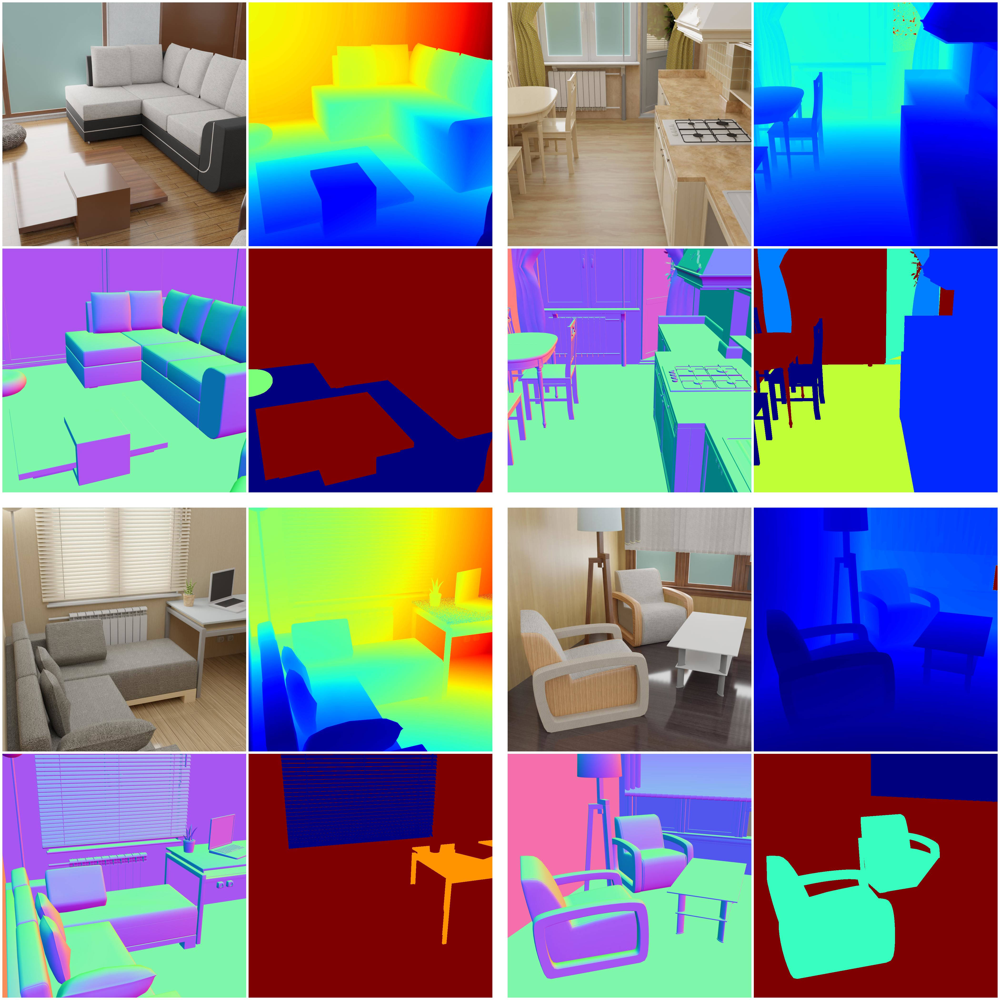

# SUNCG scene with improved materials 

<p align="center">

</p>

In contrast to the SUNCG basic example, we improve the materials loaded by SUNCG.
The procedure shown here could be done with every objects material as long as the material can be selected.

Furthermore, we do not load precomputed camera poses, but sample them using the `SuncgCameraSampler` module.

This is an advanced example please check these example before:
* [sung_basic](../suncg_basic/README.md): More on rendering SUNCG scenes with fixed camera poses.
* [sung_with_cam_sampling](../suncg_with_cam_sampling/README.md): More on rendering SUNCG scenes with sampled camera poses.

## Usage

Execute in the BlenderProc main directory:

```
python run.py examples/suncg_with_improved_mat/config.yaml <path to house.json> examples/suncg_with_improved_mat/output
```

* `examples/suncg_with_improved_mat/config.yaml`: path to the configuration file with pipeline configuration.
* `<path to house.json>`: Path to the house.json file of the SUNCG scene you want to render.
* `examples/suncg_with_improved_mat/output`: path to the output directory.

## Visualization

Visualize the generated data:

```
python scripts/visHdf5Files.py examples/suncg_with_improved_mat/output/0.hdf5
```

## Steps

* Loads a SUNCG scene: `loader.SuncgLoader` module.
* Sample camera positions inside every room: `camera.SuncgCameraSampler` module.
* Automatically adds light sources inside each room: `lighting.SuncgLighting` module.
* After that we change the materials with the `MaterialManipulator`, we call it three times, with different values.
* Writes sampled camera poses to file: `writer.CameraStateWriter` module.
* Renders semantic segmentation map: `renderer.SegMapRenderer` module.
* Renders rgb, distance and normals: `renderer.RgbRenderer` module.
* Merges all into an `.hdf5` file: `writer.Hdf5Writer` module.

## Config file

## Global

```yaml
{
  "module": "main.Initializer",
  "config": {
    "global": {
      "output_dir": "<args:1>",
      "max_bounces": 200,
      "diffuse_bounces": 200,
      "glossy_bounces": 200,
      "transmission_bounces": 200,
      "transparency_bounces": 200
    }
  }
}
```

We define here besides the usual `output_dir` also the amount of light bounces done by the path tracer.
Usually these values can be quite low, but if the materials are more complex higher bounce numbers give better results.
However, they increase the render time slightly and that's why they are usually turned off.

### SuncgCameraSampler

```yaml
{
  "module": "camera.SuncgCameraSampler",
  "config": {
    "cam_poses": [{
      "number_of_samples": 10,
      "proximity_checks": {
        "min": 1.0
      },
      "min_interest_score": 0.4,
      "location": {
        "provider":"sampler.Uniform3d",
        "max":[0, 0, 2],
        "min":[0, 0, 0.5]
      },
      "rotation": {
        "value": {
          "provider":"sampler.Uniform3d",
          "max":[1.2217, 0, 6.283185307],
          "min":[1.2217, 0, 0]
        }
      },
    }]
  }
```

With this module we want to sample `10` valid camera poses inside the loaded SUNCG rooms. 
The x and y coordinate are hereby automatically sampled uniformly across a random room, while we configure the z coordinate to lie between `0.5m` and `2m` above the ground.
Regarding the camera rotation we fix the pitch angle to `70°`, the roll angle to `0°` and sample the yaw angle uniformly between `0°` and `360°`. 

After sampling a pose the pose is only accepted if it is valid according to the properties we have specified:
  * Per default a camera pose is only accepted, if there is no object between it and the floor
  * As we enabled `proximity_checks` with a `min` value of `1.0`, we then only accept the pose if every object in front of it is at least 1 meter away
  * At the end we also check if the sampled view is interesting enough. Therefore a score is calculated based on the number of objects that are visible and how much space they occupy. Only if the score is above `0.4` the pose is accepted.

### MaterialManipulator


```yaml
  { 
    "module": "manipulators.MaterialManipulator",
    "config": {
      "selector": {
        "provider": "getter.Material",
        "conditions": [
          {"name": "wood.*"},
          {"name": "laminate.*"},
          {"name": "beam.*"}
        ]
      },
      "cf_set_Roughness": {
         "provider": "sampler.Value",
         "type": "float",
         "min": 0.05,
         "max": 0.5,
      },
      "cf_set_Specular": {
        "provider": "sampler.Value",
        "type": "float",
        "min": 0.5,
        "max": 1,
      },
      "cf_color_link_to_displacement": {
        "provider": "sampler.Value",
        "type": "float",
        "min": 0.001,
        "max": 0.15,
      },
      "mode": "once_for_each"
    }
  }
```

This a quite complex module call, that's why we will call through it from the top to the bottom.

```yaml
  "selector": {
    "provider": "getter.Material",
    "conditions": [
      {"name": "wood.*"},
      {"name": "laminate.*"},
      {"name": "beam.*"}
    ]
  }
```
In this first part do we select all materials, which name start with wood, laminate or beam. 
All of those are in the Suncg dataset materials, which look like wood structures.
If you want to find out how your materials are named, click on the objects during debugging in blender and check their names.

```yaml
  "cf_set_Roughness": {
     "provider": "sampler.Value",
     "type": "float",
     "min": 0.05,
     "max": 0.5,
  }
```

This step is now repeated two times, with different values.
We first sample the `Roughness` of the material, with a uniform value sampler between `0.05` and `0.5`.
After that we repeat this process for the `Specular` sampling.
Check this page to understand the possible values better ([web link](https://docs.blender.org/manual/en/latest/render/shader_nodes/shader/principled.html#examples)).
You can set any of those values there, even overwrite the `"Base Color"`, which would remove any linked textures.

```yaml
  "cf_color_link_to_displacement": {
    "provider": "sampler.Value",
    "type": "float",
    "min": 0.001,
    "max": 0.15,
  }
```

This last option adds displacement to your objects, so the object gets changed based on the color texture.
This means that a dark spot in the image dents the object inwards at that point and outwards if it is bright.
This make the surface more real looking as they do not look so flat. 

The distance rendering is not affected by this, the normal rendering is effected by this though.

Finally, the mode specifies if the same values are used for all materials or if each material gets its own values.
With `"once_for_each"` we decide that each object gets its own values.
