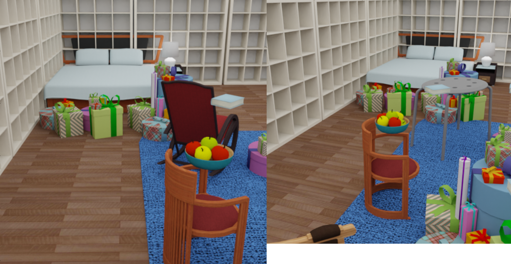

# SUNCG scene with object switching



The ObjectReplacer tries to switch between `objects_to_be_replaced` objects and `objects_to_replace_with` objects

## Usage

Execute in the Blender-Proc main directory:

```
python run.py examples/suncg_with_object_replacer/config.yaml <path to house.json> <path to new objects> examples/suncg_with_object_replacer/output
```

* `examples/suncg_with_object_replacer/config.yaml`: path to the configuration file with pipeline configuration.
* `<path to house.json>`: Path to the house.json file of the SUNCG scene you want to render.
* `<path to new objects>`: path to the `objects_to_replace_with`.
* `examples/suncg_with_object_replacer/output`: path to the output directory.

## Steps

* loader.SuncgLoader Loads a SUNCG scene
* loader.ObjectLoader loades new objetcs
* object.EntityManipulator hides the new loaded objects from the rederer
* manipulators.ObjectReplacer switch objects in the `objects_to_be_replaced` config with object in `objects_to_replace_with` config
* Sample camera positions inside every room: `camera.SuncgCameraSampler` module.
* Automatically adds light sources inside each room: `lighting.SuncgLighting` module.
* Writes sampled camera poses to file: `writer.CameraStateWriter` module.
* Renders normals: `renderer.NormalRenderer` module.
* Renders semantic segmentation map: `renderer.SegMapRenderer` module.
* Renders rgb and depth: `renderer.RgbRenderer` module.
* Merges all into an `.hdf5` file: `writer.Hdf5Writer` module.

## Explanation of specific parts of the config file


### ObjectReplacer

```yaml
    {
      "module": "manipulators.ObjectReplacer",
      "config": {
        "replace_ratio": 1,
        "copy_properties": True,
        "objects_to_be_replaced": {
            "provider": "getter.Entity",
            "conditions": {
              "type": "MESH",
              "coarse_grained_class": "chair"
            }
        },
        "objects_to_replace_with": {
            "provider": "getter.Entity",
            "conditions": {
              "replace": "chair",
              "type": "MESH"
            }
        },
        "ignore_collision_with": {
        "provider": "getter.Entity",
          "conditions": {
            "name": "Floor",
            "type": "MESH"
          }
        },
      }
    },
```

* This module tries to switch between `objects_to_be_replaced` objects and `objects_to_replace_with` objects, which the module get using a `getter.Entity`, with probability of `switch_probability` if no collision happens between `objects_to_replace_with` and objects in the scene.
* When `copy_properties` is set to `True`, the `objects_to_replace_with` gets all the custom proprites that the `objects_to_be_replaced` used to have.
* This module doesn't do collision checking between `objects_to_replace_with` and object provided by the `getter.Entity` `ignore_collision_with`.

## Visualization

Visualize the generated data:

```
python scripts/visHdf5Files.py example/suncg_with_object_replacer/output/0.hdf5
```

## More examples

* [sung_basic](../suncg_basic): More on rendering SUNCG scenes with fixed camera poses.
* [suncg_with_cam_sampling](../suncg_with_cam_sampling): More on rendering SUNCG scenes with dynamically sampled camera poses.