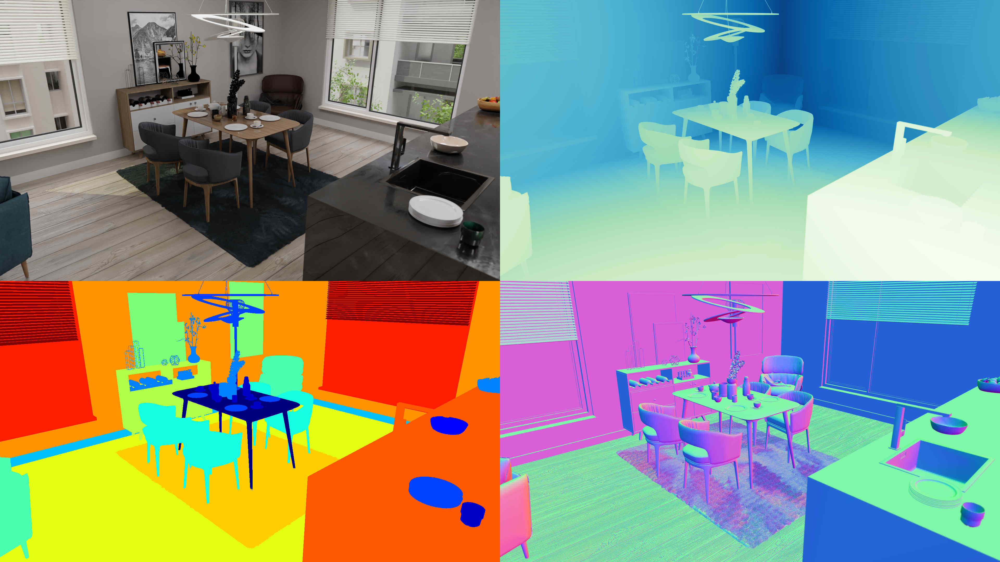

# Summary

`BlenderProc2` is a procedural pipeline that can render realistic images for the training of neural networks. 
Our pipeline can be employed in various use cases, including segmentation, depth, normal and pose estimation, and many others. 
A key feature of our Blender extension is the simple-to-use python API, designed to be easily extendable. 
Furthermore, many public datasets, such as 3D FRONT [@Front3D] or Shapenet [@shapenet], are already supported, making it easier to clutter synthetic scenes with additional objects.

# Statement of need

Deep learning thrives on the existence of vast and diverse datasets. 
Collecting those in the real world is often either too complicated or expensive. 
With `BlenderProc2`, we present a tool enabling the generation of vast and diverse datasets with a few lines of Python code.
A particular focus is placed on the acknowledgment of the simulation-to-real gap and how to tackle this particular challenge in the dataset generation process.
Even though the first version of `BlenderProc` was one of the first tools to generate photo-realistic, synthetic datasets, many more tools exist nowadays, compared in \autoref{tab:features} [@NDDS; @Stillleben; @nvisii; @habitat; @kubric].
In contrast to the first version of BlenderProc, BlenderProc2 relies on an easy-to-use python API, whereas the first version used a YAML-based configuration approach [@denninger2019blenderproc; @denninger2020blenderproc].

{ width=80% }

\def\checkmarktikz{\tikz\fill[scale=0.4](0,.35) -- (.25,0) -- (1,.7) -- (.25,.15) -- cycle;} 
\newcommand{\yesSign}{{\color{green}\checkmarktikz}}
\newcommand{\noSign}{{\color{red}$\otimes$}}
\newcommand{\journalCite}[2]{\protect\hyperlink{ref-#1}{#2}}

\begin{table}[h]
\centering
\begin{tabular}{l|c | c | c | c | c | c}
 & NDDS & NViSII & Habitat & Stillleben & Kubric & \textbf{Ours} \\
\hline
semantic segm. & \yesSign & \yesSign & \yesSign & \yesSign & \yesSign & \yesSign \\
depth rendering & \yesSign & \yesSign & \yesSign & \yesSign & \yesSign & \yesSign \\
optical flow & \noSign & \yesSign & \yesSign & \noSign & \yesSign & \yesSign \\
surface normals & \noSign & \yesSign & \yesSign & \yesSign & \noSign &\yesSign \\
object pose & \yesSign & \yesSign & \yesSign & \yesSign & \noSign & \yesSign \\
bounding box & \yesSign & \yesSign & \yesSign & \noSign & \noSign & \yesSign \\
\hline
physics module & \yesSign & \yesSign & \yesSign & \yesSign & \yesSign & \yesSign \\
camera sampling & \yesSign & \yesSign & \yesSign & \yesSign & \yesSign & \yesSign \\
\hline
GUI-based debugging viewer & \yesSign & \noSign & \noSign & \noSign & \noSign & \yesSign \\
uses an open-source renderer & \yesSign & \yesSign & \noSign & \yesSign & \yesSign & \yesSign \\
real-time & \yesSign & \noSign & \yesSign & \yesSign & \noSign  & \noSign \\
\end{tabular}
\caption{Main features present or not present in different simulators}
\label{tab:features}
\end{table}

There are two groups of visual data generators.
The first group is focused on speed and can generate dozens of images per second by typically relying on game engines to produce their images. These game engines, however, focus on producing an image that can trick the human mind into believing that a scene is real, which is not the same as generating a real image. 
In contrast to that, in the second group, we focus on the realism of the final images instead of on their generation speed. 
This realism is achieved by using a path tracer that follows the path of light beams from a light source to the camera.
Physical material properties then determine how the light interacts with the 3D scene and appears in the image.

The most significant advantage of `BlenderProc2` is its large toolbox, as it provides tools to set, for example, the intrinsic parameters of a camera (including its lens distortion) or to import a complete URDF model to specify a robot.
Further, it is possible to construct random rooms and automatically drop or place objects from the BOP datasets in them, e.g. allowing the training of networks to succeed in the task of 6D pose estimation. 
It is also possible to emulate an active stereo sensor with a random or designed pattern of structured light or to sample random items or surfaces within an existing dataset, where `BlenderProc2` provides tools to extract the correct surface per object category.
Finally, we do not only support the rendering of color, depth, distance, surface normals, and semantic segmentation. 
`BlenderProc2` is also capable of rendering optical flow and normalized object coordinates (NOCS) and then save the data either in the `hdf5` container or in the BOP or COCO formats.

# Acknowledgements

We thank the many people who helped make this a successful open-source project.

# References
